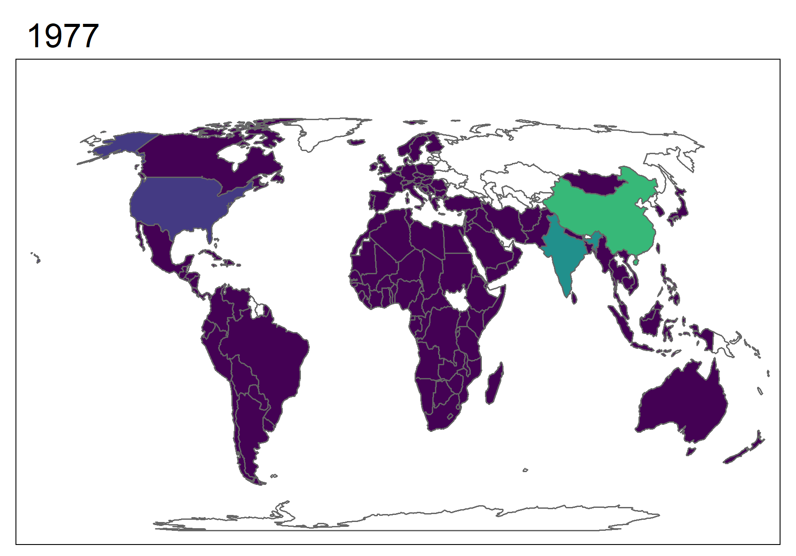

# Estadística Espacial

```{r global_options, include=FALSE}
knitr::opts_chunk$set(comment=NA, fig.width=6, fig.asp = 0.7, fig.align = 'center')
```

En este capítulo exploraremos herramientas estadísticas y de visualización para análisis de superficie. Nos centraremos en la capacidad gráfica de diversos paquetes de R.

## Paquetes Geo-R

Históricamente, el análisis de datos geográficos se centró en el paquete `sp`, que ha sido el más utilizado para manejar datos espaciales. 

La funcionalidad gráfica generalmente vino acoplada al mismo `sp`. El paquete `sp` guarda información espacial como vértices de polígonos, sistemas de coordenadas y otros atributos en objetos de la clase `Spatial`. Aunque la funcionalidad gráfica del paquete `sp` usando `plot()` es limitada, desarrollos recientes de paquetes como `tmap`, `ggplot2`, `ggmap` y `leaflet` permiten una amplia variedad de visualizaciones estáticas e interactivas, que pueden ser incorporadas a documentos `.html` como la versión electrónica de este libro. El paquete `sf` es un desarrollo relativamente reciente construido a partir de `sp`.  

## Instalar paquetes GEO-R

Vamos a instalar los paquetes que necesitamos para trabajar con data de tipo espacial.  

```{r, eval=FALSE}

install.packages("sf")
# tmap se toma su tiempo, instala muchas dependencias
# usamos el repositorio de CRAN en vez del de Rstudio
install.packages("tmap", repos = "https://cloud.r-project.org")
```

> En Mac y Linux la instalación es más complicada, seguir instrucciones en: https://github.com/r-spatial/sf y en https://github.com/mtennekes/tmap

Para facilitar que podamos trabajar con datasets abiertos, podemos cargar los datasets del paquete `spData`.  

```{r, eval=FALSE}

install.packages("spData")

```

Además, cargamos los paquetes que vamos a necesitar:  

```{r cargar-paquetes, results='hide', warning=FALSE, message=FALSE}

library(ggplot2)
library(dplyr)
library(sf)
library(tmap)
library(spData)
library(RColorBrewer)

```


## Trabajando con datos espaciales

Los datos geográficos pueden venir en base de vecotores localizados en un sistema de coordenadas de referencia. Un sitio puntual puede estar representado en longitud y latitud por un par coordenado $(x,y)$. Además, es posible encontrar datos que también posean información sobre altitud. Los puntos pueden conectarse formando polígonos (por ejemplo, los bordes de una región).

Una pequeña demostración del dataset `world` de `sf`:  

```{r, warning=FALSE}

plot(world)

```


También podemos utilizar subsets del dataset `world`:

```{r}
plot(world[4:5])
```

Miremos el continente americano 

```{r americano, warning=FALSE, fig.cap="Gráficos de América según las subregiones y la esperanza de vida."}
# subset
americano <- world %>%
             filter(region_un=="Americas") %>%
             select("subregion", "lifeExp")
# Graficar
plot(americano)
```


El mismo resultado puede obtenerse usando base R (figura omitida).

```{r, eval=FALSE}
# Subset
americano <- world[world$region_un=="Americas",
                   c("subregion", "lifeExp")]
# Graficar
plot(americano)
```


Veamos con un poco más de profundidad cómo está organizado el dataset. Podemos ver que cada país tiene un código *iso_a2* (dos letras que identifican a cada país)[^trabajando-paises], un nombre largo o *name_long* y un continente (podemos chequear toda la información en el dataset con `names(world)`). Vemos también que tenemos una columna *geom* con objetos MULTIPOLYGON de clase `sfc_MULTIPOLYGON`, `sfc. Estos geoms constituyen los bordes de los paises.    

```{r}
world[1:5, 1:3]
```


## Topología geoespacial

Las relaciones de topología espacial hacen referencia a cómo se encuentran en el espacio distintos elementos geográficos. Por ejemplo, podemos pensar en la intersección entre dos regiones en el espacio o en la intersección entre una región del espacio y un set de coordenadas. En efecto, muchas veces nuestro interés está en entender las relaciones topológicas entre un set de coordenadas espaciales y un set de polígonos[^pregunta]. Existen funciones muy útiles en el paquete `sf` que nos permiten resolver con facilidad estas cuestiones. 

### Dataset xy

Creemos un dataset `xy` donde tenemos guardadas coordenadas como puntos en el espacio $(x,y)$. En la figura \@ref(fig:crear-xy) tenemos un set de puntos (que bien podrían representar un río).

```{r crear-xy, fig.cap="Set de datos espaciales arbitrarios"}

x <- seq(0, 20, 0.5) 
y <- x * sin(x) 

plot(x,y, pch=19)

```

Agreguemos polígonos a este set para explorar relaciones topológicas. Para definir polígonos con la función `st_polygon()` debemos tener en cuenta que:

1. Los polígonos deben ser cerrados. Si la primera coordenada de un triángulo es $p_1 = (1,1)$ debemos proporcionar 4 coordenadas, siendo la última $p_4 = p_1 = (1,1)$.
1. Los puntos dentro de los polígonos se conectan según el orden especificado en la llamada a `st_polygon()`

La Figura \@ref(fig:polig) muestra dos rectángulos definidos por los mismos 5 puntos. Podemos apreciar el efecto cómo el orden con el que especificamos los puntos cambia el resultado final.

```{r polig, fig.cap='Construyendo polígonos con st_polygon.'}

# Creemos un rectángulo
r1 <- st_polygon(list(rbind(c(5, -5), c(5, 10),
                               c(10, 10), c(10, -5),
                               c(5, -5))))
# Lo pasamos a sf
r1 <- st_sfc(r1)
# Queríamos crear un rectángulo pero...
r2 <- st_polygon(list(rbind(c(15, -5), c(15, 10),
                               c(20, -5), c(20, 10),
                               c(15, -5))))
# Lo pasamos a sf
r2 <- st_sfc(r2)

plot(r1, xlim=c(2.5, 22.5))
plot(r2, add=TRUE, col="gray90")

```


Incorporemos nuestro set de coordenadas para mostrar el problema que pretendemos resolver. La Figura \@ref(fig:coord-poly) muestra el problema.

```{r coord-poly, echo=FALSE, fig.cap="Coordenadas y polígonos"}

plot(x, y, pch=19)
plot(r1, add=TRUE)
plot(r2, add=TRUE)
```


Este ejemplo es relativamente sencillo y podemos resolverlo sin las herramientas espaciales proporcionadas por `sf`. Sin embargo, utilizar funciones espaciales es altamente recomendado para operaciones dentro de sistemas de referencia y un mayor volumen de datos. Utilizaremos este ejemplo para demostrarlo. 

```{r}
# Incorporamos las coordenadas a una matriz
# Transformamos esa matriz a MULTIPOINT
coordenadas <- st_multipoint(matrix(c(x,y), ncol = 2))
# Transformamos a puntos simples, o "POINT"
coordenadas <- st_cast(st_sfc(coordenadas), "POINT")
```

Nos interesa saber cuáles son los puntos contenidos dentro de cada polígono. Por ejemplo, para `r1` tenemos:

```{r}
# sparse=FALSE nos dará un vector columna
inter_r1 <- st_intersects(coordenadas, r1, sparse = FALSE)
```

El resultado de esta función y del resto que utilizaremos en esta sección con `sparse=FALSE` es un vector lógico que podemos utilizar para hacer subset de nuestras coordenadas originales. Si hubieramos conservado el default `sparse=TRUE` sólo los resultados positivos de la operación se hubieran conservado. Recuerda que trabajar con bases de datos grandes (características de datos espaciales) implica requerimientos importantes de memoria. Por eso, las funciones de `sf` tienden a optimizar recursos. Podemos visualizar gráficamente los puntos de interes con el siguiente llamado:

```{r inter-r1, fig.cap="Puntos xy que intersectan con r1."}

plot(x, y, pch=19)
plot(r1, add=TRUE)
plot(r2, add=TRUE)
points(x[inter_r1], y[inter_r1], pch=19, col="red")
```


Debemos notar que `st_intersects()` nos da tanto puntos dentro como aquellos sobre el borde. Estrictamente, podríamos usar `st_within()` para ver aquellos que están dentro del polígono en cuestión. 

```{r dentro-r1, fig.cap="Puntos dentro de r1 (azul) y puntos que intersectan (rojo) con r1. Puntos violáceos pertenecen a ambos conjuntos."}


dentro_r1 <- st_within(coordenadas, r1, sparse = FALSE)

plot(x,y, pch=19)
plot(r1, add=TRUE)
plot(r2, add=TRUE)
points(x[inter_r1], y[inter_r1], pch=19, col=alpha("red", 0.8))
points(x[dentro_r1], y[dentro_r1], pch=19, col=alpha("blue", 0.5))

```

Podemos verificar cuál es el punto sobre el borde utilizando la función `st_touches()`.

```{r}
toca_r1 <- st_touches(coordenadas, r1, sparse=FALSE)

data.frame(x=x[toca_r1], y=y[toca_r1])

```

Las herramientas detalladas en esta sección pueden aplicarse a objetos espaciales en general y son útiles para categorizar datos según sus relaciones de topología.   


> Ejercicio: Replicar con r2 el ejemplo explicado con el rectángulo r1.  

> Ejercicio: Elegir 10 coordenadas de latitud y longitud y encontrar a qué países pertenecen.  

## Nueva Zelanda

En esta sección vamos a explorar el dataset `nz` como caso de estudio para demostrar la capacidad gráfica que adquirimos al trabajar en R con datos espaciales.  

### R-Geo con Base

Como es costumbre, la excelente función `plot()` es compatible con muchos tipos de objetos y entiende como manejar objetos de tipo `sf`. Con esta función, podemos realizar gráficos de buena calidad con relativamente poco esfuerzo.

```{r nz-base-plots, fig.show='hold', out.width = '50%'}
# Fondo celeste
par(bg = 'lightblue')
# Si queremos hacer 2 gráficos
# par(mfrow=c(1,2))
# Grafico de la isla
plot(nz[1], col="gray80", main="Nueva Zelanda")
plot(nz[2], main="Nueva Zelanda", key.pos = 1)

```

### R-Geo con tmap

La funcionalidad de base es limitada. Exploremos el paquete `tmap` que tiene una funcionalidad muy pareceida a `ggplot2`, con capas y gramática. 

```{r nz-tm-plots, message=FALSE}
# Mapa con bordes
bordes <- tm_shape(nz) +
  tm_borders()
# Agregamos fill de un solo color
con_color <- bordes + tm_fill(col="red", alpha=0.3)
# Agregamos fill segun el area de la region
# Cuidado! no usamos aes(col= Land_area) cual ggplot2
area_region <- tm_shape(nz) +
               tm_borders() +
               tm_fill(col = "Land_area")
# mostramos los mapas juntos
tmap_arrange(bordes, con_color, area_region)
```

> Ejercicio: Investigar las opciones breaks y palette en tm_fill()

### Cambiando colores con `style`

El ejercicio anterior apunta a modificar a mano los valores de `breaks`. El paquete `tm` puede asignar los valores de corte de manera automática según un estilo o `style` (ver `?tm_polygons()`):

> Los estilos se modifican mediante tm_fill(..., style=...)

* `style = pretty` (default), redondea a números enteros y los separa equidistantes.
* `style = equal` divide los valores de entrada en cortes de igual rango. Este tipo de estilo provoca que los mapas tengan poca variadad de color si tenemos una distribución asimétrica en la variable que elegimos para colorear.
* `style = quantile` divide en cuantiles nuestras observaciones de modo que el mismo número de observaciones entra en cada corte. 
* `style = jenks` identifica grupos con valores similares y maximiza las diferencias entre grupos. 
* `style = cont` nos proporciona un numero continuo de colores en un rango cromático. Podemos utilizarlo cuando queremos representar gradientes de terreno (gráficos tipo raster). 
* `style = cat` nos sirve para representar variables categóricas de modo que cada categoría será coloreada con un color único. 

A continuación se muestran ejemplos de los distintos estilos:

```{r cambiando-style-visible, echo=FALSE, warning=FALSE, message=FALSE, fig.cap="Distintas combinaciones de style"}
# Poblacion
nz_pretty <- tm_shape(nz) +
     tm_borders() +
     tm_fill(col = "Population", title = "Población", style="pretty") +
     tm_legend(legend.position = c("left", "top"),
          main.title.position = "right",
          legend.format = list(text.separator = "-"),
               legend.bg.color = NA) +
      tm_credits("pretty", size = 1.5) 

nz_equal <- tm_shape(nz) +
     tm_borders() +
     tm_fill(col = "Population", title = "Población", style="equal") +
     tm_legend(legend.position = c("left", "top"),
          main.title.position = "right",
          legend.format = list(text.separator = "-"),
           legend.bg.color = NA) +
      tm_credits("equal", size = 1.5) 

nz_quantile <- tm_shape(nz) +
     tm_borders() +
     tm_fill(col = "Population", title = "Población", style="quantile") +
     tm_legend(legend.position = c("left", "top"),
          main.title.position = "right",
          legend.format = list(text.separator = "-"),
           legend.bg.color = NA) +
      tm_credits("quantile", size = 1.5) 

nz_jenks <- tm_shape(nz) +
     tm_borders() +
     tm_fill(col = "Population", title = "Población", style="jenks") +
     tm_legend(legend.position = c("left", "top"),
          main.title.position = "right",
          legend.format = list(text.separator = "-"),
           legend.bg.color = NA) +
     tm_credits("jenks", size = 1.5) 

nz_cont <- tm_shape(nz) +
  tm_borders() +
  tm_fill(col="Population", title="Población", style="cont") +
  tm_legend(legend.position = c("left", "top"),
          main.title.position = "right",
          legend.format = list(text.separator = "-"),
           legend.bg.color = NA) +
  tm_credits("cont", size = 1.5) 

nz$categ <- c("Cat. A", "Cat. B")

nz_cat <- tm_shape(nz) +
  tm_borders() +
  tm_fill(col="categ", title="Categoría", style="cat")+
  tm_legend(legend.position = c("left", "top"),
          main.title.position = "right",
          legend.format = list(text.separator = "-"),
           legend.bg.color = NA) +
  tm_credits("cat", size = 1.5) 

tmap_arrange(nz_pretty, nz_equal, nz_quantile,
             nz_jenks, nz_cont, nz_cat)


```


Aunque menos flexible, si se acomoda a nuestras expectativas, podemos cambiar el estilo de manera global con `tm_style()`:

```{r classic-style, message=FALSE, warning=FALSE}
area_region + tm_style("classic")
```

Existen múltiples estilos que cambian de manera global los mapas que podemos hacer (ver `?tm_style()`). También podemos crear gráficos de calidad profesional.

> Ejercicio: Inspeccionar el siguiente código y comentar en cada línea su función.

```{r nz-profesional, fig.cap="Mapa de Nueva Zelanda. Coloreado según área."}

titulo_leyenda = expression("Área (km"^2*")")

tm_shape(nz) +
  tm_borders() +
  tm_fill(col = "Land_area", title = titulo_leyenda) +
  tm_compass(type = "4star", position = c("left", "top")) +
  tm_scale_bar(breaks = c(0, 125, 250), size = 1,
               position = c("right", "bottom"))+
  tm_layout(frame.lwd = 5, legend.outside = TRUE,
            legend.outside.position = c("right", "bottom"),
            legend.bg.color = NA, 
            legend.format = list(text.separator = "-"))
```


## Proyecciones

Para transformar el mundo de esfera a plano, utilizamos ciertas transformaciones matemáticas o *proyecciones*. A continuación muestro algunas proyecciones conocidas, utilizando datos de GDP per cápita[^projections]. 

```{r tres-proyecciones, echo=FALSE, fig.cap="GDP per cápita. Distintas proyecciones. Con pequeñas modificaciones al español. Fuente: https://github.com/mtennekes/tmap/tree/master/demo/WorldFacets"}
data("World")


longlat <- tm_shape(World, projection = "longlat") +
    tm_polygons("gdp_cap_est",
                palette = "Purples",
                style = "fixed",
                n = 7, 
                breaks = c(0, 500, 2000, 5000, 10000, 25000, 50000, 1000000), 
                title = c("GDP per cápita"),
                legend.format = list(text.separator = "-"),
                textNA = "Sin Datos") +
    tm_style("natural", earth.boundary = c(-180, -87, 180, 87))  +
    tm_format("World", inner.margins = 0.02, frame = FALSE) +
    tm_legend(position = c("left", "bottom"),
              bg.color = "gray95", frame = TRUE)+
    tm_credits(c("coordenadas longitud-latitud"), position = c("RIGHT"))


robin <- tm_shape(World, projection = "robin") +
  tm_polygons("gdp_cap_est",
              palette = "Purples",
              style = "fixed",
              n = 7, 
              breaks = c(0, 500, 2000, 5000, 10000, 25000, 50000, 1000000), 
              title = c("GDP per cápita"),
              legend.format = list(text.separator = "-"),
              textNA = "Sin Datos") +
  tm_style("natural", earth.boundary = c(-180, -87, 180, 87))  +
  tm_format("World", inner.margins = 0.02, frame = FALSE) +
  tm_legend(position = c("left", "bottom"),
            bg.color = "gray95", frame = TRUE)+
    tm_credits(c("Robinson (1963)"), position = c("RIGHT"))

eck4 <- tm_shape(World, projection = "eck4") +
    tm_polygons("gdp_cap_est",
                palette = "Purples",
                style = "fixed",
                n = 7, 
                breaks = c(0, 500, 2000, 5000, 10000, 25000, 50000, 1000000), 
                title = c("GDP per cápita"),
                legend.format = list(text.separator = "-"),
                textNA = "Sin Datos") +
    tm_style("natural", earth.boundary = c(-180, -87, 180, 87))  +
    tm_format("World", inner.margins = 0.02, frame = FALSE) +
    tm_legend(position = c("left", "bottom"),
              bg.color = "gray95", frame = TRUE)+
  tm_credits(c("Eckert IV (1906)"), position = c("RIGHT"))

# todo junto
tmap_arrange(longlat, robin, eck4,  nrow = 3)
```

La base para construir distintas proyecciones es cambiar el argumento `projection` en el comienzo del llamado.  

```{r, eval=FALSE}
# longitud-latitud
tm_shape(World, projection = "longlat") + ...
# robinson
tm_shape(World, projection = "robin") + ...
# eck4
tm_shape(World, projection = "eck4") + ...
```

Para ver el código completo para generar la Figura \@ref(fig:tres-proyecciones) dirigirse al Anexo A. Podemos investigar otras transformaciones con `ggplot2`. Para hacerlo, podemos utilizar la función `st_transform()` presente en `sf` y la siguiente transformación: 

`"+proj=laea +y_0=0 +lon_0=40 +lat_0=10 +ellps=WGS84 +no_defs"`  


```{r}
# Transformar el objeto sf World
world2 <- sf::st_transform(
    World,
    "+proj=laea +y_0=0 +lon_0=40 +lat_0=10 +ellps=WGS84 +no_defs"
)

# Graficar el nuevo objeto
ggplot() + geom_sf(data = world2) +
  theme_bw()

```


> Ejercicio: Explorar cómo cambian los mapas al cambiar los valores de lon y lat en la proyección del código anterior  

## Mapas con `facets`

Podemos hacer un gráfico de facets con `tm_facets()`. Sin embargo, `tm_facets()` será explorada en la sección \@ref(mapas-interactivos). Luego, en esta sección me voy a centrar en `ggplot2` para mostrar algo de variedad en la forma de crear y presentar mapas con datos provenientes de distintas fuentes. Utilizaremos los datos provenientes del paquete `gapminder`. Aprovecho para mencionar que la base de datos de `gapminder` no tiene el código `iso`. Debemos obtenerlos del objeto `country_codes`. 

```{r, warning=FALSE, message=FALSE}
library(gapminder)
# obtenemos iso

# Juntamos con gapminder 
gapminder <- gapminder %>% left_join(country_codes) %>%
              rename(iso_a3 = iso_alpha,
                     name = country)
               

# Unir los datos con los bordes y filtrar algunos años
# forzamos el join por iso_a3
# Por ejmplo, en un dataset EE.UU., aparece como "United States"
# y en el otro como "United States of America".
data_del_mundo <- World %>% left_join(gapminder, by="iso_a3") %>%
                  filter(year %in% seq(1977, 2007, 10))
```

Ahora estamos listos para graficar los datos de población en función del tiempo. Usando `ggplot2`, podemos aprovechar el funcionamiento de `facet_wrap()`, por lo que utilizaremos `facet_wrap(~year)`.  

```{r ggplot-map-facets-wrong, fig.cap="Gráfico de población en el tiempo."}
# Graficar
  ggplot() +
  geom_sf(data=data_del_mundo, aes(fill=pop))+
  facet_wrap(~year)+
  theme_bw()

```

Este mapa tiene algo extraño. Ocurre que el dataset `gapminder` no contiene información para todos los países (Puedes corroborarlo corriendo `filter(gapminder, name=="Russia")`). Un recurso es graficar los bordes de dichos países sin `fill`. Para ello, utilizamos dos llamados a `geom_sf()`.


```{r, ggplot-map-facets, fig.cap="Gráfico de población en el tiempo. Incluye países faltantes."}

ggplot() +
  geom_sf(data=World)+
  geom_sf(data=data_del_mundo, aes(fill=pop))+
     facet_wrap(~year)+
  theme_bw()+
  # agregamos viridis para mejor contraste
  viridis::scale_fill_viridis() +
  theme(axis.text.x = element_text(angle = 45, hjust = 1)) 
```


## Mapas animados

Una mejor forma de graficar el mismo set de datos es animarlo. En el siguiente código usamos un llamado a `tm_shape()` para que los países faltantes sean graficados desde `World`, mientras que nuestros datos de población sean graficados desde `data_del_mundo` via `qtm` (un abreviado de `tm_shape()+ tm_fill()`). El orden de los llamados determina qué capa va arriba, del mismo modo que ocurre en `ggplot2`. Vamos a utilizar `tm_facets()`, que nos brinda la opción de producir múltiples gráficos según una columa de nuestro dataset de entrada. En particular `tm_facets()` puede ser llamada con el argumento `by=...` si queremos viñetas o `along=...`si queremos un objeto animado[^atencion-ImageMagick].  

```{r imagick-path, include=FALSE, message=FALSE}
Sys.setenv(PATH = paste('C:\\Program Files\\ImageMagick-7.0.8-Q16',
                        Sys.getenv('PATH'), sep = ';'))
```


```{r world-anim}
# Creamos la animación como objeto
world_anim <- tm_shape(World) +
                tm_borders()+
                qtm(data_del_mundo, "pop", fill.palette="viridis") +
                tm_facets(along = "year", drop.units = TRUE)+
                tm_legend(show=FALSE)

```


Para mostrar el objeto, debemos guardarlo como `.gif` y asignar la velocidad (`delay`) con la que queremos que cambien los cuadros. Abajo reproduzco el código para generar el gráfico de la figura

```{r, eval=FALSE}
tmap_animation(world_anim, filename = "world_anim.gif", delay = 50)

```


```{r, echo=FALSE, eval=TRUE, results='hide', message=FALSE, warning=FALSE}
# Lo creo de verdad en la carpeta img
tmap_animation(world_anim, filename = "./img/world_anim.gif", delay = 50)

```


```{r show-world-anim, echo=FALSE, fig.cap="Gráfico animado creado utilizando tmap. Cambio en población sobre tiempo. Los cambios en China y India eclipsan a otros países en escala."}


```


## Mapas interactivos

En el mundo de hoy día, muchos dispositivos tienen acceso a información en archivos de tipo `.html` (cualquier dispositivo que tenga un navegador de internet). Esto hace que distintas aplicaciones se beneficien de insertar contenido `.html` en productos multimedia (ver Capítulo \@ref(comunicacion)). En esta sección, exploramos cómo crear mapas interactivos, que permiten al usuario navegar por el mapa que hemos creado e interactuar con la información que presentamos.  

El paquete `tmap` permite hacer gráficos interactivos con mucha facilidad. De hecho, no es necesario cambiar el código con el que creamos el mapa. Sólo debemos cambiar el *modo* de representación (de estático a dinámico, usando `tmap_mode("view")`). Por ejemplo, este es uno de los mapas de la figura \@ref(fig:cambiando-style-visible).  


```{r tmap-interactivo-1, message=FALSE, results='hide'}
tmap_mode("view")
nz_quantile

```

Podemos combinar los gráficos interactivos con `facets` en `tmap` con `tmap_facets()` o `tmap_arrange()`. Los gráficos se moverán en sintonía utilizando `sync=TRUE`. Por ejemplo:

```{r interactive-facets-1, message=FALSE, fig.cap="Población de Nueva Zelanda coloreada según cuantiles o jenks. Dos gráficos interactivos sincronizados."}
tmap_arrange(nz_quantile, nz_jenks, sync = TRUE)
```


```
```

Las escalas de gráficos sincronizados como el anterior no deben estar necesariamente sincronizadas. Podemos sincronizar gráficos totalmente distintos:

```{r interactive-facets-2, message=FALSE, fig.cap="Población de Nueva Zelanda coloreada según cuantiles y una variable categórica. Dos gráficos interactivos sincronizados."}

tmap_arrange(nz_quantile, nz_cat, sync = TRUE)

```


```
```

Al cambiar de modo, todos los gráficos que hagamos (o hayamos hecho) con `tmap` se mostrarán de modo interactivo. Si deseamos volver a contenido estático, debemos cambiarlo de nuevo.

```{r cambiar-estatico, results="hide"}

tmap_mode("plot")

```


Detrás del telón de estos gráficos interactivos se esconde el paquete `leaflet` (y los datos provinientes de OpenStreetMap). El paquete `leaflet` en R permite insertar mapas interactivos en archivos `.html`. Como siempre, debemos instalar el paquete si es la primera vez que lo vamos a utilizar.

```{r, message=FALSE, warning=FALSE}
# Si es la primera vez
# install.packages("leaflet")
library(leaflet)
```

`leaflet` utiliza el sistema de *pipes* (`%>%`) para construir los gráficos a partir de la llamada la función `leaflet()`. A continuación se reproduce el ejemplo básico, puede ser encontrado en la página del paquete (ver [aquí](https://rstudio.github.io/leaflet/)).

```{r creacion-r, fig.cap="Lugar en donde se creó R."}
m <- leaflet() %>%
  # Agregamos el mapa OpenStreetMap default
  addTiles() %>%  
  addMarkers(lng=174.768, lat=-36.852,
             popup="Lugar de nacimiento de R")
# Incorporar el mapa
m  
```


## Resumen

* R posee paquetes que permiten trabajar con datos espaciales (de tipo `sp` o `sf`) y realizar gráficos con calidad de publicación.
* Podemos realizar gráficos animados e interactivos. 
* El paquete `tmap` posee funcionalidad parecida a `ggplot2` y cubre una gran cantidad de aplicaciones.
* El paquete `leaflet` permite hacer gráficos interactivos de alto contenido.

## Recursos

* Este capítulo construye a partir del libro [Geocomputation with R](https://geocompr.robinlovelace.net/). Intenté ignorar detalles técnicos que considero que son cruciales para usuarios avanzados, pero que escapan a las intenciones de este libro introductorio.
* La viñeta de `tmap` [aquí](https://cran.r-project.org/web/packages/tmap/vignettes/tmap-getstarted.html) y [aquí](https://cran.r-project.org/web/packages/tmap/vignettes/tmap-changes-v2.html)
* Más información sobre manejo de datos espaciales en R [aquí](https://www.jessesadler.com/post/gis-with-r-intro/)
* Información sobre modificar la leyenda en `tmap` (http://www.jla-data.net/2017/09/20/2017-09-19-tmap-legend/)
* Información sobre proyecciones con [`ggplot2`](http://egallic.fr/maps-with-r/)
* El paquete [`leaflet`](https://rstudio.github.io/leaflet/)

## Respuestas

Podemos cambiar la escala con la que se grafica utilizando `breaks` y podemos cambiar el tipo de colores utilizando el argumento `palette`. Por ejemplo:  

```{r tm-fill-ejercicio, warning=FALSE, message=FALSE, fig.cap="Ejemplos sobre combinaciones de breaks y distintos tipos de fill en gráficos con tmap"}

# Original
area_region <- tm_shape(nz) +
               tm_borders() +
               tm_fill(col = "Land_area")
# Modifico breaks para mayor detalle
cortes <- seq(0, 50000, 5000)
area_2 <- tm_shape(nz) +
               tm_borders() +
               tm_fill(col = "Land_area", breaks = cortes)
# modifico la paleta de colores
# probar tmaptools::palette_explorer()
area_3 <- tm_shape(nz) +
               tm_borders() +
               tm_fill(col = "Land_area",
                       breaks = cortes,
                       palette = "viridis")
# mostramos los mapas juntos
tmap_arrange(area_region, area_2, area_3)

```


***

## Anexo A {-}

La figura \@ref(fig:cambiando-style-visible) fue construida con el siguiente código:

```{r cambiando-style, eval=FALSE}

# Poblacion
nz_pretty <- tm_shape(nz) +
     tm_borders() +
     tm_fill(col = "Population", title = "Población", style="pretty")+
     tm_legend(legend.position = c("left", "top"),
          main.title.position = "right",
          legend.format = list(text.separator = "-"),
               legend.bg.color = NA)+
      tm_credits("pretty", size = 1.5) 

nz_equal <- tm_shape(nz) +
     tm_borders() +
     tm_fill(col = "Population", title = "Población", style="equal")+
     tm_legend(legend.position = c("left", "top"),
          main.title.position = "right",
          legend.format = list(text.separator = "-"),
           legend.bg.color = NA)+
      tm_credits("equal", size = 1.5) 

nz_quantile <- tm_shape(nz) +
     tm_borders() +
     tm_fill(col = "Population", title = "Población", style="quantile")+
     tm_legend(legend.position = c("left", "top"),
          main.title.position = "right",
          legend.format = list(text.separator = "-"),
           legend.bg.color = NA)+
      tm_credits("quantile", size = 1.5) 

nz_jenks <- tm_shape(nz) +
     tm_borders() +
     tm_fill(col = "Population", title = "Población", style="jenks")+
     tm_legend(legend.position = c("left", "top"),
          main.title.position = "right",
          legend.format = list(text.separator = "-"),
           legend.bg.color = NA)+
     tm_credits("jenks", size = 1.5) 

nz_cont <- tm_shape(nz)+
  tm_borders()+
  tm_fill(col="Population", title="Población", style="cont")+
  tm_legend(legend.position = c("left", "top"),
          main.title.position = "right",
          legend.format = list(text.separator = "-"),
           legend.bg.color = NA)+
  tm_credits("cont", size = 1.5) 

nz$categ <- c("Cat. A", "Cat. B")

nz_cat <- tm_shape(nz)+
  tm_borders()+
  tm_fill(col="categ", title="Categoría", style="cat")+
  tm_legend(legend.position = c("left", "top"),
          main.title.position = "right",
          legend.format = list(text.separator = "-"),
           legend.bg.color = NA)+
  tm_credits("cat", size = 1.5) 

tmap_arrange(nz_pretty, nz_equal, nz_quantile,
             nz_jenks, nz_cont, nz_cat)


```


La figura \@ref(fig:tres-proyecciones) fue construida con el siguiente código:  

```{r, eval=FALSE}
data("World")


longlat <- tm_shape(World, projection = "longlat") +
    tm_polygons("gdp_cap_est",
                palette = "Purples",
                style = "fixed",
                n = 7, 
                breaks = c(0, 500, 2000, 5000, 10000, 25000, 50000, 1000000), 
                title = c("GDP per cápita"),
                legend.format = list(text.separator = "-"),
                textNA = "Sin Datos") +
    tm_style("natural", earth.boundary = c(-180, -87, 180, 87))  +
    tm_format("World", inner.margins = 0.02, frame = FALSE) +
    tm_legend(position = c("left", "bottom"),
              bg.color = "gray95", frame = TRUE)+
    tm_credits(c("coordenadas longitud-latitud"), position = c("RIGHT"))


robin <- tm_shape(World, projection = "robin") +
  tm_polygons("gdp_cap_est",
              palette = "Purples",
              style = "fixed",
              n = 7, 
              breaks = c(0, 500, 2000, 5000, 10000, 25000, 50000, 1000000), 
              title = c("GDP per cápita"),
              legend.format = list(text.separator = "-"),
              textNA = "Sin Datos") +
  tm_style("natural", earth.boundary = c(-180, -87, 180, 87))  +
  tm_format("World", inner.margins = 0.02, frame = FALSE) +
  tm_legend(position = c("left", "bottom"),
            bg.color = "gray95", frame = TRUE)+
    tm_credits(c("Robinson (1963)"), position = c("RIGHT"))

eck4 <- tm_shape(World, projection = "eck4") +
    tm_polygons("gdp_cap_est",
                palette = "Purples",
                style = "fixed",
                n = 7, 
                breaks = c(0, 500, 2000, 5000, 10000, 25000, 50000, 1000000), 
                title = c("GDP per cápita"),
                legend.format = list(text.separator = "-"),
                textNA = "Sin Datos") +
    tm_style("natural", earth.boundary = c(-180, -87, 180, 87))  +
    tm_format("World", inner.margins = 0.02, frame = FALSE) +
    tm_legend(position = c("left", "bottom"),
              bg.color = "gray95", frame = TRUE)+
  tm_credits(c("Eckert IV (1906)"), position = c("RIGHT"))

# todo junto
tmap_arrange(longlat, robin, eck4,  nrow = 3)

```


## Anexo B {-} 

Recomiendo leer con precaución toda la información antes de instalar el software ImageMagick para no cometer errores durante la instalación. Por ejemplo, asegurarse de instalar `convert` durante la instalación. Otra alternativa es intentando desde la consola de R con el siguiente código:


```{r, eval=FALSE}

install.packages('installr')  
library(installr)  
install.ImageMagick()  


```


Puede ocurrir que R no encuentre el PATH donde está ImageMagick. En mi caso es `C:/Program Files/ImageMagick-7.0.8-Q16`. Por ende uso este llamado para explicitamente incorporarlo.

```{r, eval=FALSE}

Sys.setenv(PATH = paste('C:\\Program Files\\ImageMagick-7.0.8-Q16',
                        Sys.getenv('PATH'), sep = ';'))


```


[^trabajando-paises]: Trabajar con paises es particularmente complicado. Las mejores bases de datos poseen códigos internacionales de 2 o 3 letras pero es muy común encontrar problemas con los nombres cortos (o largos) de los distintos países. Además, los datos longitudinales agregan problemas cuando la composición geopolítica cambia (por ejmplo, es común encontrar datos en donde aún tenemos USSR como un país). 
[^projections]: Para ver las distintas proyecciones disponibles recomiendo seguir el archivo de ayuda de la función de `tmaptools` que maneja proyecciones (`?get_proj4`). También [Wikipedia](http://en.wikipedia.org/wiki/List_of_map_projections)
[^atencion-ImageMagick]: Para realizar animaciones `tmap` usa ImageMagick,  un software libre que permite render de imágenes. En Windows, la instalación no es trivial. Más información [aquí](https://www.imagemagick.org/script/index.php). En el Anexo B detallo cierta información que puede ser de uso en Windows.
[^pregunta]: Nuestra pregunta de puede resumirse contestando "¿Cuál punto está dentro de cada polígono?".

