--- 
title: "Introducción a estadística con R"
author: "Matias Andina"
date: "2018-07-28"
site: bookdown::bookdown_site
documentclass: book
bibliography: [book.bib]
biblio-style: apalike
link-citations: yes
github-repo: "matiasandina/R-intro"
url: 'http\://matiasandina.netlify.com/ /'
description: "Este libro introduce conceptos de estadística utilizando R. Está principalmente orientado a estudiantes que deseen aplicar e incrementar sus conocimientos estadísticos usando un lenguaje de programación. Sin embargo, aquellos usuarios que tengan algo de experiencia con R y quieran aventurarse a aumentar sus conocimientos estadísticos pueden encontrar utilidad en los capítulos más avanzados."

---

# Prefacio {-}

R es quizás el lenguaje más desarrollado para realizar análisis exploratorios de datos y estadística. Debido a que posee una naturaleza dinámica, gratuita, *open-source*, y una comunidad que trabaja activamente en incrementar las posibilidades del lenguage, es un candidato natural para ser utilizado tanto en academia como en ámbitos profesionales.  

Creo que no exajero al decir que aprender R cambió mi vida, me abrió los ojos a un mundo de posibilidades que continúo explorando. Escribo porque tengo deseo de devolver lo que la comunidad de R me ha regalado. Escribo en español porque es mi idioma nativo y porque siento que puedo contribuir a reducir la barrera del lenguaje inglés, que complica el aprendizaje de cualquier lenguaje de programación.

Escribiendo este libro me di cuenta de que no es trivial encontrar material de referencia en relación a R (o estadística) enteramente en español. Mi objetivo principal es abrir la puerta, facilitar que hispanohablantes aprendan R. La curva de aprendizaje es empinada, aconsejo abrocharse el cinturón de seguridad y abrazar el camino. Este libro es un experimento e invita a la experimentación. Adelante.


***

Este libro está en construcción y planeo continuar actualizándolo con el tiempo. 

<!--chapter:end:index.Rmd-->

# Introducción

La organización de este libro esta fuertemente vinculada al análisis de datos. En general, el análisis suele presentarse en tres etapas: Lectura, modelado y comunicación de resultados. 

`Lectura > Modelado > Comunicación`

En lo que resta de este capítulo, vamos a transitar parte de la organización y contenido del libro, las convenciones que vamos a utilizar y los requisitos para obtener los programas necesarios. El contenido a desarrollar es de nivel básico. Sugiero que los usuarios que ya hayan instalado R o se sientan cómodos con la instalación de programas y sistema de archivos se salteen lo siguiente. 

## Términos

Existen ciertos términos en inglés que no poseen una traducción satisfactoria al español y serán utilizados inglés. La decisión es arbitraria, aunque intento mantenerme dentro de anglicismos aceptados, recomiendo tratarlos como términos técnicos. En la siguiente tabla pueden encontrar una guía:


Término en inglés   Descripción                                                     
------------------  ----------------------------------------------------------------
CRAN                Colección de paquetes en CRAN (Comprehensive R Archive Network) 
dataset             set de datos                                                    
render              generación de contenido multimedia                              
software            programa                                                        
working directory   Directorio desde donde R está trabajando en la sesión (getwd()) 

Un caso especial son los nombres nativos de objetos o propiedades de R. Estos términos aparecerán normalmente `resaltados en el texto`. Un ejemplo son las tablas que vamos a usar para acceder a datos, llamadas `data.frame`. Por ahora, no es necesario preocuparse al respecto, las piezas del rompecabezas se van a unir luego. 

## Dónde encontrar ayuda

Una gran forma de resolver los problemas que tenemos cuando escribimos código es goolgear el problema exacto. R normalmente nos mostrará errores de la forma:


```
## Error: error message here
```

Copiar y pegar el error particular es de gran ayuda. Existen diversos foros especializados. Afortunadamente existe material en español (aunque es limitado). Un gran sitio para empezar es:  

**StackOverflow** en español!
https://es.stackoverflow.com/


## Sistema Operativo

Afortunadamente, vivimos en un mundo con diversidad de sistemas operativos. R es compatible con *Windows*, *Mac OS* y *Linux*. Este libro está escrito utilizando *Windows 10* por lo que es posible que algunos ejemplos funcionen distinto en otros sistemas operativos. Haré mis mayores esfuerzos para asegurar compatibilidad entre distintos sistemas.

## Directorios

Los directorios son direcciones en nuestra computadora. Para que nuestra computadora localice un archivo o un programa, estos tienen una dirección en el disco duro. Normalmente el sistema de archivos es jerárquico, con secuencias de contenedores. Por ende, los directorios son también conocidos como *carpetas* o *ficheros*. Por ejemplo, en mi sistema, los archivos de R se encuentra en este directorio `C:\Program Files\R\R-3.4.0`. Todos los archivos contenidos en esa carpeta serán localizados a partir de esa dirección (y el nombre del archivo). Es importante entender que siempre contaremos con un *working directory* o directorio en el que estamos trabajando. Este directorio funciona como todos los demás, funcionando como un atajo.

## Traducción de contenido

Una parte del material de referencia en este libro está en inglés. Para aquellos lectores que encuentren muy dificultoso el idioma, aconsejo intentar la traducción del material usando el traductor de [Google](translate.google.com) o, si el navegador lo permite, habilitar la traducción de manera directa sobre el contenido.  

## R

Un lenguaje de programación es una serie de reglas que están diseñadas para realizar procesos en una computadora [^LenguajeWiki]. R es un lenguaje de programación. En ese sentido, no se diferencia de ningún otro (ej. C, Python). A su vez, como todo lenguaje, el set de reglas es particular y lleva tiempo incorporarlo. La mejor forma de naturalizarse con un idioma es hablarlo y, fundamentalmente en este caso, leerlo y escribirlo! Afortunadamente, el dominio de un idioma facilita el dominio de otro(s).  

R nació en 1993 en Auckland. Sin embargo, su origen puede rastrearse hasta un lenguaje previo llamado S, creado por John Chambers y colaboradores en *Bell Laboratories* durante la década de 1970 [^RWiki]. Actualmente, la diversidad de proyectos que pueden abarcarse en R es altísima, desde hacer análisis de estadística pura hasta escribir libros, como éste.  

En este libro voy a usar mayoritariamente R para hablar del lenguaje. Una excepción es la instalación del programa en sí mismo (ver Instalar R).

El copyright del software R es mantenido por la fundación R ( [R Foundation]((https://www.r-project.org/foundation/)) ) bajo una licencia pública [GNU General Public License version 2.0](https://www.gnu.org/licenses/gpl-2.0.html).  Algunas traducciones *no oficiales* de la licencia pueden encontrarse [aquí](https://www.gnu.org/licenses/translations.html). 

La fundación R es una organización sin fines de lucro que trabaja en pos del interés público. Fue fundada por los miembros del *R Development Core Team* para proveer. Sus  objetivos son:  

* Proveer apoyo al proyecto R y otras innovaciones en estadística computacional. 
* Asegurar su continuo desarollo, así como también el desarrollo de futuras innovaciones en software estadístico. 
* Proveer un punto de referencia para individuos, instituciones y empresas que deseen interactuar con la comunidad de desarrollo de R. 
* Mantener y administrar el copyright del software R y su documentación.[^R_Fund]

Podemos pensar a R estando dividido en dos marcos conceptuales:

1. El sistema de "base" R descargado desde CRAN.
1. El conjunto de paquetes externos que agregan funcionalidad.

En la siguientes secciones realizaremos la descarga e instalación de R. En el próximo capítulo trabajaremos con agregar funcionalidad utilizando paquetes externos.

## Instalar R

Para instalar R debemos dirigirnos a la colección de paquetes en CRAN (del inglés, Comprehensive R Archive Network). CRAN es un repositorio global donde se puede acceder al software y a los paquetes que la comunidad produce. Veremos pronto que R provee limitada funcionalidad de base y los paquetes son una parte fundamental del uso diario. 

1. La instalación comienza entrando en `https://cran.r-project.org/` 
1. Seleccionar el link correcto de descarga. El link depende del sistema operativo.  


3. Hacer clic en *Install R for the first time* (instalar R por primera vez).  


4. Hacer clic en *Download R 3.4.3 for Windows* para descargar el ejecutable. Al momento de escribir este libro la versión 3.4.3 es la última disponible en CRAN.  


5. Instalar desde el `.exe` (El cuádro de dialogo permite seleccionar idioma español).  


### Terminal de R

Si fantaseamos con escribir desde un terminal, es posible ejecutar R de ese modo. En mi caso, el acceso al terminal se encuentra en `C:\Program Files\R\R-3.4.0\bin` y la aplicación es `Rterm`. Como pueden ver, estoy utilizando una versión desactualizada, `R version 3.4.0 (2017-04-21) -- "You Stupid Darkness"`. 


### Interfaz gráfica

Si bien el terminal (o *consola*) es seductor, en muchas ocasiones es conveniente tener una interfaz gráfica. Podemos acceder a la interfaz `RGui` desde `C:\Program Files\R\R-3.4.0\bin\i386` o directamente si hemos creado un acceso directo en el escritorio durante nuestra instalación. La interfaz gráfica se ve de este modo:  


Como podemos ver, la interfaz permite acceso a mayores opciones pero, en esencia, se asemeja al terminal. Afortunadamente, existe una versión ampliamente mejorada de esta experiencia, se llama Rstudio (ver Instalar Rstudio). Rstudio es la interfaz gráfica que utilizaremos en este libro. 

## Instalar Rstudio

Rstudio es un software que integra una serie de herramientas gráficas y variabilidad de opciones a R. De este modo, ganamos versatilidad y comodidad en el uso. En el día a día, abrir Rstudio es, a fines prácticos, abrir R. Para instalar Rstudio, podemos seguir los siguientes pasos:

1. Ir a `https://www.rstudio.com/products/rstudio/download/`
1. Hacer clic en Descargar software.
1. Seleccionar la version compatible con el sistema operativo.
1. Instalar desde el `.exe` descargado.


### La experiencia

Al abrir Rstudio nos encontraremos con un programa que tiene principalmente dos áreas, una de entrada (consola) y una de salida (exploradores):


Podemos hacer un intento rápido para graficar el histograma de una distribución Normal con media 0 y desvío estándar 1. Puedes copiar y pegar el siguiente código en la consola.


```r
set.seed(123)
ejemplo <- rnorm(n = 10000, mean = 0, sd = 1)
hist(ejemplo, col='orange', breaks=40, 
     ylab = "Frecuencia", main = "Histograma ejemplo")
```


En la ventana de Rstudio se vería así:  


Normalmente usaremos Rstudio con 4 zonas principales: 

* Editor de scripts.
* Terminal o consola.
* Explorador de entorno e historial.
* Explorador de archivos y gráficos. 

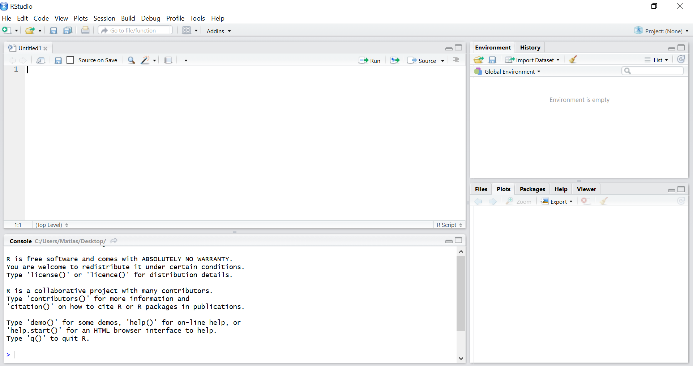

En los próximos capítulos ahondaremos en la funcionalidad de cada uno.

### Preferencias

Rstudio permite personalizar la *experiencia R* de modo de obtener virtualmente infinitas combinaciones. Para mayor información visitar la página de [Rstudio](https://support.rstudio.com/hc/en-us/articles/200549016-Customizing-RStudio)


## Resumen

* La organización del análisis estadístico procede `Lectura > Modelado > Comunicación`
* R es un lenguaje de programación orientado a objetos que permite realizar las tres etapas.
* El software R es de dedistribución gratuita y con funcionalidad dividida en:
    * Base R.
    * Paquetes externos descargados de un repositorio.  
* Rstudio es una interfaz gráfica gratuita que permite trabajar con R.


[^LenguajeWiki]: Mayor descripción en lenguajes de programación [aquí](https://es.wikipedia.org/wiki/Lenguaje_de_programaci%C3%B3n).

[^RWiki]: Historia e información sobre R [aquí](https://es.wikipedia.org/wiki/R_(lenguaje_de_programaci%C3%B3n). Para aquellos curiosos que tienen una consola a mano y se aventuran al inglés: `contributors()`

[^R_Fund]: La traducción es de mi autoría, la información original en inglés puede encontrarse [aquí](https://www.r-project.org/foundation/).

<!--chapter:end:01-Introduccion.Rmd-->

# Primeros Pasos

Como se mencionó en el capítulo anterior, R contiene funcionalidad limitada de base. Por eso, una vez instalados los requisitos mínimos, debemos comenzar a instalar aquellos paquetes útiles. Los paquetes son grupos de funciones útiles, que pueden usarse de forma repetida y reproducible entre usuarios. En particular, recomiendo fuertemente instalar **tidyverse**, un compendio de paquetes para hacer manejo y visualización de datos [^tidylink].

## Ejecutar código

Ejecutar (o correr) código en R puede realizarse desde la consola o desde el editor de scrips. En el editor, podemos seleccionar las líneas de código y presionar `Ctr+Enter` para que las líneas seleccionadas se ejecuten.

## Crear Objetos

R es un lenguaje orientado a objetos. Los objetos pueden ser usados para guardar valores y pueden modificarse (mediante *funciones*) como por ejemplo sumar dos objetos o calcular la media. 

### El operador `<-`

Para crear objetos *asignamos* (con el operador `<-`) valores a una variable. Por ejemplo, creemos un vector `x` que vaya de 1 a 10.


```r
# Crear un vector en secuencia de 1 a 10
x <- 1:10
# Ver el vector
x
```

```
##  [1]  1  2  3  4  5  6  7  8  9 10
```

En general, podemos pensarlo de este modo:

`nombre_del_objeto <- valor_del_objeto`[^recomendacion]

Las operaciones algebráicas con R siguen reglas matemáticas y son aplicadas a los elementos del vector.


```r
# Sumar 
x + 1
```

```
##  [1]  2  3  4  5  6  7  8  9 10 11
```

```r
# Multiplicar 

x * 2
```

```
##  [1]  2  4  6  8 10 12 14 16 18 20
```

```r
# Operaciones combinadas

(x^2 + 1) / 1.5
```

```
##  [1]  1.333333  3.333333  6.666667 11.333333 17.333333 24.666667 33.333333
##  [8] 43.333333 54.666667 67.333333
```


## Clases de objetos en R

Hasta ahora, nuestro objeto `x` es un simple vector de 1 dimensión y es de tipo entero o `integer` (puedes verificarlo con `class(x)` en la consola). La riqueza de R radica en la posibilidad de trabajar con distintas clases de objetos.

R tiene cinco clases básicas de vectores:  

* character (letras)
* numeric (números reales)
* integer (números enteros)
* complex (números complejos)
* logical (verdadero/falso o `True/False`)

Lo más importante es que los vectores sólo pueden contener elementos de la misma clase. Por ejemplo, no es posible tener un vector de la siguiente forma: `c(1, "perro", FALSE, "gato", 1.5)` pero sí es posible tenerlo de esta forma: `c("1", "perro", "FALSE", "gato", "1.5")`. En este caso, aunque bastante inconveniente, todos los elementos son de tipo `character`. R  automaticamente fuerza el resultado para no obtener errores (en un proceso llamado coerción). En nuestro ejemplo:


```r
# Crear un vector con problemas de clases
prueba <- c(1, "perro", FALSE, "gato", 1.5)
# Ver el vector
prueba
```

```
## [1] "1"     "perro" "FALSE" "gato"  "1.5"
```

```r
# Clase del vector
class(prueba)
```

```
## [1] "character"
```

Un problema de la coerción de datos es que no es posible para todos los casos. Allí, R agrega `NA`. Por ejemplo:


```r
# Transformar nuestro vector a numérico
as.numeric(prueba)
```

```
## Warning: NAs introduced by coercion
```

```
## [1] 1.0  NA  NA  NA 1.5
```

Los `NAs` (del inglés *not available*) son datos faltantes. Nuestros datos reales pueden contener `NA` y normalmente es muy útil tenerlos en cuenta. Para chequear si un vector contiene `NA` podemos usar la funcion `is.na()`, por ejemplo:


```r
# Nuestro vector previo
prueba_num <- as.numeric(prueba)
```

```
## Warning: NAs introduced by coercion
```

```r
# Chequeamos si tiene NA
is.na(prueba_num)
```

```
## [1] FALSE  TRUE  TRUE  TRUE FALSE
```

Podemos tener `NA` de tipo `character`, cuando un vector de tipo `character` tiene espacios vacíos. Por ejemplo,


```r
# Nuestro vector previo
vector_palabra <- c("Lo esencial es", NA, "a los ojos")
# Chequeamos si tiene NA
is.na(vector_palabra)
```

```
## [1] FALSE  TRUE FALSE
```

Además, podemos contar con vectores que contienen palabras y guardan un orden de niveles como los factores (`factor`). Por ejemplo:


```r
# Creemos un factor con niveles
grupo_altura <- factor(c("mediano", "pequeño", "grande", "muy grande"),
                       levels=c("pequeño", "mediano", "grande", "muy grande"))

# Veamos el factor
grupo_altura
```

```
## [1] mediano    pequeño    grande     muy grande
## Levels: pequeño mediano grande muy grande
```

Una situación en la que nos importa el orden es al graficar los datos. Si no tenemos el grupo como `character`  (o como `factor` con orden incorrecto), obtendremos un gráfico cuyo eje `x` está ordenado alfabéticamente en vez de tener el orden correcto.  

Finalmente, vectores vacíos (`NULL`) nos permiten hacer ciertas operaciones más complejas (ver más adelante).  

Otras clases de objetos incluyen listas (`list`), matrices (`matrix`), tablas de datos (`data.frame`) y modelos (por ejemplo `lm` para modelos lineales). Las distintas clases de objetos irán apareciendo a lo largo del texto.

## Errores comunes

La curva de aprendizaje de R es inclinada. La barrera del lenguaje es real. Por ejemplo, supongamos que queremos ordenar nuestro vector `x` de modo descendente (de 10 a 1). Para ello sería muy conveniente saber que *sort* es la forma de decir *ordenar* en inglés. Luego, los programadores probablemente incluyeron una función `sort()`.[^referencias-esp]


```r
# Usamos decreasing=T para marcar orden descendente 
sort(x, decreasing=T)
```

```
##  [1] 10  9  8  7  6  5  4  3  2  1
```

Además de la barrera del lenguaje, es muy común realizar errores de tipeo. La realidad es que no podemos enojarnos con la máquina cuando ocurren, su trabajo es ser exacta, no leernos la mente `:)`. Veamos un ejemplo:


```r
# Tengamos la palabra 'perro' en un objeto
palabra <- "perro"

# Hagamos una lista de palabras
palabras <- c('hola', 'como','estas','?')
```

Un error común será pedir `palabra` cuando queremos `palabras` y vice versa. Además, tendremos problemas de longitud (1 vs 4) que pueden romper el código o provocar errores inesperados. Estos problemas surgen cuando usamos dIsTinTaS FoRmAs De EsCrIbIR. R es sensible a cambios de mayúsculas, por ejemplo:   


```r
# Pidamos palabra de nuevo
Palabra
```

```
## Error in eval(expr, envir, enclos): object 'Palabra' not found
```


El error indica que no tenemos `Palabra` en el entorno, lo cual es cierto! Cuando manejamos muchos objetos, estos errores tienden a pasar desapercibidos y provocar dolores de cabeza. Estos errores son muy comunes cuando nombramos mal los objetos o hacemos abuso de copiar y pegar. Por ejemplo:


```r
variable1 <- 1:10
variable2 <- variable1 + 5 
variable3 <- variable1 + 5 # Error! era variable2 pero no me di cuenta

# La confusión se propaga de manera silenciosa!!!!
variable4 <- variable1 * variable2 * variable3
```

Nombrar objetos es difícil! Aunque conlleve nombres más largos, recomiendo nombrar los objetos de la forma más descriptiva posible[^tentacion]. Recuerden que su futuro ser (aquél que quiera usar el código unos meses después de haberlo escrito) no tendrá la menor idea de cómo llamó a las variables.Por ejemplo,


```r
# Mala práctica
# Nombrando con única letra
A <- 5
B <- 9.8

C <- A * B 

# Mejor
# (sin acentos)
masa <- 5
aceleracion <- 9.8

fuerza <- masa * aceleracion
```

Un caso muy particular es el de los caracteres protegidos por R. Por ejemplo, `c` (operación para concatenar objetos), `t` (operación para transponer), `T` (atajo para el concepto lógico verdadero o `TRUE`) o  `pi` (constante $\pi$), entre otros. Utilizar estos valores crea inconvenientes con las funciones nativas del sistema (le creamos a R el conflicto entre tranponer un objeto o utilizar el objeto `t`). Una ventaja de tener idioma nativo distinto de inglés es que nos permite llamar a los objetos en castellano sin crear conflicto con las funciones del sistema (por ejemplo, podemos crear el objeto `VERDADERO` sin remordimientos). 

Parte de realizar progresos con el lenguage (y con nuestro deseado análisis de datos) es lograr dialogar en los términos que R entiende.

> Es completamente normal sentirse frustrado con R. Adelante!

## Instalar y cargar paquetes

Para instalar paquetes desde CRAN podemos correr:  


```r
install.packages("tidyverse")
```

En este caso, la última versión de **tidyverse** (la última versión de los paquetes que lo conforman) será incorporadas a nuestra librería de paquetes. Instalar paquetes debe hacerse únicamente la primera vez. A partir de ahí, debemos indicarle a R que deseamos que esas funciones estén disponibles al iniciar el programa. La función `library()` es la que utilizamos para cargar paquetes, por ejemplo:  


```r
library(tidyverse)
```

Para cargar múltiples paquetes a la misma vez, es posible realizar una lista de paquetes y llamar a `library()` de manera recursiva.


```r
muchos_paquetes <- c('ggplot2', 'dplyr', 'tidyr', 'maptools')

lapply(muchos_paquetes, function(x) require(x, character.only = T))
```

Volveremos sobre este ejemplo en el futuro cuando veamos la utilidad de las funciones de tipo `apply`.

## Recursos

* Un buen manual en español [aquí](https://bookdown.org/jboscomendoza/r-principiantes/)

[^tidylink]: La página oficial de **tidyverse** y los paquetes que contiene está en ingles [aquí](https://www.tidyverse.org/packages/) 
[^recomendacion]: Notar los espacios antes y despues del operador `<-`. Esto es intencional y es aconsejable como *buenas prácticas* a la hora de escribir. Cuando tenemos muchas líneas de código es más agradable a la vista y facilita la lectura.
[^referencias-esp]: Si bien la barrera es real, no debemos entrar en pánico. Siempre intenten en Google (búsqueda o traductor) para entender las funciones.
[^tentacion]: Muchas veces yo caigo en la tentación y nombro gráficos con una sola letra (o letra y numero) `p1, p2, ...`. 

<!--chapter:end:02-Primeros-Pasos.Rmd-->

# Leer Datos

En este capítulo vamos a focalizarnos en las diversas formas de entrar datos a R.


## Datasets de base

R contiene datasets que pueden ser utilizados directamente. Para dar un vistazo a los paquetes 


```r
paquetes <- library(help = "datasets")
head(paquetes$info[[2]])
```

```
## [1] "AirPassengers           Monthly Airline Passenger Numbers 1949-1960"   
## [2] "BJsales                 Sales Data with Leading Indicator"             
## [3] "BOD                     Biochemical Oxygen Demand"                     
## [4] "CO2                     Carbon Dioxide Uptake in Grass Plants"         
## [5] "ChickWeight             Weight versus age of chicks on different diets"
## [6] "DNase                   Elisa assay of DNase"
```

Para ver la lista completa con toda la información, entrar `paquetes` en la consola nos abrirá una ventana. Utilizar datos que vienen con la instalación R nos facilitará avanzar hacia modelado y comunicación. Por ejemplo, en muchas ocasiones utilizaremos el dataset `iris`, que contiene información sobre la longitud de pétalos y sépalos en tres plantas distintas.  

Si bien importar datos es crucial, recomiendo que los usuarios menos experimentados continuen con el siguiente capítulo. 

A continuación se darán detalles más específicos para importar datos a R.

## Importar datos de manera manual

Rstudio posee una pestaña en donde tenemos el *Entorno* y un botón que nos permite importar datasets (ver figura). Desaconsejo utilizar esta pestaña de manera recurrente debido a que es de poca utilidad para leer archivos grandes. Además, aprender a importar archivos usando código nos permite leer múltiples archivos con gran velocidad, tarea prácticamente imposible si utilizamos los cuadros de diálogo.   

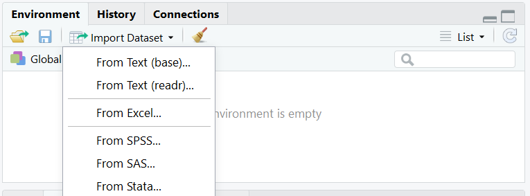

Luego recibiremos la posibilidad de seleccionar el archivo y modificar parámetros en sendos cuadros de diálogo.

## Archivos de texto

La gran ventaja de mantener archivos de texto (por ejemplo, `.csv` o `.txt`) es que una enorme cantidad de software es capaz de leerlos y no están ligados a un sistema operativo. Estos archivos son normalmente livianos y es fácil mantenerlos como *sólo lectura*, es decir, archivos en los que no cambiamos la información, sólo accedemos a ella. Si nuestros datos están guardados en un archivo de texto de sólo lectura, es menos probable que ocurra corrupción de datos o que, con el paso del tiempo, los mismos no puedan abrirse porque el software se ha discontinuado.  

R tiene funciones genéricas para abrir este tipo de archivos en una tabla como `read.table(...)`. Esta función presume pocas cosas en la estructura de datos, por lo que permite especificar un montón de parámetros y nos brinda variabilidad (ver `help(read.table)`). Sin embargo, en general conocemos la estructura de nuestros datos (por ejemplo, la primera fila es el título de las columnas o es un archivo separado por comas). Por lo tanto, usaremos llamadas del estilo:


```r
datos <- read.csv(file = 'nombre_de_archivo.csv')
```

### Importar múltiples archivos de texto

Normalmente tendremos múltiples archivos de texto, probablemente llamados de manera seriada en una carpeta dentro de nuestro working directory (por ejemplo, tendremos `resultados/sujeto001.csv`, `resultados/sujeto002.csv`, ... `resultados/sujeto154.csv`).


```r
# Obtener lista de archivos dentro de la carpeta 'resultados'

lista_nombres <- list.files(path = 'resultados')

# leer todos los archivos en una nueva lista

lista_archivos <- lapply(lista_nombres, read.csv())
```

Esta estrategia nos ahorra tener que escribir 154 llamadas a `read.csv()` con el nombre de archivo correcto. También facilita el acceso a todas las tablas en un único objeto, la lista `lista_archivos`. 

## Otros formatos

### SAS

Si jugaron con los cuadros de diálogo para importar datos de forma manual, probablemente se toparon con el paquete `haven`, por ejemplo podemos leer desde SAS usando:  


```r
library(haven)
dataset <- read_sas(...)
```

También es posible usar `foreign` y la función `read.ssd()`.

### SPSS

R puede leer datos directamente de spss: 

* El paquete `foreign` contiene la función `read.spss()`. 
* El paquete `haven` y la función `read_spss()`.  

### Excel

En algún momento tendremos que leer datos en la forma `.xls` o `.xlsx`. Existen distintos paquetes que permiten realizar la tarea, por ejemplo:

* `readxl` contiene la función `read_excel()`, entre otras.
* `xlsx` contiene la función `read.xlsx()`, entre otras.


<!--chapter:end:03-Leer-Datos.Rmd-->

# Exploración de Datos

Los humanos somos animales fuertemente dependientes en nuestra visión, así hemos evolucionado. Por lo tanto, no es sorpendente que la herramienta más útil para comprender datos sea utilizar una gráfica.

## Gráficos de base

R posee funcionalidad gráfica de base. Con relativa facilidad podemos hacer una gráfica de dos variables (por ejemplo, una hipotética variable respuesta en el tiempo). 


```r
tiempo <- c(1:10)
respuesta <- c(1:4, seq(10, 20, 2))  

plot(tiempo,respuesta,
     type='b',
     pch=19,
     col="black",
     main = "Respuesta vs tiempo",
     ylab = "Respuesta",
     xlab = "Tiempo")
```

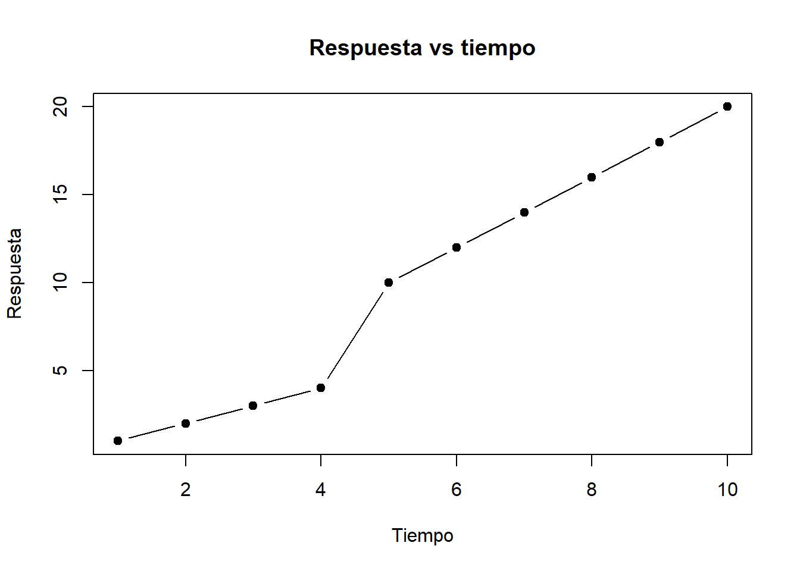

Esta funcionalidad no está limitada a gráficos de puntos y líneas. Por ejemplo, el histograma que figura en el principio del libro fue realizado con la función `hist()`


```r
set.seed(123)
ejemplo <- rnorm(n = 10000, mean = 0, sd = 1)
hist(ejemplo, col='orange', breaks=40, 
     ylab = "Frecuencia", main = "Histograma ejemplo")
```

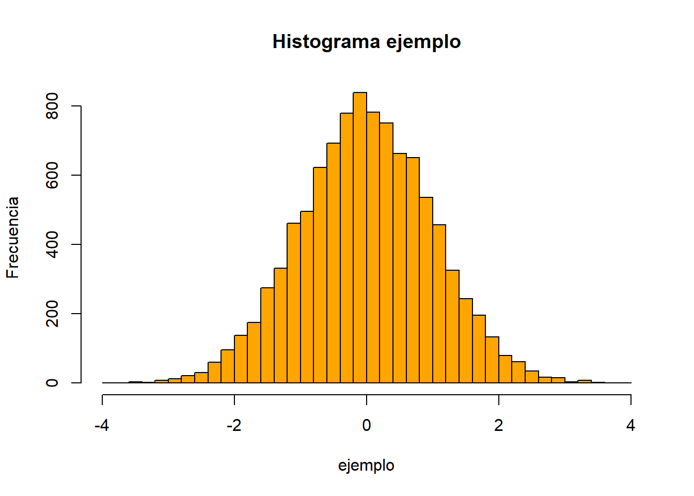

Los gráficos de base son geniales para explorar modelos ya que aceptan objetos de tipo  `lm` (ver siguientes capítulos). Si bien es posible realizar gráficos muy bonitos con la funcionalidad de base, incluso gráficas de calidad para publicación impresa, es cierto que la gramática no es sencilla de recordar (o requiere demasiada previsión) y, en muchos casos, es limitada.

## ggplot2

Una forma más intuitiva de construir gráficas es utilizar *capas*. El paquete `ggplot2` pertenece al `tidyverse` y es el más utilizado para realizar gráficas de alta calidad en R. A lo largo de la explicación utilizaré el dataset **iris**, que contiene medidas de las ojas de tres especies de plantas:


```r
head(iris)
```

```
##   Sepal.Length Sepal.Width Petal.Length Petal.Width Species
## 1          5.1         3.5          1.4         0.2  setosa
## 2          4.9         3.0          1.4         0.2  setosa
## 3          4.7         3.2          1.3         0.2  setosa
## 4          4.6         3.1          1.5         0.2  setosa
## 5          5.0         3.6          1.4         0.2  setosa
## 6          5.4         3.9          1.7         0.4  setosa
```


Veamos cómo se construye capa por capa un gráfico utilizando `ggplot2` y los datos de `iris`. Para entender cómo funciona, es importante entender el argumento `aes()`, que permite indicar qué pondremos en los ejes *XY* y además permite . Veamos el ejemplo:


```r
library(ggplot2)

ggplot(data=iris,
       aes(Sepal.Length, Petal.Length))
```


Este gráfico contiene los ejes que especificamos pero no contiene los datos. Para dibujarlos, debemos decirle a `ggplot` cómo hacerlo (por ejemplo, puntos).


```r
ggplot(iris, aes(Sepal.Length, Petal.Length)) +
  geom_point()
```


Al parecer, los datos presentan una estructura de asociación entre el largo de los sépalos y el de los pétalos (a mayor largo de sépalos, mayor largo de pétalos). Este dataset contiene un factor *Species* con tres niveles, *setosa*, *versicolor*, *virginica*. Fácilmente podemos ver si las distintas especies presentan distintas asociaciones. Una forma rápida de visualizarlo es coloreando los puntos según el nivel del factor *Species*. En `ggplot2` usamos `color = Species`.


```r
ggplot(iris, aes(Sepal.Length, Petal.Length, color = Species)) +
  geom_point()
```


Podemos agregar una nueva capa con una línea de tendencia. Para hacerlo, especificamos un ajuste lineal ("lm") en `geom_smooth(method = "lm")`. Es clave notar que `geom_smooth()` posee distintos métodos cuya riqueza exploraremos en los siguientes capítulos.


```r
ggplot(iris, aes(Sepal.Length, Petal.Length, color = Species)) +
       geom_point() +
       geom_smooth(method = "lm")
```

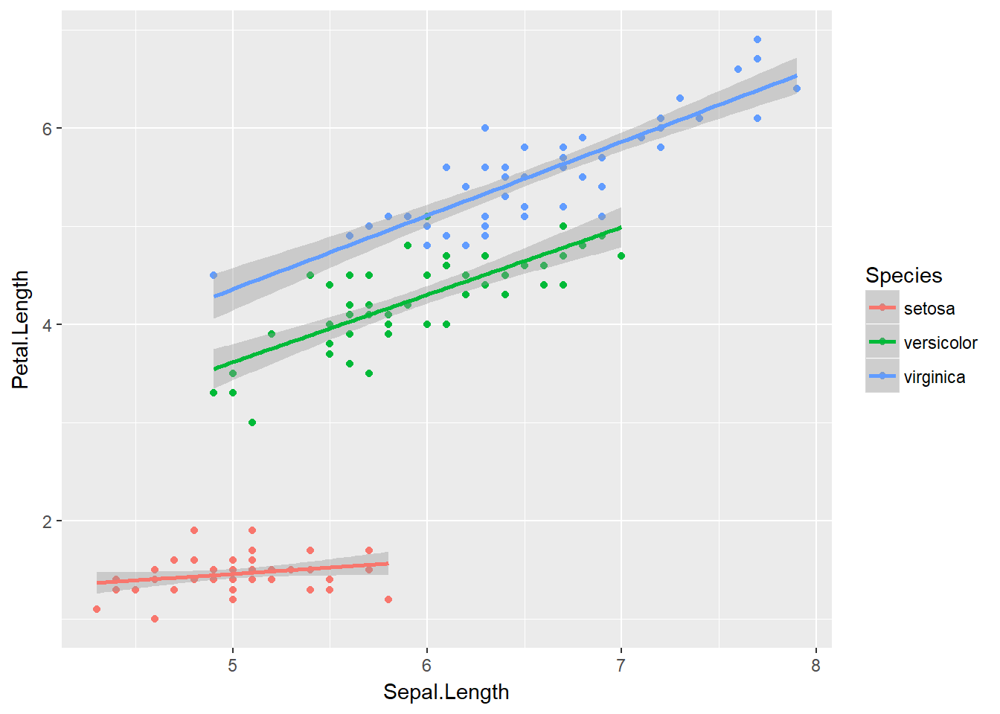

Como pueden apreciar, incorporar la gramática de `ggplot2` permite realizar visualizaciones más complejas con menor esfuerzo. La riqueza de este grupo de funciones esta en la gran variedad de funciones `geom` que podemos incorporar. A lo largo de el libro veremos varias de ellas.

### Entendiendo `aes()`

En ggplot, `aes()` hace referencia al contenido estético del gráfico (del ingles *aesthetics*). Es decir, la función le dará indicios a ggplot2 sobre cómo dibujar los distintos trazos, formas, colores y tamaños. Es importante notar que `aes()` crea una nueva capa en relación a las variables y agrega leyendas a los gráficos. Al incorporar `aes()` al llamado de `ggplot()` estamos compartiendo la información en todas las capas. Si deseamos que esa información sólo esté en una de las capas, debemos usar `aes()` en la capa correspondiente. Esto puede parecer confuso, las siguientes líneas de código generan un gráfico que se ve idéntico al que realizamos previamente:


```r
ggplot(iris, aes(Sepal.Length, Petal.Length)) +
       geom_point(aes(color = Species)) # Notar diferencia! aes() aparece en geom_point()
```


Sin embargo, podemos ver la diferencia al intentar repetir el gráfico con línea de tendencia.


```r
ggplot(iris, aes(Sepal.Length, Petal.Length)) +
       geom_point(aes(color = Species))+
       geom_smooth(method="lm")
```


En este caso `geom_smooth()` no recibe la orden de agrupar segun `Species`, por ende, todos los datos son usados para construir el ajuste lineal. Este comportamiento nos permite gran versatilidad en los gráficos. Sin embargo, también permite que el usuario cometa algunos errores. Por ejemplo, intentemos cambiar todos los puntos del primer gráfico de negro a magenta:


```r
# Primer gráfico, izquierda

ggplot(iris, aes(Sepal.Length, Petal.Length)) +
       geom_point()

# Intento 1

ggplot(iris, aes(Sepal.Length, Petal.Length, color='magenta')) +
       geom_point()

# Intento 2

ggplot(iris, aes(Sepal.Length, Petal.Length)) +
       geom_point(color='magenta')
```

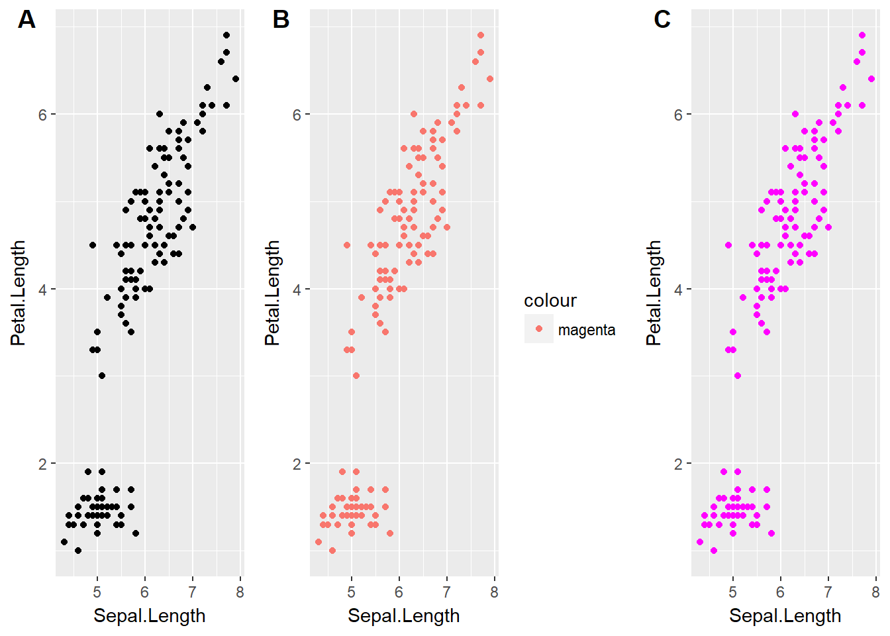

### Explorando `geom`

Los distintas funciones `geom` nos permiten obtener resultados gráficos distintos, aunque utilicemos los mismos datos. Analicemos el largo de los sépalos por especie.


```r
# Gráfico de puntos
p1 <- ggplot(iris, aes(Species, Sepal.Length)) +
       geom_point()

# Gráfico de puntos con ruido en el eje horizontal
p2 <- ggplot(iris, aes(Species, Sepal.Length)) +
       geom_jitter(width = 0.1)

# Boxplot

p3 <- ggplot(iris, aes(Species, Sepal.Length)) +
       geom_boxplot()

# Violin 
p4 <- ggplot(iris, aes(Species, Sepal.Length)) +
       geom_violin()

# Combinando boxplot y violin

p5 <- ggplot(iris, aes(Species, Sepal.Length)) +
       geom_violin(fill='orange', alpha=0.5)+
       geom_boxplot(color="white", fill="black",
                    lwd=0.8, width=0.2 )

# Grafico de barras con medias + SEM

p6 <- ggplot(iris, aes(Species, Sepal.Length)) +
      stat_summary(fun.y = mean, geom = "bar",
                   width=0.5) +
      stat_summary(fun.data = mean_se, geom = "errorbar",
                   color="red", width=0.5)
```

<div class="figure">

<p class="caption">(\#fig:six-plot-figure)Varias formas de mostrar los mismos datos.</p>
</div>


Este es un pequeño ejemplo de como los distintos `geoms` participan en la creación de gráficos. En **A** es difícil ver que los puntos están superpuestos, por eso en **B** usamos `geom_jitter()`, que da una buena idea de la distribución de los datos. Para resumir la información, es común utilizar gráficos de cajas o tipo violín (**C,D**). Notar que la combinación de `geoms` en capas permite fácilmente mezclar ambos gráficos (**E**). Al combinarlos, hemos cambiado cuestiones estéticas dentro de las capas para incrementar el contraste. Finalmente, otra forma común de hacer un resumen de datos es un gráfico de barras de tipo media ± SEM (**E**).

### Explorando `facet_wrap`

En otras secciones separamos datos categóricos utilizando color. En esta sección, veremos que es posible utilizar `facets` para separar las gráficas en distintas ventanas.


```r
ggplot(iris, aes(Sepal.Length, Petal.Length)) +
  geom_point()+
  facet_wrap(~Species)
```


Este comportamiento es súmamente útil cuando tenemos más de una variable categórica o cuando deseamos utilizar el color para simbolizar otra variable. Por ejemplo, quizás nos interesa evaluar cómo varía el ancho de los pétalos en las distintas plantas.


```r
ggplot(iris, aes(Sepal.Length, Petal.Length)) +
     geom_point(aes(color=Petal.Width))+
     facet_wrap(~Species)
```


En este último gráfico hemos podido representar con claridad variaciones en la longitud de pétalos y sépalos, el ancho de los pétalos y una variable categórica de tres niveles. Los datos indican que las plantas con menor longitud de pétalos y sépalos también poseen pétalos más angostos. Efectivamente, explotar los recursos de `ggplot2` nos permite generar poderosas herramientas de análisis y comunicación estadística. 

### Cowplot

Los gráficos realizados en la sección previa (\@ref(explorando-geom)) muestran gráficos individuales que fueron *acomodados* distintos paneles. Para realizar esto, se ha utilizando el paquete `cowplot`. A continuación se muestra el código para realizar figura \@ref(fig:six-plot-figure)


```r
cowplot::plot_grid(p1,p2,p3,p4,p5,p6, labels = "AUTO")
```

## Caso de estudio

El primer objetivo de un análisis exploratorio debe ser ganar entendimiento cualitativo de la naturaleza de los datos (tendencia central, distribución y estructura de correlación). Esto puede lograrse utilizando tablas de resumen, sin embargo, en mi opinión el análisis gráfico es superior.  

`ELEGIR Y REALIZAR CASO DE ESTUDIO DE ANALISIS GRAFICO`


## Resumen

En este capítulo no he realizando una descripción exhaustiva sobre análisis gráfico, mi idea fue brindar ejemplos de las posibilidades para exploración de datos, principalmente con `ggplot2`.  

* Uno de los mayores beneficios de R es la plataforma gráfica, principalmente `ggplot2`.
* `ggplot2` está basada en una gramática que permite incorporar capas a los gráficos.
* Las capas son agregadas una encima de la otra segun los `aes()` y `geoms` que se utilicen.
* Tanto `ggplot2` como paquetes accesorios permiten realizar gráficos de paneles de alta calidad.
* Utilizar combinaciones de capas permite representar con claridad más dimensiones en un gráfico.

## Recursos

El material sobre visualización de datos es virtualmente infinito. Recomiendo fuertemente los siguientes textos:

* [ggplot2 online](https://ggplot2.tidyverse.org/)
* [Data Visualization-Kieran Healy](http://socviz.co/)

<!--chapter:end:04-Exploracion.Rmd-->

# Modelos Lineales

> Esencialmente, todos los modelos son erróneos, pero algunos son útiles - George Box

La realidad es multidimensional, compleja e incierta. Un modelo es una representación formal de un fenómeno, una reducción de dimensionalidad que posee utilidad práctica. Dicha representación normalmente puede ser condensada en una expresión matemática, una *fórmula*, que indica cómo una variable se relaciona con otra(s). Empíricamente, el paradigma se basa en estudiar la relación matemática entre variables aleatorias respuesta, con una distribución de probabilidades dada, y aquellas variables que la predicen, con el fin de explicar asociaciones entre variables y realizar inferencia. De modo muy general, podemos escribir:

\begin{equation} 
  y = f(x)  
  (\#eq:general-fx)
\end{equation} 


Donde $y$ es la variable que modelamos, $f$ es una función de una o múltiples variable(s) explicatoria(s).

## ¿Qué es un modelo lineal?

En este capítulo trabajaremos con modelos *lineales*. Un modelo lineal suele escribirse como:

\begin{equation} 
y = \beta_0 + \beta_1x_1 + \ ...\  + \beta_nx_n
  (\#eq:general-glm)
\end{equation} 

Donde $x_{1..n}$ representa cada variable predictora y $\beta_{1..n}$ representan los coeficientes (o parámetros) a estimar.  El efecto de cada coeficiente (por ejemplo, $\beta_3$) debe interpretarse como el cambio en $y$ dado por un cambio unitario en la variable predictora asociada a ese coeficiente ($x_3$), siempre que las demás variables $x$ se mantengan constantes. Además, tenemos una ordenada al origen (o $\beta_0$) que representa la media general.  

Este modelo es *lineal* porque está escrito como una combinación lineal de las preditoras y sus coeficientes. Por ejemplo, la ecuación de Michaelis-Menten[^michaelis] es un modelo *no lineal*:

\begin{equation} 

V_{prod} = V_{max} * \frac{[S]}{K_m [S]}
  (\#eq:michaelis-menten)
\end{equation}

Que podemos escribir en los términos usados en \@ref(eq:general-glm) como:

\begin{equation} 

y = \beta_0 *\frac{x}{\beta_1 x}

\end{equation}

## Modelos estadísticos

Hasta ahora, los modelos estaban *determinados*, es decir, dados los valores de $\beta, x$, los valores $y$ son únicos. En nuestro caso trabajaremos con modelos *estadísticos*, en donde cada valor que medimos en la vida real tiene asociado un *error*.

\begin{equation} 
y_i = \beta_0 + \beta_1x_{1i} + \ ...\  + \beta_nx_{ni} + \epsilon_i 
  (\#eq:general-glm-estadist)
\end{equation} 

Donde $i$ representa la observación obtenida de cada unidad experimental. Debido a que existen diferencias entre unidades experimentales, el valor de $y_i$ no será determinado por una combinación lineal de $\beta x$, tendrá un error ($\mathcal{E}_i$) asociado.  

### Simulando datos en R

Podemos crear un ejemplo para entender de dónde sale el error. Supongamos que podemos medir *felicidad* de manera cuantitativa, como una variable continua. Supongamos, además, que nuestro laboratorio quiere investigar cómo impactan distintas dosis de chocolate a la felicidad de los humanos. Para esto, tomamos una muestra de 100 voluntarios y los asignamos de manera aleatoria a 5 dosis de chocolate (20, 40, 60, 80, y 100 gramos).   


```r
# Paquetes que vamos a usar
library(ggplot2)
# Permite cambiar el aspecto de ggplot a algo parecido a base
library(ggthemes) 
```


```r
# Generar participantes
id <- 1:100
# Generar dosis
dosis <- sort(rep(seq(20,100,20), 20))
# Generar respuesta "ideal" 
respuesta <- dosis * 2.5 + 10
# Construir data.frame
datos <- data.frame(id=id,
                    dosis=dosis,
                    respuesta=respuesta)

# Graficar
p <- ggplot(datos, aes(dosis, respuesta))+
      geom_point()+
      xlab("Dosis Chocolate (gr)")+
      ylab("Felicidad")+
      theme_base()+
      theme(plot.background = element_rect(colour = NA))

p
```


El modelo que construimos hasta ahora tiene valores determinados. Pero, en la realidad, esperamos variabilidad en la respuesta al chocolate entre individuos. Esta variabilidad existe porque los individuos no son réplicas exactas: cada cuerpo fue construido a partir de un genoma levemente distinto, con diferentes eventos en el desarrollo y la experiencia. Incluso podemos pensar en eventos aleatorios relacionados con la ingesta y digestión de el mismo trozo de chocolate! Por eso, si queremos trabajar con un modelo más realista deberíamos tener un gráfico como el siguiente:


```r
# semilla
set.seed(444)
# Agregar ruido con distribucion normal (media 0, sd = 5)
datos$respuesta <- datos$respuesta + rnorm(n = 100, mean = 0, sd = 5)

p <- ggplot(datos, aes(dosis, respuesta))+
       geom_point(alpha = 0.1)+
       xlab("Dosis Chocolate (gr)")+
       ylab("Felicidad")+
       theme_base()+
       theme(plot.background = element_rect(colour = NA))

p
```


En este caso podemos ver claramente que para cada valor de dosis hemos registrado más de un valor de felicidad. La naturaleza de la pregunta cambia, debemos preguntarnos: 

* ¿Cuál es el valor **esperado** de felicidad para una dada dosis de chocolate?
* ¿Cómo podemos estimarlo?

## Esperanza

Lo que esperamos en este caso es registrar valores que estén distribuidos alrededor del valor de la media para cada concentración (ver  \@ref(eq:general-glm-estadist)). La esperanza va a estar dada por:

\begin{equation} 
E(Y_i) = \beta_0 + \beta_1 x_{1i}
  (\#eq:esperanza)
\end{equation} 

Donde $E(Y_i)$ es la esperanza del caso $i$ (también escrita como $\mu_{Y|x_i}$), $\beta_0$ es el valor esperado para dosis cero (en este caso tiene sentido experimental pensar en participantes que no comieron chocolate), y $\beta_1$ es el incremento en la esperanza dado por un incremento unitario en la variable predictora (exactamente cuánto más feliz espero ser por gramo de chocolate!). Gráficamente, esperamos:


```r
# Graficar
p + geom_smooth(method = "lm", color="lightgray", se=FALSE)+
  stat_summary(fun.y = mean, geom="point", size=2, color="red")
```


## Estimación del modelo

En este caso, los parámetros de nuestro modelo se estiman por *cuadrados mínimos*, una forma acotada de decir que buscaremos aquella recta (combinación lineal de parámetros y predictoras) tal que se minimice la suma de las distancias entre los datos y los valores predichos.

Formalmente, podemos calcular el error o *residuo*, para cada punto como la diferencia entre el valor observado ($y_i$) y predicho por nuestro modelo ($E(Y_i)$):

\begin{equation} 
e_i = y_i - E(Y_i)
  (\#eq:residuo1)
\end{equation} 

Un inconveniente de esta definición es el signo de los residuos. Como no deseamos que los resultados varíen si las observaciones están por encima o por debajo de la esperanza, podemos usar el cuadrado de los residuos para trabajar. Usando la Ecuación \@ref(eq:esperanza) podemos expandir la Ecuación \@ref(eq:residuo1) y plantear:

\begin{equation} 
\Sigma e_i^2 = \Sigma (y_i - E(Y_i))^2 = \Sigma (y_i - (b_0 + b_1 x))^2
  (\#eq:residuo2)
\end{equation} 

Si minimizamos $\Sigma e_i^2$ podemos obtener estimadores para $\beta_0$ y $\beta_1$ (denotados como $b_0$ y $b_1$):

\begin{equation} 
b_1 = \frac{\Sigma (x_i - \bar{x})(y_i - \bar{y})}{\Sigma (x_i - \bar{x})^2} \\
b_0 = \bar{y} - b_1 \bar{x}
  (\#eq:parametros)
\end{equation} 

Donde $\bar{x}$ y $\bar{y}$ representan las respectivas medias en nuestra muestra.

### Entendiendo la estimación con gráficos

Si pensamos a los residuos como distancias entre nuestra recta de predichos y las observaciones de la vida real, lo que la regresión hace es minimizar esas distancias (todas a la vez, por eso en la \@ref(eq:residuo2) tenemos la sumatoria).  

Supongamos que una primera aproximación a estimar el valor de $y$ es olvidarse de la variación en $x$ por un instante y plantear una recta que contenga a la media global ($\bar{y}$) como valor esperado para cualquier $x$ (equivalente a $y_i = \beta_0 = \bar{y}$):


En este caso, vemos que los valores observados tienen una distancia grande a la media. Esto indica que $x$ efectivamente tiene un efecto sobre $y$. Sin embargo, cerca del centro (alrededor del punto $(\bar{x},\bar{y})$), los residuos son pequeños. Intuitivamente, debemos cambiar la pendiente, pero, al rotar la recta, deberíamos hacerlo desde el punto $(\bar{x},\bar{y})$. Por ejemplo:


Podemos ver que con esta acción hemos reducido los residuos y el ajuste es mejor. Naturalmente, es muy complicado encontrar gráficamente el par $b_0, b_1$ tal que la suma de las distancias sean *mínimas*. En la siguiente figura se muestra la gráfica de dicha recta. Apenas se se pueden apreciar los residuos, vemos que el ajuste es mucho mejor que nuestro primer intento con la media:   

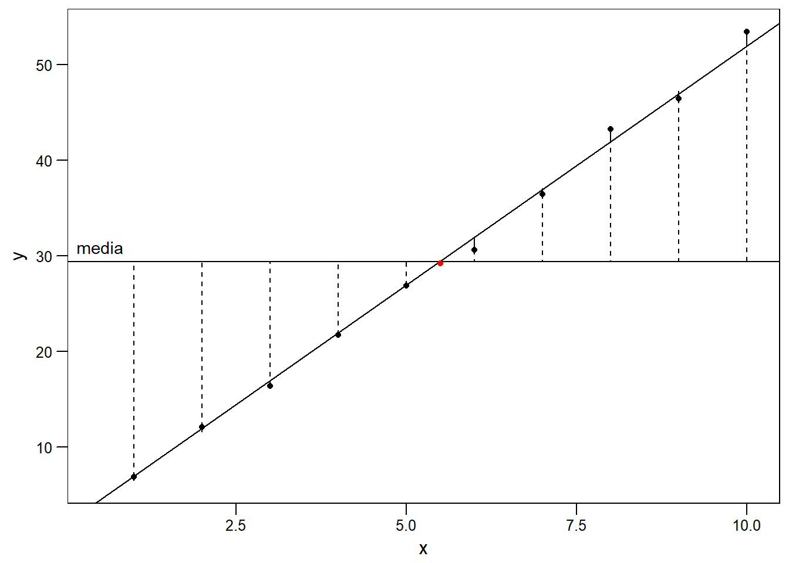

## Modelo en R

Ya es hora de meternos de lleno en la práctica. Volvamos a nuestro modelo de felicidad y chocolate para realizar un ajuste lineal en R usando la función `lm`. Esta función requiere argumentos de tipo `formula`. En nuestro caso, queremos estudiar la relación entre la felicidad (`respuesta`) y la dosis de chocolate (`dosis`). Por ende, la fórmula que utilizaremos es `respuesta ~ dosis`, con `~` para dividir entre respuesta y predictoras [^tilde]:


```r
# crear modelo
modelo_chocolate <- lm(data=datos,
                       respuesta ~ dosis)
# Ver resultados del modelo
summary(modelo_chocolate)
```

```
## 
## Call:
## lm(formula = respuesta ~ dosis, data = datos)
## 
## Residuals:
##    Min     1Q Median     3Q    Max 
## -9.204 -3.696 -1.330  3.091 11.497 
## 
## Coefficients:
##             Estimate Std. Error t value Pr(>|t|)    
## (Intercept)  8.59279    1.15698   7.427 4.15e-11 ***
## dosis        2.51659    0.01744 144.283  < 2e-16 ***
## ---
## Signif. codes:  0 '***' 0.001 '**' 0.01 '*' 0.05 '.' 0.1 ' ' 1
## 
## Residual standard error: 4.933 on 98 degrees of freedom
## Multiple R-squared:  0.9953,	Adjusted R-squared:  0.9953 
## F-statistic: 2.082e+04 on 1 and 98 DF,  p-value: < 2.2e-16
```

El llamado a `summary()` nos permite ver una gran cantidad de información. 
También recomiendo familiarizarse con el paquete `broom`, que nos permite extraer información estadística de los modelos. Aquí está la tabla con los estimadores:


```r
# Estimadores
broom::tidy(modelo_chocolate)
```

```
##          term estimate  std.error  statistic       p.value
## 1 (Intercept) 8.592791 1.15697854   7.426923  4.146133e-11
## 2       dosis 2.516593 0.01744211 144.282604 5.934481e-116
```

Vemos claramente que el consumo de chocolate incrementa la felicidad (esperamos mayor un incremento en ~2.5 unidades de felicidad por cada gramo de chocolate!). 


```r
# Herramientas de diagnóstico del ajuste
t(broom::glance(modelo_chocolate))
```

```
##                         [,1]
## r.squared       9.953145e-01
## adj.r.squared   9.952667e-01
## sigma           4.933373e+00
## statistic       2.081747e+04
## p.value        5.934481e-116
## df              2.000000e+00
## logLik         -3.004860e+02
## AIC             6.069720e+02
## BIC             6.147875e+02
## deviance        2.385141e+03
## df.residual     9.800000e+01
```

También podemos acceder a porciones del modelo por separado. Puedes intentar en tu consola los siguientes comandos.


```r
# parametros
modelo_chocolate$coefficients
# predichos
modelo_chocolate$fitted.values
# residuos
modelo_chocolate$residuals
```


## Supuestos

Cuando construimos modelos de este tipo, asumimos ciertas cosas. Los supuestos principales en este caso son:

* Los valores de las predictoras no tienen error, son determinados por el investigador. 
* Independencia entre observaciones.
* Homocedasticidad.
* Los residuos son normales.

### Error en $x$

La minimización de distancias se realiza únicamente sobre el componente $y$. De esto se desprende el supuesto de que el componente $x$ no tiene error asociado. Experimentalmente, esto es imposible (no es posible pesar exactamente 20.00 gr de chocolate). Sin embargo, en la gran mayoría de los casos, un error relativo pequeño en este componente, como por ejemplo el porcentaje de error de nuestra balanza, no afecta el análisis.   

### Independencia

Los valores que obtenemos de cada unidad experimental deben ser independientes. Esto significa que los valores obtenidos de una unidad experimental no afectan los valores obtenidos por otra. Formalmente, $cov(y_i,y_j) = 0 \ \ \forall \ \ i\neq j$.

### Homocedasticidad.

Podemos pensar a cada uno de los valores que obtuvimos para una dosis como una subpoblación. En este modelo, la media de cada una de estas subpoblaciones está dada por la ecuación de esperanza (ver Ecuación \@ref(eq:esperanza)). Para cada subpoblación asumimos una distribución normal alrededor de $E(y_i)$ con idéntica varianza ($\sigma^2$). Formalmente:

\begin{equation} 
\sigma^{2}(Y_i|x_i) = \sigma^{2}(Y_j|x_j) = \sigma^2 \ \ \forall \ \ i\neq j
  (\#eq:varianza-cte)
\end{equation} 

Este supuesto no es trivial y veremos cómo detectar su cumplimiento a partir del análisis de residuos. 

### Normalidad de residuos

Este modelo tiene como supuesto que los residuos se distribuyen de manera normal. En general, utilizaremos gráficos de diagnóstico, que son importantes para evaluar los supuestos.

**Residuos vs Predichos (Residuals vs Fitted)**  

En este gráfico buscamos ver la dispersión respecto de la recta para cada valor predicho  (cuánto se alejan de nuestro ajuste). Esperamos no observar ningún tipo de patrón en los residuos. Esperamos no ver datos atípicos (datos con residuos muy grandes). 

**Q-Q Plot**  

Este gráfico muestra cómo se acumulan los residuos respecto de los cuantiles teóricos de una distribución normal. Si la distribución de residuos es normal, los veremos cercanos a la recta. Desviaciones de la recta indican que la distribución de los residuos no es normal. Por ejemplo, en el siguiente gráfico muestro la comparación de residuos provenientes de una distribución Normal y una gamma en un Q-Q plot:


**Residuos estandarizados vs Predichos**  

Este gráfico es similar al primero, pero los residuos están estandarizados. Esperamos no ver ningún patrón, con los residuos distribuidos normalmente alrededor de cero. En la siguiente figura muestro ejemplos de distintos gráficos de residuos vs predichos:


En el primer caso veremos cómo son los gráficos *deseados* de residuos vs predichos. Tanto en **A** como en **B** tenemos residuos normales, la diferencia está en que para el modelo en **B** los predichos responden a niveles de un factor. Es importante mirar la dispersión de los residuos y que la variabilidad se mantiene constante a lo largo de todo el dominio. No hay reglas exactas para describir estos gráficos, se aprende mirando los patrones o, en este caso, la falta de ellos!

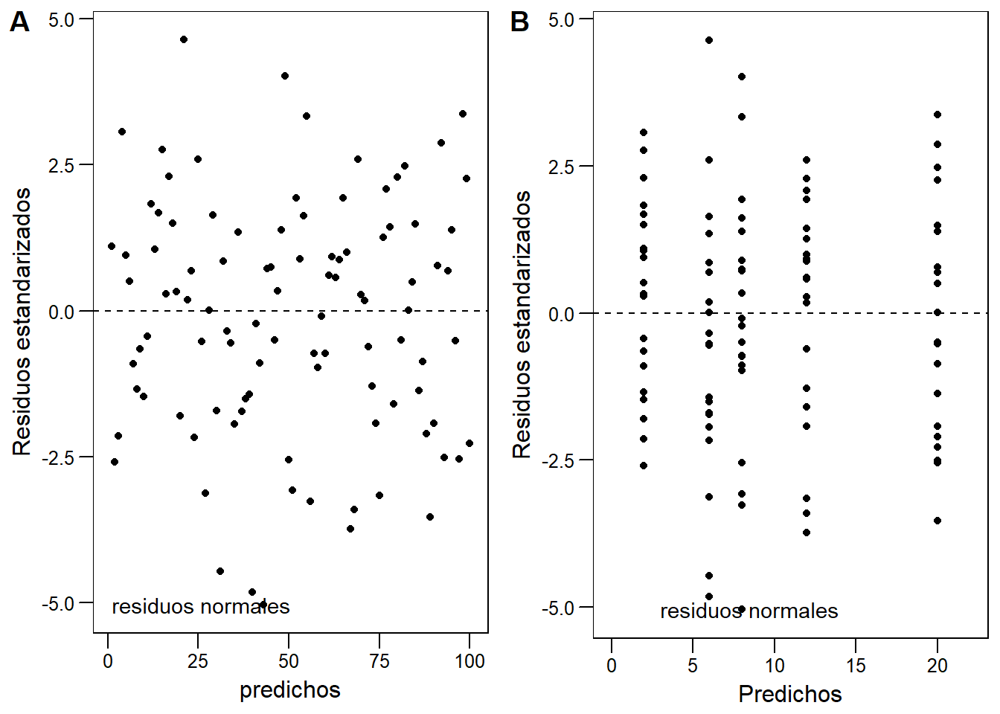

En el segundo caso vemos problemas clásicos como los gráficos en forma de *cono*, predichos más altos tienen mayor variabilidad.


Finalmente, dos casos distintos. En **D**, vemos residuos con un patrón de $x^2$, indica que nuestro modelo lineal no sigue el patrón de distribución de los datos. En **E**, vemos cómo modifica un outlier un gráfico al gráfico de residuos mostrado en **A**.


**Gráfico de puntos influyentes**   

Los puntos influyentes son aquellos con gran palanca o *leverage*. Formalmente, dada la matriz de diseño de nuestro modelo $\mathbf{X}$ y la matriz de proyección $\mathbf{H}=\mathbf{X} \ (\mathbf{X}^{\mathsf{T}}\mathbf{X})^{-1} \ \mathbf {X} ^{\mathsf{T}}$, el leverage para la observación $i$ está definido como el elemento $i$ de la diagonal de la matriz $\mathbf{H}$ ($h_{ii}=\mathbf{H}_{ii}$).  

Cuando tenemos pocas variables es fácil observarlos en el ajuste lineal.  

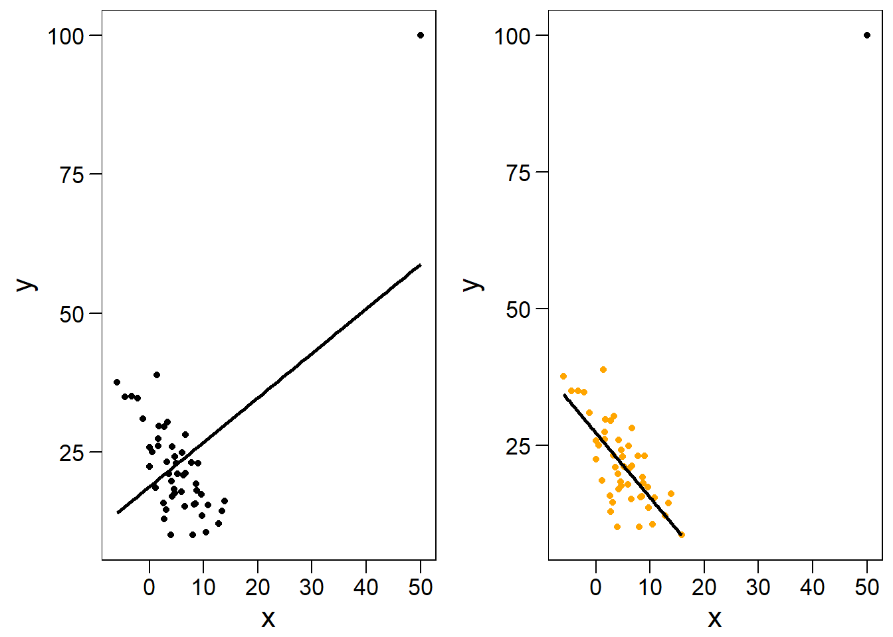

Vemos que aquellos puntos que están muy alejados en $x$ tienen gran influencia sobre el ajuste. En particular, si estos puntos no se alinean bien con el patrón general de los datos, pueden forzar el modelo hacia un ajuste erróneo. Es conveniente tener buena cobertura, es decir, tomar registros igualmente espaciados a lo largo del rango de $x$, para prevenir este tipo de eventos. En este caso, el punto en cuestión tiene alto residuo y alto leverage:


## Análisis de supuestos en R

Podemos explorar el ajuste y analizar el cumplimiento de supuestos en R utilizando la función `plot`, que maneja bien objetos `lm`.


```r
# Acomodamos las opciones gráficas para 4 gráficos en 2x2
par(mfrow = c(2, 2))
# graficamos el ajuste
plot(modelo_chocolate)
```


### Cuando los residuos no son normales

## Visualizando residuos en R

Este modelo asume que los errores están normalmente distribuidos alrededor de la esperanza. Formalmente, pedimos $\mathcal{E}_i \sim \  \mathcal{N}(\mu,\,\sigma^{2})$ donde $\mu=0$ y $\sigma^{2} \approx cte$. 

En el `modelo_chocolate` este supuesto se cumple (lo armamos de ese modo[^check_residuals]). En esta sección quiero explorar los residuos de los modelos lineales y brindar herramientas gráficas para conceptualizar mejor lo que la regresión está haciendo con nuestros datos.  

En esta sección voy a modificar los datos de chocolate para que el ajuste sea peor y permita visualizar los residuos mejor (básicamente agregamos ruido en dosis). 


```r
# Agregar ruido en dosis creando nueva columna
datos$nueva_dosis <- datos$dosis + rnorm(100,10,10)
# Calcular el nuevo modelo
nuevo_modelo <- lm(data = datos,
                   respuesta~nueva_dosis)
# Guardar los predichos del modelo en datos
datos$nuevo_pred <- nuevo_modelo$fitted.values
# Guardar los residuos
datos$residuos <- nuevo_modelo$residuals 
# Veamos la data
fit_plot <- ggplot(datos, aes(nueva_dosis, respuesta))+
    geom_smooth(method="lm", se=FALSE, color="lightgray")+      
    geom_point(alpha = 0.5) +
    theme_base()+
    theme(plot.background = element_rect(colour = NA))+
    xlab("Dosis Chocolate (gr)")+
    ylab("Felicidad")

fit_plot
```

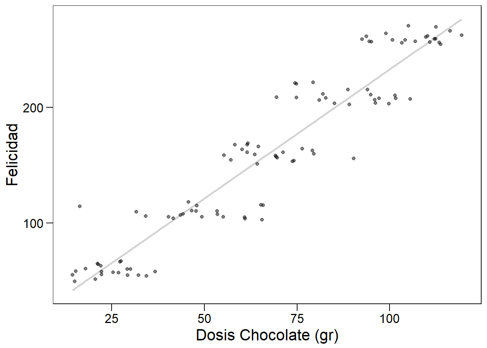

En este gráfico vemos que el ajuste sigue siendo bueno, pero hay mayor cantidad de puntos alejados de la recta. En vez de la recta de ajuste, usemos sólo los predichos.


```r
# Graficar
pre_plot <- ggplot(datos, aes(nueva_dosis, respuesta))+
  geom_point()+
  # Agregamos los predichos en una nueva capa!
  geom_point(aes(nueva_dosis, nuevo_pred), color="gray50", pch=1) +
  theme_base()+
  theme(plot.background = element_rect(colour = NA))+
  xlab("Dosis Chocolate (gr)")+
  ylab("Felicidad")
pre_plot
```

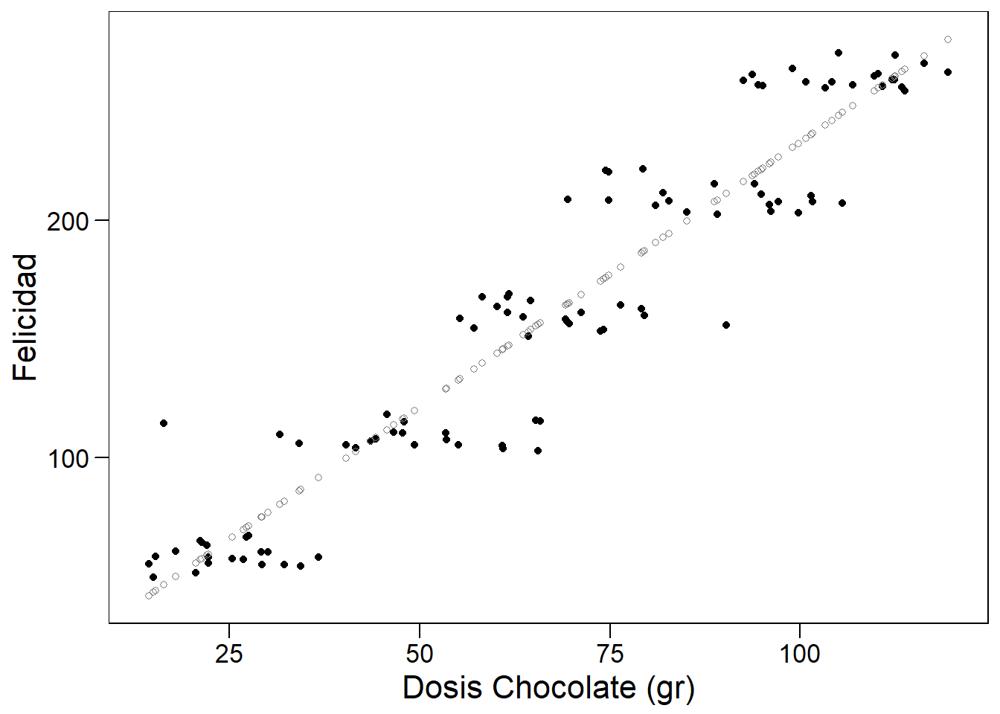

Como vemos, los predichos están alineados perfectamente en la regresión. Podemos agregar los residuos de la siguiente forma:


```r
pre_plot +
  geom_segment(aes(xend = nueva_dosis, yend = nuevo_pred),
               alpha=0.5)
```


Lo que nuestra regresión está realizando es minimizar la suma de los residuos al cuadrado (ver Ecuación \@ref(eq:residuo2)). Una herramienta para visualizar mejor los puntos con residuos grandes es graficarlos utilizando una escala de color.


```r
ggplot(datos, aes(nueva_dosis, respuesta))+
  #Agregamos opción de color dentro del geom_point()
  geom_point(aes(color = residuos))+ 
  geom_point(aes(nueva_dosis, nuevo_pred), color="gray50", pch=1) +
  geom_segment(aes(xend = nueva_dosis, yend = nuevo_pred),
               alpha=0.5)+
  theme_base()+
  theme(plot.background = element_rect(colour = NA))+
  xlab("Dosis Chocolate (gr)")+
  ylab("Felicidad")+
  # Agregamos color segun los residuos
  scale_color_gradientn(colours = c("red", "black", "red"))+
  # Sacamos la leyenda
  guides(color = FALSE)
```

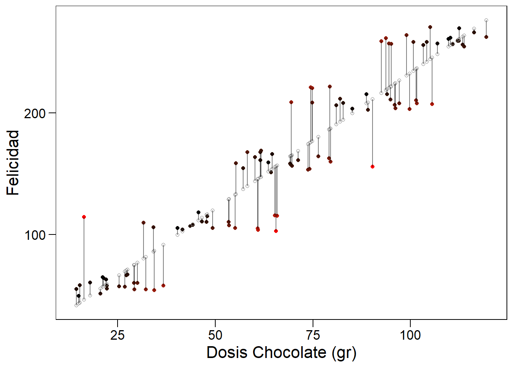


## Descomponiendo variabilidad


```r
# Creamos un grafico base al que agregaremos varias capas
grafico_base <- ggplot(datos, aes(nueva_dosis, respuesta))+
    geom_hline(yintercept = mean(datos$respuesta))+
    geom_point() +
    theme_base(base_size = 12)+
    theme(plot.background = element_rect(colour = NA))+
    xlab("Dosis Chocolate (gr)")+
    ylab("Felicidad")+
    annotate("text", label = "media global",
             x = 30, y = mean(datos$respuesta) + 15,
             size = 4, colour = "black")

# Variacion respecto de la media global
variacion_total <- grafico_base +
      geom_segment(aes(xend=nueva_dosis,
                       yend=mean(datos$respuesta)),
                       alpha=0.5)+
      ggtitle("Variación total")

# Variacion no explicada
variacion_explicada <- grafico_base+
 geom_smooth(method="lm", se=FALSE, color="lightgray")+
  geom_point(aes(nueva_dosis, nuevo_pred), color="gray50", pch=1) +
  geom_segment(aes(xend = nueva_dosis, y = mean(datos$respuesta),
                   yend = nuevo_pred), alpha=0.5)+
  ggtitle("Variación explicada")  


# Variacion explicada por el modelo
variacion_no_explicada <- grafico_base +
  geom_smooth(method="lm", se=FALSE, color="lightgray")+
  geom_point(aes(nueva_dosis, nuevo_pred), color="gray50", pch=1) +
  geom_segment(aes(xend = nueva_dosis, yend = nuevo_pred),
               alpha=0.5)+
  ggtitle("Variación no explicada")  
    

# Los tres graficos juntos
cowplot::plot_grid(variacion_total, variacion_explicada, variacion_no_explicada)    
```

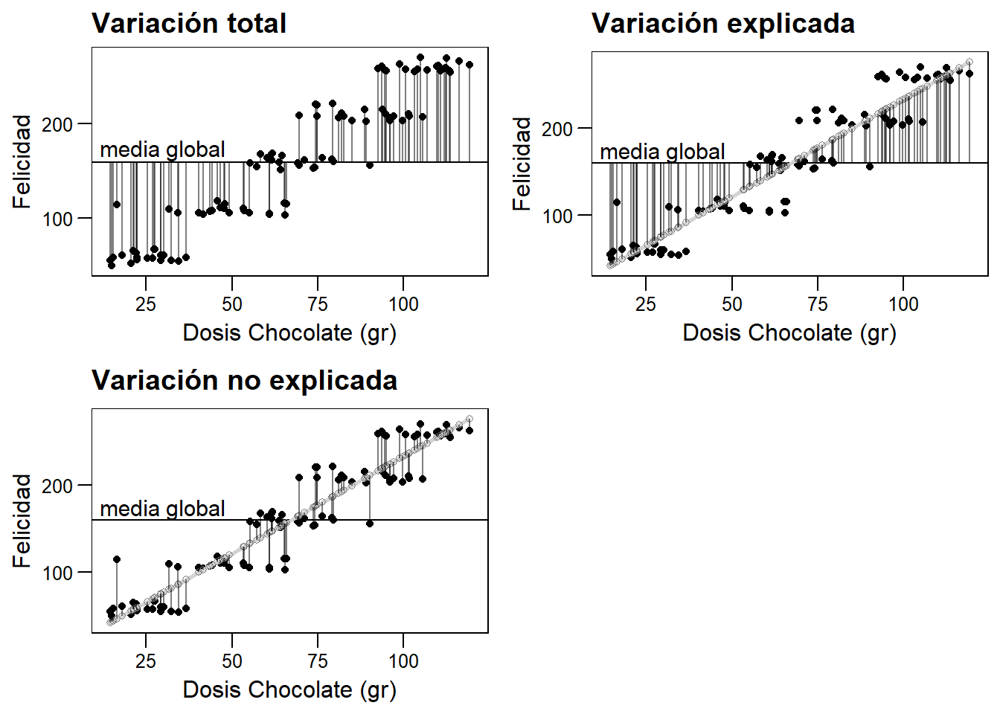


## ¿Por qué hacer una regresión?

Los objetivos de realizar un análisis de regresión pueden resumirse en: 

1. Describir la relación funcional entre X e Y (rectilínea, polinomial,
cuadrática, …)
1. Determinar cuánta de la variación en Y puede ser explicada por
la variación de X y cuánto permanece sin explicar.
1. Estimar los parámetros del modelo.
1. Hacer inferencia sobre los parámetros del modelo (mediante pruebas de
hipótesis y cálculo de intervalos de confianza).
1. Predecir nuevos valores de Y para valores específicos de X en
el dominio estudiado (interpolación dentro del rango de la(s) variable(s) predictora(s)).

## Resumen


## Recursos

* Un gran ejemplo para visualizar residuos [aquí](https://drsimonj.svbtle.com/visualising-residuals)
* Una función que utiliza ggplot para crear gráficos de diagnóstico de modelos [aquí](https://rpubs.com/therimalaya/43190)

[^michaelis]: Más información en la cinética enzimática [aquí](https://es.wikipedia.org/wiki/Cin%C3%A9tica_de_Michaelis-Menten). 
[^tilde]: Si no puedes localizar la tilde en tu teclado, prueba `ALT+126`
[^check_residuals]: Cuando creamos el modelo, explícitamente definimos variación en y con la función `rnorm()`, con media 0 y sd. Para comprobar que el supuesto se cumple, puedes correr `mean(modelo_chocolate$residuals)` que dará como resultado un número muy pequeño, empíricamente cero. Además del qqplot, existen pruebas analíticas para normalidad: `shapiro.test(datos$residuos)` nos da un p>0.05, que indica que no tenemos evidencias para decir que los residuos no siguen una distribución normal. 

<!--chapter:end:05-Modelos_Lineales.Rmd-->

# Comunicación

El trabajo estadístico no termina cuando entendemos la estructura de los datos. Nuestro trabajo estará incompleto a menos que logremos llevar aquello que destilamos de la evidencia a la combinación correcta de palabras e imagenes que logren recrear el mensaje en otra mente.  

La mayoría de los usos a continuación requieren cierta familiaridad con los sistemas de control de versiones (por ejemplo, GIT) y plataformas online basadas en dichos sistemas (por ejemplo, GitHub). Dicho material excede a la complejidad de este libro[^git].

## Ciencia reproducible

## Gráficos

## RMarkdown

Markdown es un lenguage de marcado ligero que permite agregar marcajes sencillos al texto plano (`.md`), para convertirlo en un poderoso conjunto de operaciones que pueden exportarse a formatos de publicación profesional como `.html`, `.pdf` y `.tex`[^markdown-wiki]. *RMarkdown* es la implementación de Markdown dentro de Rstudio. RMarkdown posee toda la funcionalidad de Markdown y además permite introducir trozos de código.  

Los archivos de Rmarkdown son archivos de texto con extensión `.Rmd`. Podemos crearlo dentro de Rstudio desde el mismo menú con el que abrimos scripts.  


Al abrirlo, un navegador nos permitirá seleccionar opciones (como el título, autor, etc). No me centraré en esa ventana debido a que todas estas opciones pueden modificarse en el encabezado del nuevo archivo `.Rmd`.   

## Texto

Markdown es un lenguaje que permite escribir de manera veloz, con muy pocas distracciones. La funcionalidad para editar la presentación de texto es limitada, pero es más que suficiente para el 99% de las cosas que necesitamos al escribir. Los siguientes ejemplos están ordenados segun cómo se escriben en Rmarkdown y cómo es el render.


`Lo esencial es *invisible* a los ojos.` $\rightarrow$ Lo esencial es *invisible* a los ojos.  
`Lo esencial es **invisible** a los ojos.` $\rightarrow$ Lo esencial es **invisible** a los ojos. 
`Lo esencial es ~~in~~visible a los ojos.` $\rightarrow$ Lo esencial es ~~in~~visible a los ojos. 

Si tienes familiaridad con $\LaTeX$ es posible utilizarlo para fórmulas matemáticas en línea con la frase que se está escribiendo. Por ejemplo, un supuesto de los modelos lineales generales es $\mathcal{E}_i \sim \  \mathcal{N}(\mu,\,\sigma^{2})$. Utilzar $\LaTeX$ en RMarkdown es tan sencillo como englobar el código utilizando el símbolo `$`. Si queremos utilizar una ecuación, por ejemplo, utilizamos los entornos `\begin{equation}` y `\end{equation}` y escribimos sin necesidad de utilizar el símbolo `$`.  

Para utilizar resaltado tipo `código` en línea utilizamos palabras envueltas en *backticks* (`` ` ``)[^backticks]. Podemos utilizar código de R en la línea en la que estamos escribiendo de la forma `r`+`espacio`+`función deseada`. Por ejemplo, si combinamos con $\LaTeX$ y le preguntamos a R cuánto es $\pi$, nos dará el resultado en la misma línea así: $\pi$ = 3.1415927[^en-mi-pc].

## Separando líneas y párrafos

La belleza de Rmarkdown es que acomoda el texto y las figuras automáticamente, por lo que no debemos preocuparnos por el número de líneas y demás problemas que aparecen con un editor de texto tradicional. Sin embargo, en ciertas ocasiones realmente deseamos forzar un quiebre, un espacio extra. Para separar párrafos, basta con terminar la línea que se está escribiendo con dos espacios. Por ejemplo,  

*No te des por vencido, ni aún vencido, no te sientas esclavo, ni aún esclavo;*  

Puede transformarse en:  

*No te des por vencido, ni aún vencido,*  
*no te sientas esclavo, ni aún esclavo;*  

Si agregamos dos espacios entre las palabras deseadas[^normalmente].  

Las listas de objetos son un caso puntual muy útil:

```
# Listas no numeradas
* item 1
* item 2
+ sub-item
* item 3
    * sub-item
    * sub-item

```
Se ve así:  

* item 1
* item 2
+ sub-item
* item 3
    * sub-item
    * sub-item

```
# Listas numeradas
1. item 1
1. item 2
1. item 3
    a) item 3a
    a) item 3b
```
Se ve así:  

En las listas numeradas no debemos mantener la cuenta. Simplemente `1. ` y escribimos lo que necesitamos, Markdown hace el resto!  

Otra posibilidad es utilizar texto resaltado. Para resaltar texto utilizamos el símbolo mayor (>) seguido de un espacio. Esta opción no es recomendada para uso extensivo, pero puede resaltar una frase corta de un modo interesante. Por ejemplo,  

> R es genial.

Cuando terminamos una sección o deseamos una marca física entre párrafos, podemos usar 3 asteriscos (*).  

```
# Línea
***
```

Se ve:  

***

## Trozos de código

En Rmarkdown podemos mezclar texto y código de R. La siguiente figura muestra cómo se ve en mi computadora:  


Cuando estos trozos se agregan al documento final, corren en la consola de R y el output se incluye en los resultados. Por ejemplo, el siguiente trozo:


```r
summary(cars)
```

```
##      speed           dist       
##  Min.   : 4.0   Min.   :  2.00  
##  1st Qu.:12.0   1st Qu.: 26.00  
##  Median :15.0   Median : 36.00  
##  Mean   :15.4   Mean   : 42.98  
##  3rd Qu.:19.0   3rd Qu.: 56.00  
##  Max.   :25.0   Max.   :120.00
```

## Links e imágenes

Los links e imágenes pueden incluirse utilizando corchetes ([]) y paréntesis. Por ejemplo,

```
# Imágenes

# URLs
[descripción de mi link](link)
```
El link puede ser un directorio dentro de nuestra computadora (`imagenes/vacaciones/.png`) o via `www` con un link externo, como 

## Encabezado YAML

Los encabezados son útiles para diversos archivos, ciertamente necesarios para la organización de documentos más complejos. Rmarkdown utiliza un encabezado conocido como YAML y tiene la siguiente forma:

```
--- 
title: "Un mundo feliz"
author: "Aldous Huxley"
date: "1932"
output: html_document
---
```

Por ejemplo, el encabezado de este libro es el siguiente[^encabezado]:

```
--- 
title: "Introducción a estadística con R"
author: "Matias Andina"
date: "2018-07-28"
site: bookdown::bookdown_site
documentclass: book
---

```

Notarán algunas variaciones, por ejemplo, en la fecha. El llamado a `Sys.Date()` permite que cada vez que este libro se compila, se use la fecha de sistema para el compilado., De este modo, no tengo que actualizarlo manualmente cada vez que edito el libro.  

## Otros proyectos con RStudio

* Presentaciones de diapositivas con Markdown y `R presentation`.
* Usando el paquete `blogdown`, Websites como [este](http://matiasandina.netlify.com)
* Usando el paquete `bookdown`, libros como éste ([y otros!](bookdown.org))

## Notas

Mucha tecnología cotidiana detrás de los servicios de publicación está principalmente desarrollada alrededor del idioma inglés. Problemas inesperados pueden aparecer incluso cuando hacemos todo bien utilizando R, Rstudio y Rmarkdown. Por ejemplo, mientras escribía este libro tuve un problema con el nombre de mis archivos que contenían tilde (por ejemplo, el archivo de este capítulo era "Comunicación.Rmd"). La inconveniente `ó` provocó que el link a ciertas imágenes del capítulo (`www. .../Comunicación/imagen-01.png`) no pudiera ser encontrado y dichas imágenes no aparecieran. La solición de compromiso es (como en muchas otras direcciones de internet) no utilizar caracteres que no existen en inglés (por ejemplo, la ñ, o palabras con tildes).

## Recursos

* Cheatsheet oficial de Rmarkdown en español por Rstudio [aquí](https://www.rstudio.com/wp-content/uploads/2015/03/rmarkdown-spanish.pdf)

[^encabezado]: El encabezado que muestro es una porción que es comparable con un documento clásico. El encabezado real contiene ciertas especificaciones para que este libro pueda ser publicado online y entiendo que no aportan al ejemplo.
[^markdown-wiki]: Puedes encontrar más información sobre Markdown[aquí](es.wikipedia.org/markdown)
[^git]: Puedes aprender sobre GIT [aquí](https://git-scm.com/book/es/v1/Empezando)
[^normalmente]: Normalmente suelo agregar un enter y escribir en la siguiente línea. Aunque no es necesrario, me ayuda a visualizar el render antes de tiempo.
[^backticks]: Los backtics son difícilies de encontrar en el teclado en español, puedes probar ALT+96.
[^en-mi-pc]: Para lograr esto el formato debe ser `` $\pi$ = 3.1415927 ``

<!--chapter:end:06-Comunicacion.Rmd-->

# Agradecimientos {-}


<!--chapter:end:09-Agradecimientos.Rmd-->

