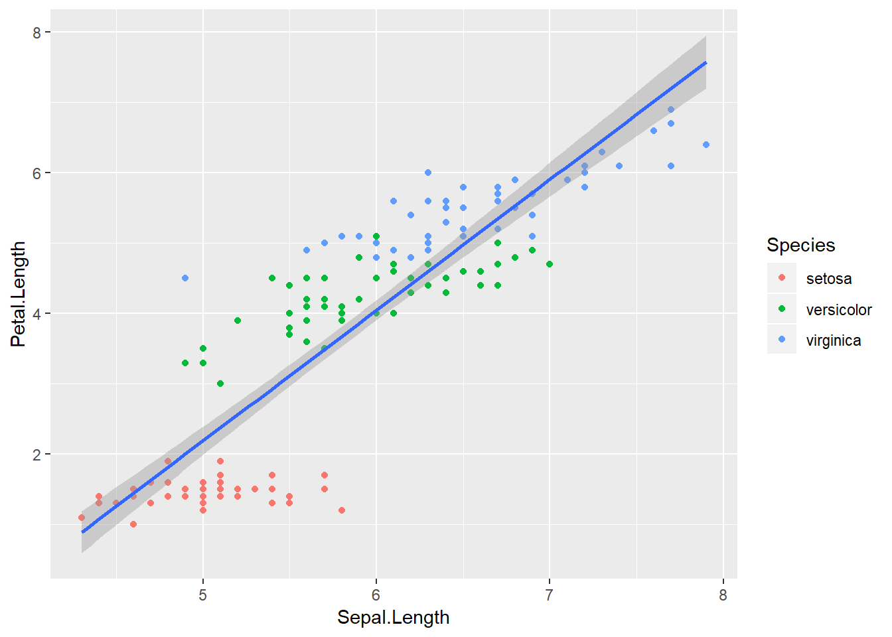
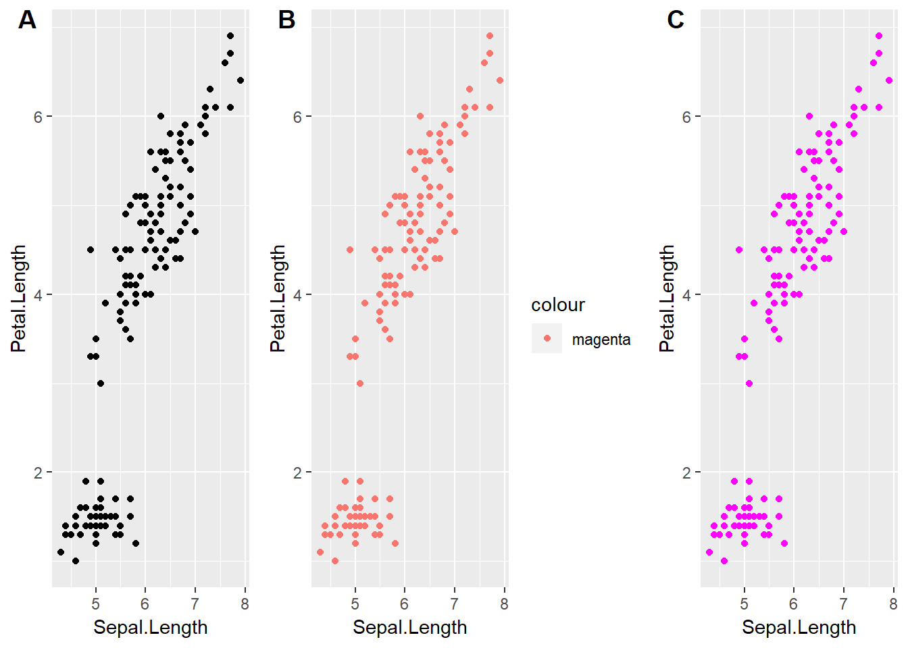
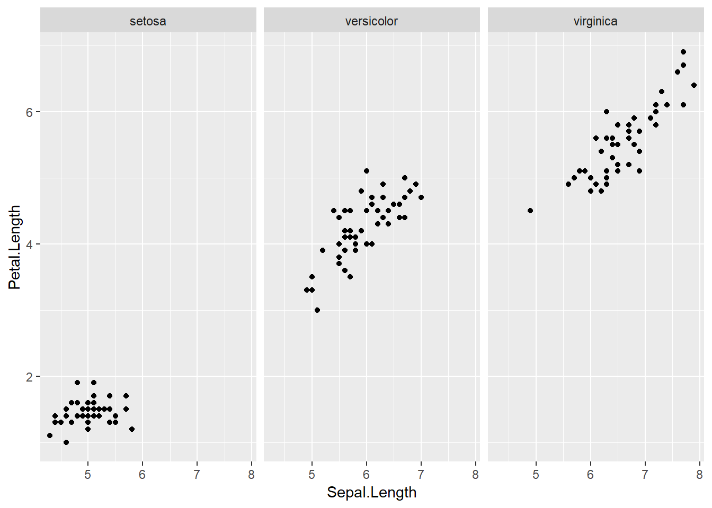
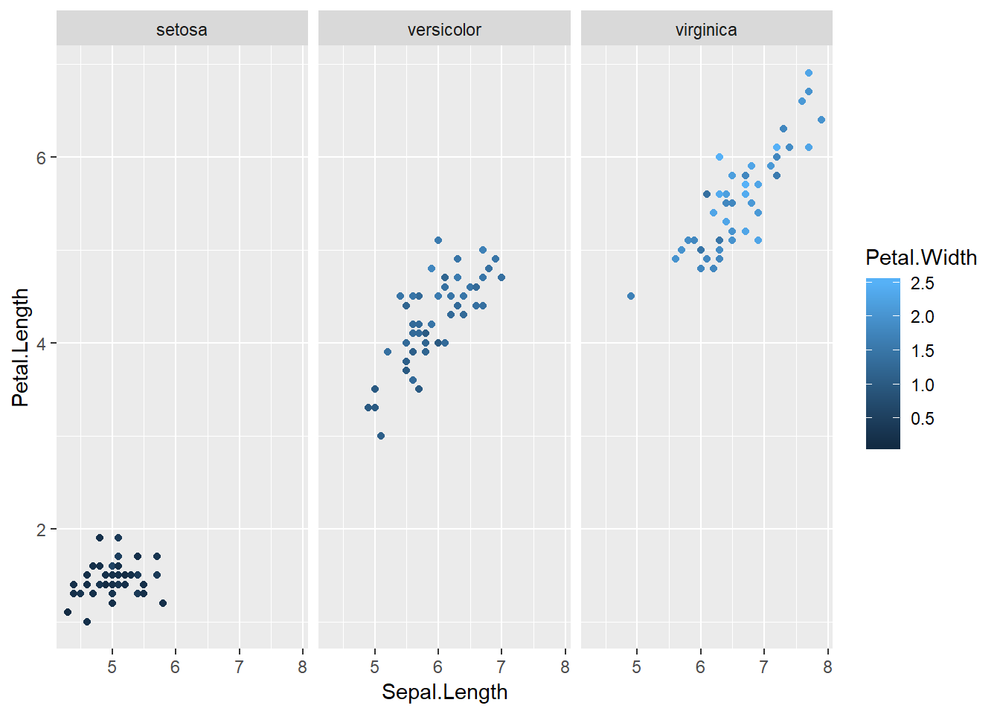
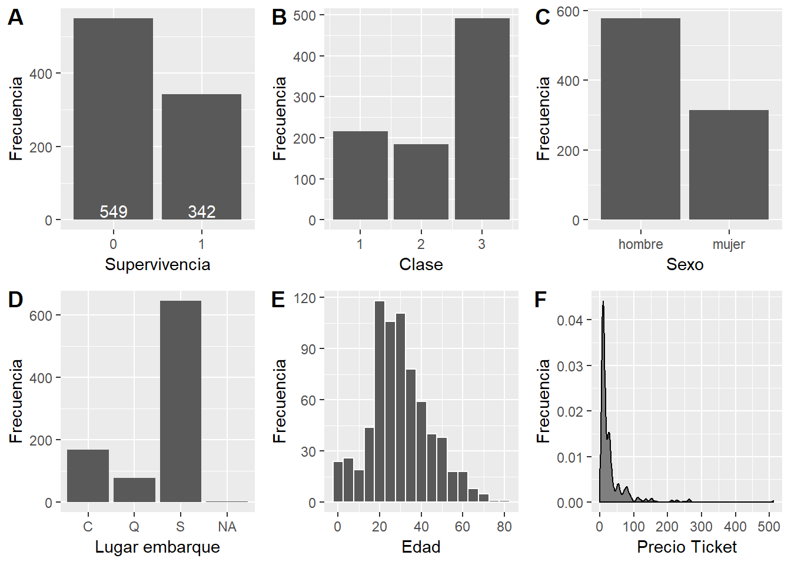
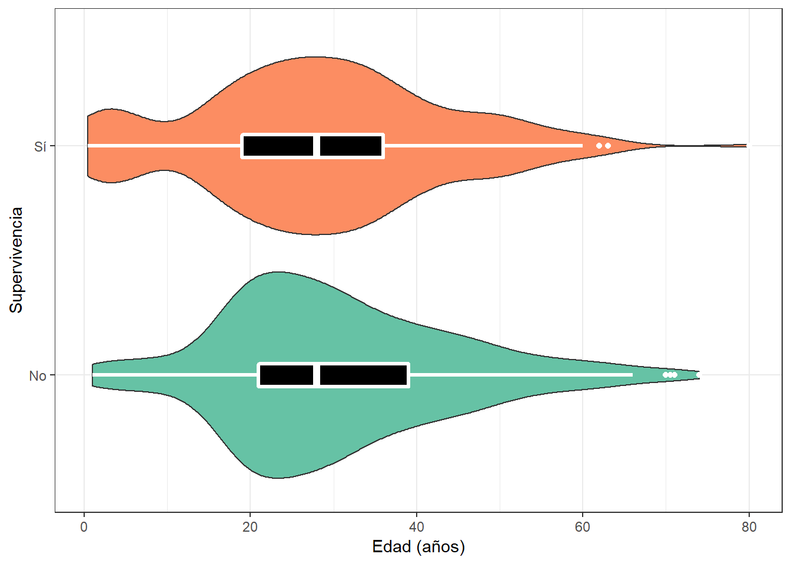
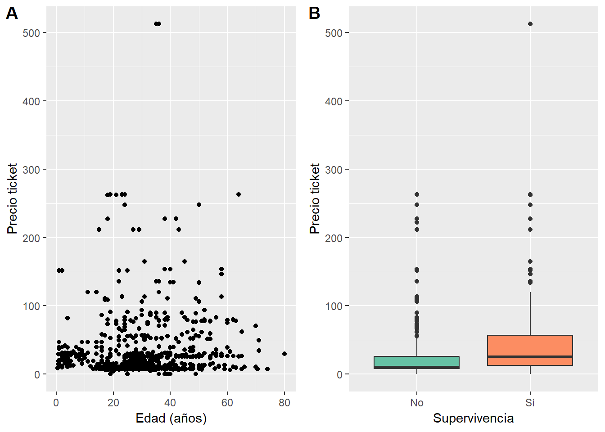
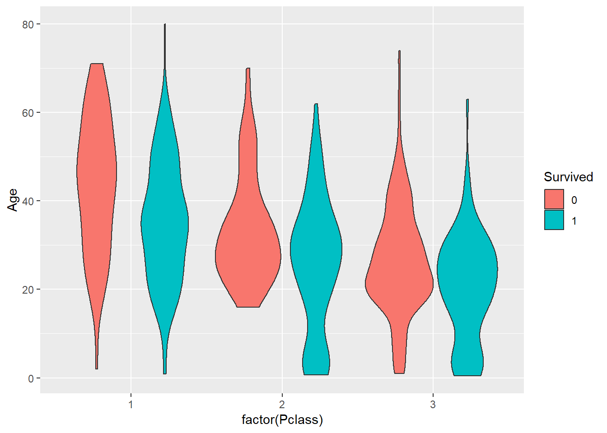

# Exploración de Datos

Los humanos somos animales fuertemente dependientes en nuestra visión, así hemos evolucionado. Por lo tanto, no es sorpendente que la herramienta más útil para comprender datos sea utilizar una gráfica.

## Gráficos de base

R posee funcionalidad gráfica de base. Con relativa facilidad podemos hacer una gráfica de dos variables (por ejemplo, una hipotética variable respuesta en el tiempo). 


```r
tiempo <- c(1:10)
respuesta <- c(1:4, seq(10, 20, 2))  

plot(tiempo,respuesta,
     type='b',
     pch=19,
     col="black",
     main = "Respuesta vs tiempo",
     ylab = "Respuesta",
     xlab = "Tiempo")
```


Esta funcionalidad no está limitada a gráficos de puntos y líneas. Por ejemplo, el histograma que figura en el principio del libro fue realizado con la función `hist()`


```r
set.seed(123)
ejemplo <- rnorm(n = 10000, mean = 0, sd = 1)
hist(ejemplo, col='orange', breaks=40, 
     ylab = "Frecuencia", main = "Histograma ejemplo")
```


Los gráficos de base son geniales para explorar modelos ya que aceptan objetos de tipo  `lm` (ver siguientes capítulos). Si bien es posible realizar gráficos muy bonitos con la funcionalidad de base, incluso gráficas de calidad para publicación impresa, es cierto que la gramática no es sencilla de recordar (o requiere demasiada previsión) y, en muchos casos, es limitada.

## ggplot2

Una forma más intuitiva de construir gráficas es utilizar *capas*. El paquete `ggplot2` pertenece al `tidyverse` y es el más utilizado para realizar gráficas de alta calidad en R.  

El paquete se basa en una gramática de gráficos que puede ser entendida a partir de entender sus componentes[^estan-en-ingles]:

* **Data** es aquél dataset que vamos a graficar, con toda la información pertinente para realizar el gráfico.  
* **geoms** son representaciones para dibujar gráficos (puntos, líneas, cajas, entre otros).  
* **Stats** son aquellas transformaciones estadísticas que le hagamos a los datos. Nos ayudan a hacer un resumen del dataset para visualizar mejor (por ejemplo, la media o la mediana son estadísticas de tendencia central).  
* **Scales** nos ayudan a colorear (o escalar) la data según distintas variables. Dibujan los ejes y las leyendas.  
* **Coordinate Systems** describe how geoms are mapped to the plane of the graphic.  
* **Facets** nos permiten partir el dataset según factores para graficar en viñetas separadas.  
* **Themes** son conjuntos de especificaciones gráficas que permiten controlar la apariencia general de todos los elementos que no son data (por ejemplo, el color del fondo o el ancho de los ejes).  

A lo largo de la explicación utilizaré el dataset **iris**, que contiene medidas de las ojas de tres especies de plantas:


```r
head(iris)
```

```
##   Sepal.Length Sepal.Width Petal.Length Petal.Width Species
## 1          5.1         3.5          1.4         0.2  setosa
## 2          4.9         3.0          1.4         0.2  setosa
## 3          4.7         3.2          1.3         0.2  setosa
## 4          4.6         3.1          1.5         0.2  setosa
## 5          5.0         3.6          1.4         0.2  setosa
## 6          5.4         3.9          1.7         0.4  setosa
```


Veamos cómo se construye capa por capa un gráfico utilizando `ggplot2` y los datos de `iris`. Para entender cómo funciona, es importante entender el argumento `aes()`, que permite indicar qué pondremos en los ejes *XY* y además permite . Veamos el ejemplo:


```r
library(ggplot2)

ggplot(data=iris,
       aes(Sepal.Length, Petal.Length))
```


Este gráfico contiene los ejes que especificamos pero no contiene los datos. Para dibujarlos, debemos decirle a `ggplot` cómo hacerlo (por ejemplo, puntos).


```r
ggplot(iris, aes(Sepal.Length, Petal.Length)) +
  geom_point()
```


Al parecer, los datos presentan una estructura de asociación entre el largo de los sépalos y el de los pétalos (a mayor largo de sépalos, mayor largo de pétalos). Este dataset contiene un factor *Species* con tres niveles, *setosa*, *versicolor*, *virginica*. Fácilmente podemos ver si las distintas especies presentan distintas asociaciones. Una forma rápida de visualizarlo es coloreando los puntos según el nivel del factor *Species*. En `ggplot2` usamos `color = Species`.


```r
ggplot(iris, aes(Sepal.Length, Petal.Length, color = Species)) +
  geom_point()
```


Podemos agregar una nueva capa con una línea de tendencia. Para hacerlo, especificamos un ajuste lineal ("lm") en `geom_smooth(method = "lm")`. Es clave notar que `geom_smooth()` posee distintos métodos cuya riqueza exploraremos en los siguientes capítulos.


```r
ggplot(iris, aes(Sepal.Length, Petal.Length, color = Species)) +
       geom_point() +
       geom_smooth(method = "lm")
```


Como pueden apreciar, incorporar la gramática de `ggplot2` permite realizar visualizaciones más complejas con menor esfuerzo. La riqueza de este grupo de funciones esta en la gran variedad de funciones `geom` que podemos incorporar. A lo largo de el libro veremos varias de ellas.

### Entendiendo `aes()`

En ggplot, `aes()` hace referencia al contenido estético del gráfico (del ingles *aesthetics*). Es decir, la función le dará indicios a ggplot2 sobre cómo dibujar los distintos trazos, formas, colores y tamaños. Es importante notar que `aes()` crea una nueva capa en relación a las variables y agrega leyendas a los gráficos. Al incorporar `aes()` al llamado de `ggplot()` estamos compartiendo la información en todas las capas. Si deseamos que esa información sólo esté en una de las capas, debemos usar `aes()` en la capa correspondiente. Esto puede parecer confuso, las siguientes líneas de código generan un gráfico que se ve idéntico al que realizamos previamente:


```r
ggplot(iris, aes(Sepal.Length, Petal.Length)) +
       geom_point(aes(color = Species)) # Notar diferencia! aes() aparece en geom_point()
```


Sin embargo, podemos ver la diferencia al intentar repetir el gráfico con línea de tendencia.


```r
ggplot(iris, aes(Sepal.Length, Petal.Length)) +
       geom_point(aes(color = Species))+
       geom_smooth(method="lm")
```



En este caso `geom_smooth()` no recibe la orden de agrupar segun `Species`, por ende, todos los datos son usados para construir el ajuste lineal. Este comportamiento nos permite gran versatilidad en los gráficos. Sin embargo, también permite que el usuario cometa algunos errores. Por ejemplo, intentemos cambiar todos los puntos del primer gráfico de negro a magenta:


```r
# Primer gráfico, izquierda

ggplot(iris, aes(Sepal.Length, Petal.Length)) +
       geom_point()

# Intento 1

ggplot(iris, aes(Sepal.Length, Petal.Length, color='magenta')) +
       geom_point()

# Intento 2

ggplot(iris, aes(Sepal.Length, Petal.Length)) +
       geom_point(color='magenta')
```



### Explorando `geom`

Los distintas funciones `geom` nos permiten obtener resultados gráficos distintos, aunque utilicemos los mismos datos. Analicemos el largo de los sépalos por especie.


```r
# Gráfico de puntos
p1 <- ggplot(iris, aes(Species, Sepal.Length)) +
       geom_point()

# Gráfico de puntos con ruido en el eje horizontal
p2 <- ggplot(iris, aes(Species, Sepal.Length)) +
       geom_jitter(width = 0.1)

# Boxplot

p3 <- ggplot(iris, aes(Species, Sepal.Length)) +
       geom_boxplot()

# Violin 
p4 <- ggplot(iris, aes(Species, Sepal.Length)) +
       geom_violin()

# Combinando boxplot y violin

p5 <- ggplot(iris, aes(Species, Sepal.Length)) +
       geom_violin(fill='orange', alpha=0.5)+
       geom_boxplot(color="white", fill="black",
                    lwd=0.8, width=0.2 )

# Grafico de barras con medias + SEM

p6 <- ggplot(iris, aes(Species, Sepal.Length)) +
      stat_summary(fun.y = mean, geom = "bar",
                   width=0.5) +
      stat_summary(fun.data = mean_se, geom = "errorbar",
                   color="red", width=0.5)
```

<div class="figure">

<p class="caption">(\#fig:six-plot-figure)Varias formas de mostrar los mismos datos.</p>
</div>


Este es un pequeño ejemplo de cómo los distintos `geoms` participan en la creación de gráficos. En **A** es difícil ver que los puntos están superpuestos, por eso en **B** usamos `geom_jitter()`, que da una buena idea de la distribución de los datos. Para resumir la información, es común utilizar gráficos de cajas o tipo violín (**C,D**). Notar que la combinación de `geoms` en capas permite fácilmente mezclar ambos gráficos (**E**). Al combinarlos, hemos cambiado cuestiones estéticas dentro de las capas para incrementar el contraste. Finalmente, otra forma común de hacer un resumen de datos es un gráfico de barras de tipo media ± SEM (**E**).

### Explorando `facet_wrap`

En otras secciones separamos datos categóricos utilizando color. En esta sección, veremos que es posible utilizar `facets` para separar las gráficas en distintas ventanas o viñetas.


```r
ggplot(iris, aes(Sepal.Length, Petal.Length)) +
  geom_point()+
  facet_wrap(~Species)
```



Este comportamiento es súmamente útil cuando tenemos más de una variable categórica o cuando deseamos utilizar el color para simbolizar otra variable. Por ejemplo, quizás nos interesa evaluar cómo varía el ancho de los pétalos en las distintas plantas.


```r
ggplot(iris, aes(Sepal.Length, Petal.Length)) +
     geom_point(aes(color=Petal.Width))+
     facet_wrap(~Species)
```



En este último gráfico hemos podido representar con claridad variaciones en la longitud de pétalos y sépalos, el ancho de los pétalos y una variable categórica de tres niveles. Los datos indican que las plantas con menor longitud de pétalos y sépalos también poseen pétalos más angostos. Efectivamente, explotar los recursos de `ggplot2` nos permite generar poderosas herramientas de análisis y comunicación estadística. 

### Cowplot

Los gráficos realizados en la sección previa (\@ref(explorando-geom)) muestran gráficos individuales que fueron *acomodados* distintos paneles. Para realizar esto, se ha utilizando el paquete `cowplot`. A continuación se muestra el código para realizar figura \@ref(fig:six-plot-figure)


```r
# Si es la primera vez
install.packages("cowplot")
# Graficar en grilla
cowplot::plot_grid(p1,p2,p3,p4,p5,p6, labels = "AUTO")
```

## Caso de estudio

El primer objetivo de un análisis exploratorio debe ser ganar entendimiento cualitativo de la naturaleza de los datos (tendencia central, distribución y estructura de correlación). Esto puede lograrse utilizando tablas de resumen, sin embargo, en mi opinión el análisis gráfico es superior.  

En este caso voy a mostrar un análisis exploratorio del dataset de Titanic, que puede ser obtenido desde CRAN.


```r
# Si es la primera vez,
install.packages('titanic')
```

El dataset contiene información sobre el destino de los pasajeros del barco. Carguemos los paquetes necesarios para trabajar.


```r
# Paquete útil para reorganizar datos (parte de tidyverse)
library(dplyr)
# Cargamos el paquete titanic
library(titanic)
```

Vamos a trabajar con el dataset llamado `titanic_train`. En este caso es útil conocer a las variables que estaremos manejando. Puedes acceder al nombre de las variables con el comando `names(titanic_train)`. Aquí hay una tabla con las descripciones de las variables.


Variable Inglés   Descr. Español                    Tipo de variable   Valores                                        
----------------  --------------------------------  -----------------  -----------------------------------------------
survival          Supervicencia                     dicotómica         no, si (0, 1)                                  
pclass            Clase                             factor             1, 2, 3                                        
sex               Sexo                              continua           0+                                             
Age               Edad en años                      continua           0+                                             
sibsp             # de hermanos o esposas a bordo   continua           0+                                             
parch             # padres a bordo                  continua           0+                                             
ticket            Número de ticket                  caracter           [A-Z][0-9]                                     
fare              Valor del ticket                  continua           0+                                             
cabin             Número de cabina                  caracter           [A-Z][0-9]                                     
embarked          Puerto en donde embarcaron        factor             Cherbourg (C), Queenstown (Q), Southampton (S) 

Podemos utilizar la función `str()` para obtener una descripción rápida del tipo de datos que tenemos. Podemos ver que el dataset no necesariamente contiene las variables en las clases que queremos (por ejemplo, algunos factores están como `character`).  


```r
str(titanic_train)
```

```
## 'data.frame':	891 obs. of  12 variables:
##  $ PassengerId: int  1 2 3 4 5 6 7 8 9 10 ...
##  $ Survived   : int  0 1 1 1 0 0 0 0 1 1 ...
##  $ Pclass     : int  3 1 3 1 3 3 1 3 3 2 ...
##  $ Name       : chr  "Braund, Mr. Owen Harris" "Cumings, Mrs. John Bradley (Florence Briggs Thayer)" "Heikkinen, Miss. Laina" "Futrelle, Mrs. Jacques Heath (Lily May Peel)" ...
##  $ Sex        : chr  "male" "female" "female" "female" ...
##  $ Age        : num  22 38 26 35 35 NA 54 2 27 14 ...
##  $ SibSp      : int  1 1 0 1 0 0 0 3 0 1 ...
##  $ Parch      : int  0 0 0 0 0 0 0 1 2 0 ...
##  $ Ticket     : chr  "A/5 21171" "PC 17599" "STON/O2. 3101282" "113803" ...
##  $ Fare       : num  7.25 71.28 7.92 53.1 8.05 ...
##  $ Cabin      : chr  "" "C85" "" "C123" ...
##  $ Embarked   : chr  "S" "C" "S" "S" ...
```

Cambiemos un par de cosas.


```r
# Transformamos en factor
titanic_train$Survived <- factor(titanic_train$Survived)
# Transforamamos al castellano
titanic_train$Sex <- ifelse(titanic_train$Sex == "male",
                            "hombre",
                            "mujer")
# Transformamos una varibale con valor "" a NA
titanic_train$Embarked <- ifelse(titanic_train$Embarked == "",
                                 NA,
                                 titanic_train$Embarked)
```


Ahora sí, empecemos a entender el dataset gráficamente, una variable a la vez. Cada visualización responde a una pregunta respecto de la variable en cuestión.  


```r
# Calculamos la supervivencia segun el factor Survived
sobrev <- titanic_train %>%
          group_by(Survived) %>%
          count()

# Supervivencia
# Cuál es el número de sobrevivientes?
g1 <- ggplot(titanic_train, aes(Survived)) +
  geom_bar()+
  # Agregamos la cuenta de sobrevivientes
  # Notar que debemos utilizar otro data.frame en data
  # vamos a utilizar y=20 para posicionar los n cerca del eje x
  geom_text(data = sobrev,
            aes(Survived, y=25, label=n),
            color="white")+
  xlab("Supervivencia")+
  ylab("Frecuencia")

# Clase
# Cuál es la cantidad de pasajeros en cada clase?
g2 <- ggplot(titanic_train,
             aes(Pclass))+
  geom_bar()+
  xlab("Clase")+
  ylab("Frecuencia")


# Sexo
# cuántos hombres y mujeres a bordo?
g3 <- ggplot(titanic_train,
             aes(Sex))+
  geom_bar()+
  xlab("Sexo")+
  ylab("Frecuencia")

# Lugar de embarque
# dónde (en qué puerto) subió la gente al barco?
g4 <- ggplot(titanic_train,
             aes(Embarked))+
  geom_bar()+
  xlab("Lugar embarque")+
  ylab("Frecuencia")

# Edad de los pasajeros
# Cuál es la distribución de edades de los pasajeros?
g5 <- ggplot(titanic_train,
             aes(Age))+
  geom_histogram(binwidth = 5, color="white")+
  xlab("Edad")+
  ylab("Frecuencia")


# Precio del ticket
# Cuánto costaba subir al Titanic?
g6 <- ggplot(titanic_train,
             aes(Fare))+
  geom_density(fill="gray50")+
  xlab("Precio Ticket")+
  ylab("Frecuencia")


# Graficar todo junto!
cowplot::plot_grid(g1,g2,g3,g4,g5,g6,
                   labels="AUTO")
```



Estos gráficos son bastante típicos. En esta sección concentro nuestros esfuerzos en entender el dataset rápidamente. Es posible hacer gráficos que comuniquen mejor. Más adelante retomaremos desde este punto (ver Sección \@ref(graficos)).  

Ahora vamos a centrarnos en entender relaciones entre más de una variable.


```r
ggplot(titanic_train, 
       aes(Sex, Survived))+
  # Coloreamos segun la interaccion entre los niveles de interes
  geom_jitter(aes(color=interaction(factor(Sex), Survived)),
              alpha=0.5)+
  # Separamos por clase
  facet_wrap(~Pclass)+
  # Nombramos al eje
  ylab("Supervivencia")+
  # Agregamos un eje y descriptivo
  scale_y_discrete(breaks=c("0","1"),
        labels=c("No", "Sí"))+
  # Sacamos la leyenda
  theme(legend.position = "none")+
  # mejoramos los colores
  scale_color_brewer(palette = "Set2")+
  # Titulo
  ggtitle("Supervivencia por clase")
```


En el gráfico anterior podemos apreciar claramente que las mayor supervivencia se dio en las mujeres, y luego en las clases altas, siendo "hombre en tercera clase" la peor combinación. 

> Ejercicio: Calcular % sobrevivientes


```r
# Calcular el porcentaje segun la clase
titanic_train %>%
  # Agrupar por clase y sexo
  # contar los sobrevivientes
  # sumar el total de casos
  # dividir por el total y expresar en porcentaje
```


Podemos explorar cómo se relaciona la edad con la supervivencia. En el siguiente gráfico vemos que prácticamente no hay diferencias en supervivencia según las edades (quizás sí existen pequeñas diferencias para los niños menores de 10 años).  


```r
ggplot(titanic_train,
       aes(Survived, Age, fill=Survived))+
  geom_violin()+
  geom_boxplot(fill="black", color="white",
               lwd=1.1, width=0.1)+
  theme_bw()+
  scale_fill_brewer(palette = "Set2")+
  theme(legend.position = "none")+
  xlab("Supervivencia")+
  ylab("Edad (años)")+
  scale_x_discrete(breaks=c("0","1"),
        labels=c("No", "Sí"))+
  # Rotamos los ejes!
  coord_flip()
```



> Ejercicio: Analizar sobrevivientes vs edad (por clase)


```r
# La base de este gráfico es la misma que la del anterior
# Debemos cambiar el x a Pclass 
# (cuidado, necesitamos que Pclass sea un factor). Como queda el fill?
ggplot(titanic_train,
       aes(x= ..., Age, fill=...))+
  # Resto de los componentes?
```

Veamos algunos componentes relacionados con el precio de los tickets. En general, podemos ver que, independientemente de la edad, el precio estaba por debajo de 50, con algunas notables excepciones en cero o por encima de 500 (**A**)!. También podemos ver que aquellos que pagaron más parecieran haber estado en el grupo de los sobrevivientes (**B**).


```r
# Edad vs Precio ticket
p1 <- ggplot(titanic_train, aes(Age, Fare)) +
  geom_point()+
  xlab("Edad (años)")+
  ylab("Precio ticket")

p2 <- ggplot(titanic_train, aes(Survived, Fare)) +
  geom_boxplot(aes(fill=Survived))+
  xlab("Supervivencia")+
  ylab("Precio ticket")+
  scale_x_discrete(breaks=c("0","1"),
        labels=c("No", "Sí"))+
  theme(legend.position = "none")+
  scale_fill_brewer(palette = "Set2")
  

cowplot::plot_grid(p1,p2, labels="AUTO")
```



## Resumen

En este capítulo no he realizando una descripción exhaustiva sobre análisis gráfico, mi idea fue brindar ejemplos de las posibilidades para exploración de datos, principalmente con `ggplot2`.  

* Uno de los mayores beneficios de R es la plataforma gráfica, principalmente `ggplot2`.
* `ggplot2` está basada en una gramática que permite incorporar capas a los gráficos.
* Las capas son agregadas una encima de la otra segun los `aes()` y `geoms` que se utilicen.
* Tanto `ggplot2` como paquetes accesorios permiten realizar gráficos de paneles de alta calidad.
* Utilizar combinaciones de capas permite representar con claridad más dimensiones en un gráfico.

## Recursos

El material sobre visualización de datos es virtualmente infinito. Recomiendo fuertemente los siguientes textos:

* [ggplot2 online](https://ggplot2.tidyverse.org/)
* [Data Visualization-Kieran Healy](http://socviz.co/)

[^estan-en-ingles]: Estos fueron incluídos en inglés debido a que la función `ggplot2` los utilizará en inglés y traducciones directas serían en perjuicio del usuario.


## Respuestas


```r
# Calculando el porcentaje de sobrevivientes por clase y sexo
titanic_train %>%
  group_by(Pclass, Sex) %>%
  count(Survived) %>%
  mutate(total=sum(n),
         porcentaje=n/total*100)
```

```
## # A tibble: 12 x 6
## # Groups:   Pclass, Sex [6]
##    Pclass Sex    Survived     n total porcentaje
##     <int> <chr>  <fct>    <int> <int>      <dbl>
##  1      1 hombre 0           77   122      63.1 
##  2      1 hombre 1           45   122      36.9 
##  3      1 mujer  0            3    94       3.19
##  4      1 mujer  1           91    94      96.8 
##  5      2 hombre 0           91   108      84.3 
##  6      2 hombre 1           17   108      15.7 
##  7      2 mujer  0            6    76       7.89
##  8      2 mujer  1           70    76      92.1 
##  9      3 hombre 0          300   347      86.5 
## 10      3 hombre 1           47   347      13.5 
## 11      3 mujer  0           72   144      50.0 
## 12      3 mujer  1           72   144      50.0
```


```r
# La base de este gráfico es la misma que la del anterior
# Debemos cambiar el x a Pclass 
# (cuidado, necesitamos que Pclass sea un factor). Como queda el fill?
ggplot(titanic_train,
       aes(x= factor(Pclass), Age, fill=Survived))+
  # Resto de los componentes? 
  # (la principal es geom_violin(), el resto es estético)
  geom_violin()
```



