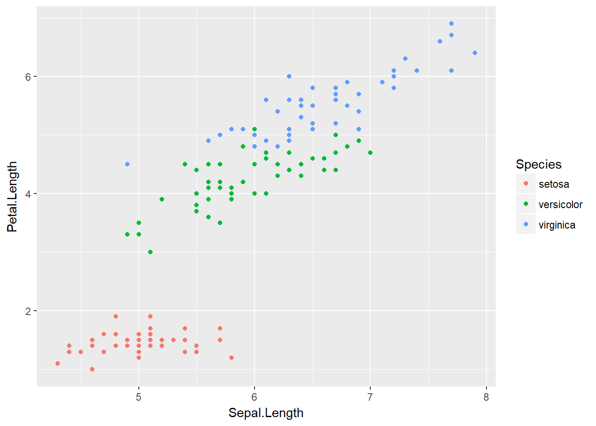
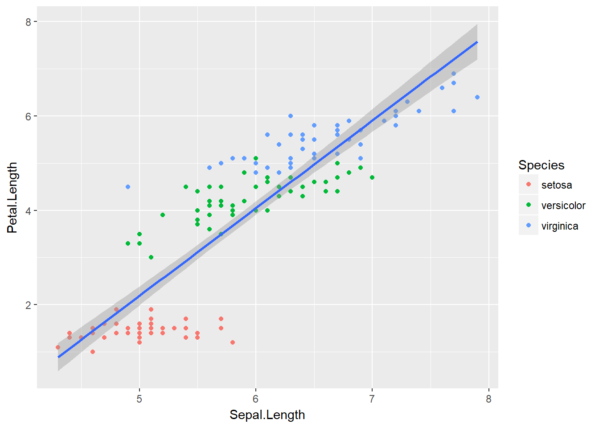
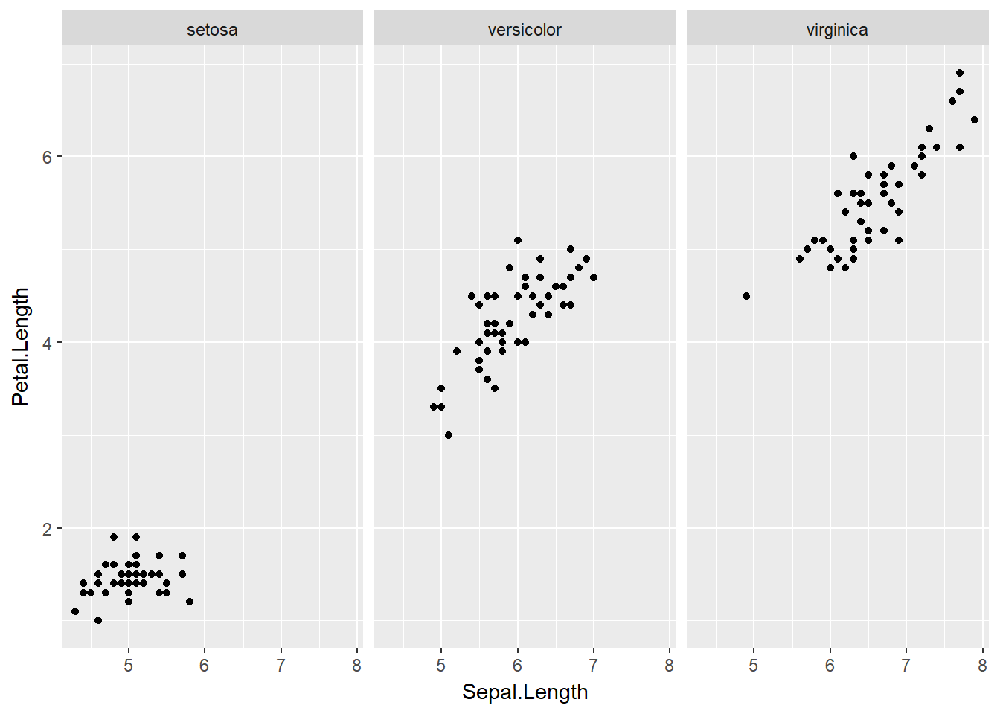

# Exploración de Datos

Los humanos somos animales fuertemente dependientes en nuestra visión, así hemos evolucionado. Por lo tanto, no es sorpendente que la herramienta más útil para comprender datos sea utilizar una gráfica.

## Gráficos de base

R posee funcionalidad gráfica de base. Con relativa facilidad podemos hacer una gráfica de dos variables (por ejemplo, una hipotética variable respuesta en el tiempo). 


```r
tiempo <- c(1:10)
respuesta <- c(1:4, seq(10, 20, 2))  

plot(tiempo,respuesta,
     type='b',
     pch=19,
     col="black",
     main = "Respuesta vs tiempo",
     ylab = "Respuesta",
     xlab = "Tiempo")
```


Esta funcionalidad no está limitada a gráficos de puntos y líneas. Por ejemplo, el histograma que figura en el principio del libro fue realizado con la función `hist()`


```r
set.seed(123)
ejemplo <- rnorm(n = 10000, mean = 0, sd = 1)
hist(ejemplo, col='orange', breaks=40, 
     ylab = "Frecuencia", main = "Histograma ejemplo")
```


Los gráficos de base son geniales para explorar modelos ya que aceptan objetos de tipo  `lm` (ver siguientes capítulos). Si bien es posible realizar gráficos muy bonitos con la funcionalidad de base, incluso gráficas de calidad para publicación impresa, es cierto que la gramática no es sencilla de recordar (o requiere demasiada previsión) y, en muchos casos, es limitada.

## ggplot2

Una forma más intuitiva de construir gráficas es utilizar *capas*. El paquete `ggplot2` pertenece al `tidyverse` y es el más utilizado para realizar gráficas de alta calidad en R. A lo largo de la explicación utilizaré el dataset **iris**, que contiene medidas de las ojas de tres especies de plantas:


```r
head(iris)
```

```
##   Sepal.Length Sepal.Width Petal.Length Petal.Width Species
## 1          5.1         3.5          1.4         0.2  setosa
## 2          4.9         3.0          1.4         0.2  setosa
## 3          4.7         3.2          1.3         0.2  setosa
## 4          4.6         3.1          1.5         0.2  setosa
## 5          5.0         3.6          1.4         0.2  setosa
## 6          5.4         3.9          1.7         0.4  setosa
```


Veamos cómo se construye capa por capa un gráfico utilizando `ggplot2` y los datos de `iris`. Para entender cómo funciona, es importante entender el argumento `aes()`, que permite indicar qué pondremos en los ejes *XY* y además permite . Veamos el ejemplo:


```r
library(ggplot2)

ggplot(data=iris,
       aes(Sepal.Length, Petal.Length))
```


Este gráfico contiene los ejes que especificamos pero no contiene los datos. Para dibujarlos, debemos decirle a `ggplot` cómo hacerlo (por ejemplo, puntos).


```r
ggplot(iris, aes(Sepal.Length, Petal.Length)) +
  geom_point()
```


Al parecer, los datos presentan una estructura de asociación entre el largo de los sépalos y el de los pétalos (a mayor largo de sépalos, mayor largo de pétalos). Este dataset contiene un factor *Species* con tres niveles, *setosa*, *versicolor*, *virginica*. Fácilmente podemos ver si las distintas especies presentan distintas asociaciones. Una forma rápida de visualizarlo es coloreando los puntos según el nivel del factor *Species*. En `ggplot2` usamos `color = Species`.


```r
ggplot(iris, aes(Sepal.Length, Petal.Length, color = Species)) +
  geom_point()
```




Podemos agregar una nueva capa con una línea de tendencia. Para hacerlo, especificamos un ajuste lineal ("lm") en `geom_smooth(method = "lm")`. Es clave notar que `geom_smooth()` posee distintos métodos cuya riqueza exploraremos en los siguientes capítulos.


```r
ggplot(iris, aes(Sepal.Length, Petal.Length, color = Species)) +
       geom_point() +
       geom_smooth(method = "lm")
```


Como pueden apreciar, incorporar la gramática de `ggplot2` permite realizar visualizaciones más complejas con menor esfuerzo. La riqueza de este grupo de funciones esta en la gran variedad de funciones `geom` que podemos incorporar. A lo largo de el libro veremos varias de ellas.

### Entendiendo `aes()`

En ggplot, `aes()` hace referencia al contenido estético del gráfico (del ingles *aesthetics*). Es decir, la función le dará indicios a ggplot2 sobre cómo dibujar los distintos trazos, formas, colores y tamaños. Es importante notar que `aes()` crea una nueva capa en relación a las variables y agrega leyendas a los gráficos. Al incorporar `aes()` al llamado de `ggplot()` estamos compartiendo la información en todas las capas. Si deseamos que esa información sólo esté en una de las capas, debemos usar `aes()` en la capa correspondiente. Esto puede parecer confuso, las siguientes líneas de código generan un gráfico que se ve idéntico al que realizamos previamente:


```r
ggplot(iris, aes(Sepal.Length, Petal.Length)) +
       geom_point(aes(color = Species)) # Notar diferencia! aes() aparece en geom_point()
```


Sin embargo, podemos ver la diferencia al intentar repetir el gráfico con línea de tendencia.


```r
ggplot(iris, aes(Sepal.Length, Petal.Length)) +
       geom_point(aes(color = Species))+
       geom_smooth(method="lm")
```



En este caso `geom_smooth()` no recibe la orden de agrupar segun `Species`, por ende, todos los datos son usados para construir el ajuste lineal. Este comportamiento nos permite gran versatilidad en los gráficos. Sin embargo, también permite que el usuario cometa algunos errores. Por ejemplo, intentemos cambiar todos los puntos del primer gráfico de negro a magenta:


```r
# Primer gráfico, izquierda

ggplot(iris, aes(Sepal.Length, Petal.Length)) +
       geom_point()

# Intento 1

ggplot(iris, aes(Sepal.Length, Petal.Length, color='magenta')) +
       geom_point()

# Intento 2

ggplot(iris, aes(Sepal.Length, Petal.Length)) +
       geom_point(color='magenta')
```


### Explorando `geom`

Los distintas funciones `geom` nos permiten obtener resultados gráficos distintos, aunque utilicemos los mismos datos. Analicemos el largo de los sépalos por especie.


```r
# Gráfico de puntos
p1 <- ggplot(iris, aes(Species, Sepal.Length)) +
       geom_point()

# Gráfico de puntos con ruido en el eje horizontal
p2 <- ggplot(iris, aes(Species, Sepal.Length)) +
       geom_jitter(width = 0.1)

# Boxplot

p3 <- ggplot(iris, aes(Species, Sepal.Length)) +
       geom_boxplot()

# Violin 
p4 <- ggplot(iris, aes(Species, Sepal.Length)) +
       geom_violin()

# Combinando boxplot y violin

p5 <- ggplot(iris, aes(Species, Sepal.Length)) +
       geom_violin(fill='orange', alpha=0.5)+
       geom_boxplot(color="white", fill="black",
                    lwd=0.8, width=0.2 )

# Grafico de barras con medias + SEM

p6 <- ggplot(iris, aes(Species, Sepal.Length)) +
      stat_summary(fun.y = mean, geom = "bar",
                   width=0.5) +
      stat_summary(fun.data = mean_se, geom = "errorbar",
                   color="red", width=0.5)
```

<div class="figure">

<p class="caption">(\#fig:six-plot-figure)Varias formas de mostrar los mismos datos.</p>
</div>


Este es un pequeño ejemplo de como los distintos `geoms` participan en la creación de gráficos. En **A** es difícil ver que los puntos están superpuestos, por eso en **B** usamos `geom_jitter()`, que da una buena idea de la distribución de los datos. Para resumir la información, es común utilizar gráficos de cajas o tipo violín (**C,D**). Notar que la combinación de `geoms` en capas permite fácilmente mezclar ambos gráficos (**E**). Al combinarlos, hemos cambiado cuestiones estéticas dentro de las capas para incrementar el contraste. Finalmente, otra forma común de hacer un resumen de datos es un gráfico de barras de tipo media ± SEM (**E**).

### Explorando `facet_wrap`

En otras secciones separamos datos categóricos utilizando color. En esta sección, veremos que es posible utilizar `facets` para separar las gráficas en distintas ventanas.


```r
ggplot(iris, aes(Sepal.Length, Petal.Length)) +
  geom_point()+
  facet_wrap(~Species)
```



Este comportamiento es súmamente útil cuando tenemos más de una variable categórica o cuando deseamos utilizar el color para simbolizar otra variable. Por ejemplo, quizás nos interesa evaluar cómo varía el ancho de los pétalos en las distintas plantas.


```r
ggplot(iris, aes(Sepal.Length, Petal.Length)) +
     geom_point(aes(color=Petal.Width))+
     facet_wrap(~Species)
```


En este último gráfico hemos podido representar con claridad variaciones en la longitud de pétalos y sépalos, el ancho de los pétalos y una variable categórica de tres niveles. Los datos indican que las plantas con menor longitud de pétalos y sépalos también poseen pétalos más angostos. Efectivamente, explotar los recursos de `ggplot2` nos permite generar poderosas herramientas de análisis y comunicación estadística. 

### Cowplot

Los gráficos realizados en la sección previa (\@ref(explorando-geom)) muestran gráficos individuales que fueron *acomodados* distintos paneles. Para realizar esto, se ha utilizando el paquete `cowplot`. A continuación se muestra el código para realizar figura \@ref(fig:six-plot-figure)


```r
cowplot::plot_grid(p1,p2,p3,p4,p5,p6, labels = "AUTO")
```

## Caso de estudio

El primer objetivo de un análisis exploratorio debe ser ganar entendimiento cualitativo de la naturaleza de los datos (tendencia central, distribución y estructura de correlación). Esto puede lograrse utilizando tablas de resumen, sin embargo, en mi opinión el análisis gráfico es superior.  

`ELEGIR Y REALIZAR CASO DE ESTUDIO DE ANALISIS GRAFICO`


## Resumen

En este capítulo no he realizando una descripción exhaustiva sobre análisis gráfico, mi idea fue brindar ejemplos de las posibilidades para exploración de datos, principalmente con `ggplot2`.  

* Uno de los mayores beneficios de R es la plataforma gráfica, principalmente `ggplot2`.
* `ggplot2` está basada en una gramática que permite incorporar capas a los gráficos.
* Las capas son agregadas una encima de la otra segun los `aes()` y `geoms` que se utilicen.
* Tanto `ggplot2` como paquetes accesorios permiten realizar gráficos de paneles de alta calidad.
* Utilizar combinaciones de capas permite representar con claridad más dimensiones en un gráfico.

## Recursos

El material sobre visualización de datos es virtualmente infinito. Recomiendo fuertemente los siguientes textos:

* [ggplot2 online](https://ggplot2.tidyverse.org/)
* [Data Visualization-Kieran Healy](http://socviz.co/)
