# Modelos Lineales


> Esencialmente, todos los modelos son erróneos, pero algunos son útiles - George Box

La realidad es multidimensional, compleja e incierta. Un modelo es una representación formal de un fenómeno, una reducción de dimensionalidad que posee utilidad práctica. Dicha representación normalmente puede ser condensada en una expresión matemática, una *fórmula*, que indica cómo una variable se relaciona con otra(s). Empíricamente, el paradigma se basa en estudiar la relación matemática entre variables aleatorias respuesta, con una distribución de probabilidades dada, y aquellas variables que la predicen, con el fin de explicar asociaciones entre variables y realizar inferencia. De modo muy general, podemos escribir:

\begin{equation} 
  y = f(x)  
  (\#eq:general-fx)
\end{equation} 


Donde $y$ es la variable que modelamos, $f$ es una función de una o múltiples variable(s) explicatoria(s).

## ¿Qué es un modelo lineal?

En este capítulo trabajaremos con modelos *lineales*. Un modelo lineal suele escribirse como:

\begin{equation} 
y = \beta_0 + \beta_1x_1 + \ ...\  + \beta_nx_n
  (\#eq:general-glm)
\end{equation} 

Donde $x_{1..n}$ representa cada variable predictora y $\beta_{1..n}$ representan los coeficientes (o parámetros) a estimar.  El efecto de cada coeficiente (por ejemplo, $\beta_3$) debe interpretarse como el cambio en $y$ dado por un cambio unitario en la variable predictora asociada a ese coeficiente ($x_3$), siempre que las demás variables $x$ se mantengan constantes. Además, tenemos una ordenada al origen (o $\beta_0$) que representa la media general.  

Este modelo es *lineal* porque está escrito como una combinación lineal de las preditoras y sus coeficientes. Por ejemplo, la ecuación de Michaelis-Menten[^michaelis] es un modelo *no lineal*:

\begin{equation} 

V_{prod} = V_{max} * \frac{[S]}{K_m [S]}
  (\#eq:michaelis-menten)
\end{equation}

Que podemos escribir en los términos usados en \@ref(eq:general-glm) como:

\begin{equation} 

y = \beta_0 *\frac{x}{\beta_1 x}

\end{equation}

## Modelos estadísticos

Un modelo como el caracterizado por la ecuación (\@ref(eq:general-glm)) está *determinado*, es decir, dados los valores de $\beta, x$, los valores $y$ son únicos. En nuestro caso trabajaremos con modelos *estadísticos*, en los que cada valor que medimos proviene de mediciones en la vida real y, por lo tanto, tiene asociado un *error*.

\begin{equation} 
y_i = \beta_0 + \beta_1x_{1i} + \ ...\  + \beta_nx_{ni} + \epsilon_i 
  (\#eq:general-glm-estadist)
\end{equation} 

Donde $i$ representa la observación obtenida de cada unidad experimental. Debido a que existen diferencias entre unidades experimentales, el valor de $y_i$ no será determinado por una combinación lineal de $\beta x$, tendrá un error ($\mathcal{E}_i$) asociado.  

### Simulando datos en R

Podemos crear un ejemplo en R para visualizar rápidamente. Supongamos que podemos medir *felicidad* de manera cuantitativa, como una variable continua. Supongamos, además, que nuestro laboratorio quiere investigar cómo impactan distintas dosis de chocolate a la felicidad de los humanos. Para esto, tomamos una muestra de 100 voluntarios y los asignamos de manera aleatoria a 5 dosis de chocolate (20, 40, 60, 80, y 100 gramos). Los individuos consumen la dosis asignada, el chocolate aumenta su felicidad (según la fórmula $felicidad = dosis * 2.5 + 10$), que medimos y graficamos.    


```r
# Paquetes que vamos a usar
library(dplyr)
library(ggplot2)
# Permite cambiar el aspecto de ggplot a algo parecido a base
library(ggthemes) 
```


```r
# Generar participantes
id <- 1:100
# Generar dosis
dosis <- sort(rep(seq(20,100,20), 20))
# Generar respuesta "ideal" 
respuesta <- dosis * 2.5 + 10
# Construir data.frame
datos <- data.frame(id=id,
                    dosis=dosis,
                    respuesta=respuesta)

# Graficar
p <- ggplot(datos, aes(dosis, respuesta))+
      geom_point()+
      xlab("Dosis Chocolate (gr)")+
      ylab("Felicidad")+
      theme_base()+
      theme(plot.background = element_rect(colour = NA))

p
```

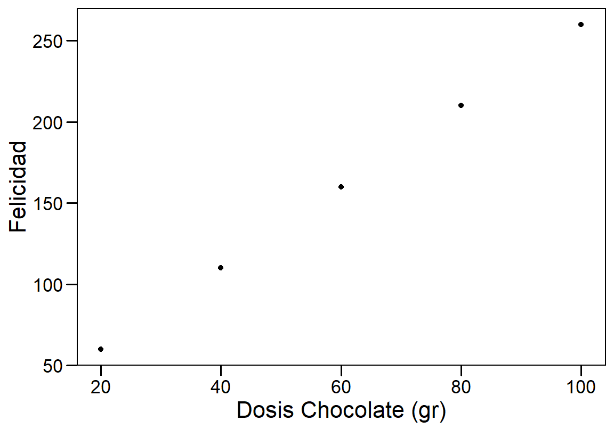

El modelo que construimos hasta ahora tiene valores determinados. Pero, en la realidad, esperamos variabilidad en la respuesta al chocolate entre individuos. Esta variabilidad existe porque los individuos no son réplicas exactas: cada cuerpo fue construido a partir de un genoma levemente distinto, con diferentes eventos en el desarrollo y la experiencia. Incluso podemos pensar en eventos aleatorios relacionados con la ingesta y digestión del mismo trozo de chocolate! Por eso, si queremos trabajar con un modelo más realista deberíamos tener un gráfico como el siguiente:


```r
# semilla
set.seed(444)
# Agregar ruido con distribucion normal (media 0, sd = 5)
datos$respuesta <- datos$respuesta + rnorm(n = 100, mean = 0, sd = 5)

p <- ggplot(datos, aes(dosis, respuesta))+
       geom_point(alpha = 0.1)+
       xlab("Dosis Chocolate (gr)")+
       ylab("Felicidad")+
       theme_base()+
       theme(plot.background = element_rect(colour = NA))

p
```

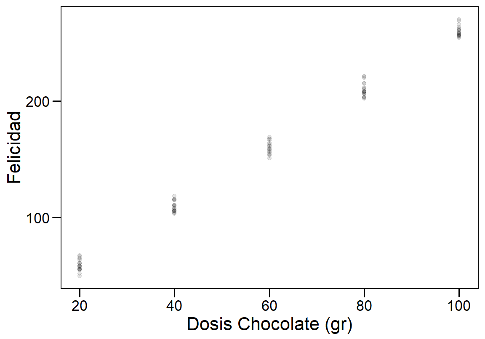

En este caso podemos ver claramente que para cada valor de dosis hemos registrado más de un valor de felicidad. La naturaleza de la pregunta cambia, debemos preguntarnos: 

* ¿Cuál es el valor **esperado** de felicidad para una dada dosis de chocolate?
* ¿Cómo podemos estimarlo?

## Esperanza

Lo que esperamos en este caso es registrar valores que estén distribuidos alrededor del valor de la media para cada concentración (ver  \@ref(eq:general-glm-estadist)). La esperanza va a estar dada por:

\begin{equation} 
E(Y_i) = \beta_0 + \beta_1 x_{1i}
  (\#eq:esperanza)
\end{equation} 

Donde $E(Y_i)$ es la esperanza del caso $i$ (también escrita como $\mu_{Y|x_i}$), $\beta_0$ es el valor esperado para dosis cero (en este caso tiene sentido experimental pensar en participantes que no comieron chocolate), y $\beta_1$ es el incremento en la esperanza dado por un incremento unitario en la variable predictora (exactamente cuánto más feliz espero ser por gramo de chocolate!). Gráficamente, esperamos:


```r
# Graficar
p + geom_smooth(method = "lm", color="lightgray", se=FALSE)+
  stat_summary(fun.y = mean, geom="point", size=2, color="red")
```

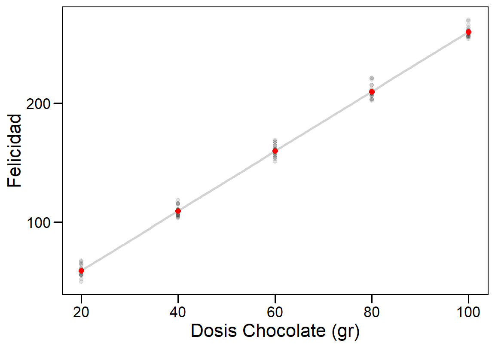

## Estimación del modelo

En este caso, los parámetros de nuestro modelo se estiman por *cuadrados mínimos*, una forma acotada de decir que buscaremos aquella recta (combinación lineal de parámetros y predictoras) tal que se minimice la suma de las distancias entre los datos y los valores predichos.

Formalmente, podemos calcular el error o *residuo*, para cada punto como la diferencia entre el valor observado ($y_i$) y predicho por nuestro modelo ($E(Y_i)$ o $\hat{y_i}$):

\begin{equation} 
e_i = y_i - E(Y_i) = y_i - \hat{y_i}
  (\#eq:residuo1)
\end{equation} 

Un inconveniente de esta definición es el signo de los residuos. Como no deseamos que los resultados varíen si las observaciones están por encima o por debajo de la esperanza, podemos usar el cuadrado de los residuos para trabajar. Usando la Ecuación \@ref(eq:esperanza) podemos expandir la Ecuación \@ref(eq:residuo1) y plantear:

\begin{equation} 
\Sigma e_i^2 = \Sigma (y_i - E(Y_i))^2 = \Sigma (y_i - (b_0 + b_1 x))^2
  (\#eq:residuo2)
\end{equation} 

Si minimizamos $\Sigma e_i^2$ podemos obtener estimadores para $\beta_0$ y $\beta_1$ (denotados como $b_0$ y $b_1$):

\begin{equation} 
b_1 = \frac{\Sigma (x_i - \bar{x})(y_i - \bar{y})}{\Sigma (x_i - \bar{x})^2} \\
b_0 = \bar{y} - b_1 \bar{x}
  (\#eq:parametros)
\end{equation} 

Donde $\bar{x}$ y $\bar{y}$ representan las respectivas medias en nuestra muestra.

### Entendiendo la estimación con gráficos

Si pensamos a los residuos como distancias entre nuestra recta de predichos y las observaciones de la vida real, lo que la regresión hace es minimizar esas distancias (todas a la vez, por eso en la Ecuación \@ref(eq:residuo2) tenemos la sumatoria).  

Supongamos que una primera aproximación a estimar el valor de $y$ es olvidarse de la variación en $x$ por un instante y plantear una recta que contenga a la media global ($\bar{y}$) como valor esperado para cualquier $x$ (equivalente a $y_i = \beta_0 = \bar{y}$):

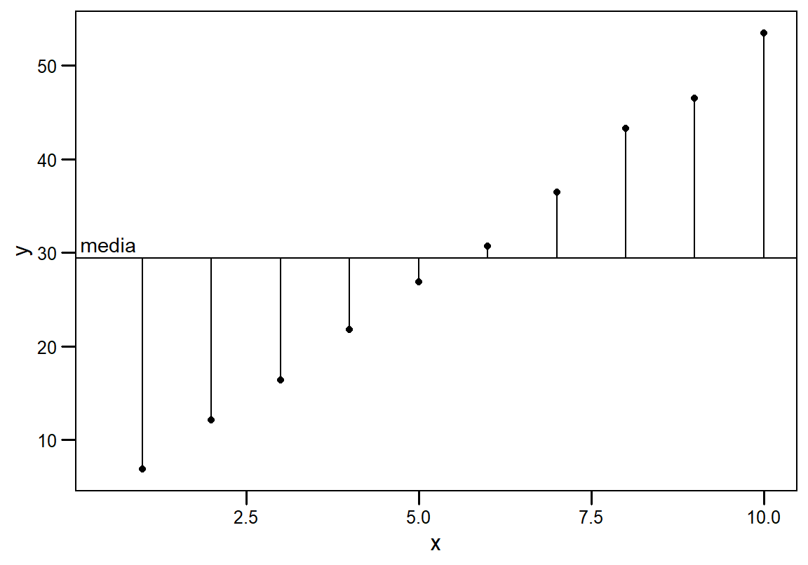

En este caso, vemos que los valores observados tienen una distancia grande a la media. Esto indica que $x$ efectivamente tiene un efecto sobre $y$. Sin embargo, cerca del centro (alrededor del punto $(\bar{x},\bar{y})$), los residuos son pequeños. Intuitivamente, debemos cambiar la pendiente, pero, al rotar la recta, deberíamos hacerlo desde el punto $(\bar{x},\bar{y})$. Por ejemplo:


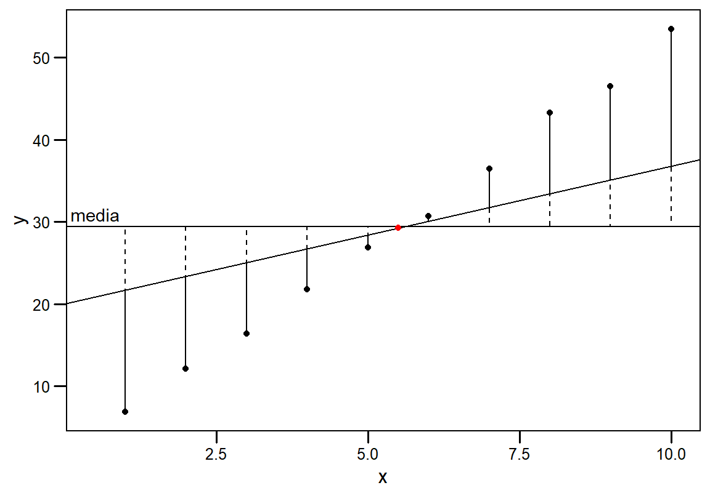

Podemos ver que con esta acción hemos reducido los residuos y el ajuste es mejor. Naturalmente, es muy complicado encontrar gráficamente el par $b_0, b_1$ tal que la suma de las distancias sean *mínimas*. En la siguiente figura se muestra la gráfica de dicha recta. Apenas se se pueden apreciar los residuos, pero podemos intuir que el ajuste es mucho mejor que nuestro primer intento con la media al observar las líneas punteadas.   

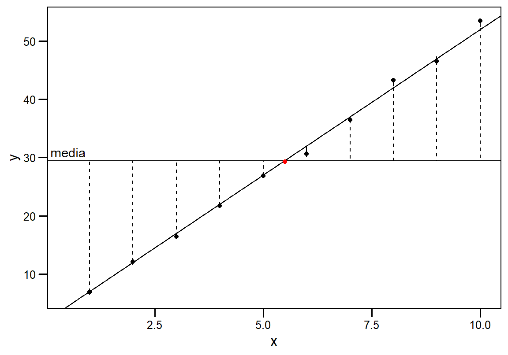


## Modelo en R

Ya es hora de meternos de lleno en la práctica. Volvamos a nuestro modelo de felicidad y chocolate para realizar un ajuste lineal en R usando la función `lm`. Esta función requiere argumentos de tipo `formula`. En nuestro caso, queremos estudiar la relación entre la felicidad (`respuesta`) y la dosis de chocolate (`dosis`). Por ende, la fórmula que utilizaremos es `respuesta ~ dosis`, con `~` para dividir entre respuesta y predictoras [^tilde]:


```r
# crear modelo
modelo_chocolate <- lm(data=datos,
                       respuesta ~ dosis)
# Ver resultados del modelo
summary(modelo_chocolate)
```

```

Call:
lm(formula = respuesta ~ dosis, data = datos)

Residuals:
   Min     1Q Median     3Q    Max 
-9.204 -3.696 -1.330  3.091 11.497 

Coefficients:
            Estimate Std. Error t value Pr(>|t|)    
(Intercept)  8.59279    1.15698   7.427 4.15e-11 ***
dosis        2.51659    0.01744 144.283  < 2e-16 ***
---
Signif. codes:  0 '***' 0.001 '**' 0.01 '*' 0.05 '.' 0.1 ' ' 1

Residual standard error: 4.933 on 98 degrees of freedom
Multiple R-squared:  0.9953,	Adjusted R-squared:  0.9953 
F-statistic: 2.082e+04 on 1 and 98 DF,  p-value: < 2.2e-16
```

El llamado a `summary()` nos permite ver una gran cantidad de información. 
También recomiendo familiarizarse con el paquete `broom`, que nos permite extraer información estadística de los modelos. Aquí está la tabla con los estimadores:


```r
# Estimadores
broom::tidy(modelo_chocolate)
```

```
# A tibble: 2 x 5
  term        estimate std.error statistic                         p.value
  <chr>          <dbl>     <dbl>     <dbl>                           <dbl>
1 (Intercept)     8.59    1.16        7.43                       4.15e- 11
2 dosis           2.52    0.0174    144                          5.93e-116
```

A partir de la columna de estimadores (*estimate*), vemos que el consumo de chocolate incrementa la felicidad (esperamos mayor un incremento en ~2.5 unidades de felicidad por cada gramo de chocolate!). Nuestro modelo puede escribirse como:

$felicidad = 2.52 * dosis + 8.59$

En la tabla vemos que los estimadores tienen un error asociado, un estadístico *t* y su *p-valor* asociado. Por default, estos resultados están dados para un intervalo de confianza del 95%. Podemos ver que el cero no está incluido en el intervalo de nuestros estimadores.


```r
round(confint(modelo_chocolate), 3)
```

```
            2.5 % 97.5 %
(Intercept) 6.297 10.889
dosis       2.482  2.551
```


También podemos acceder a porciones del modelo por separado. Puedes intentar en tu consola los siguientes comandos.


```r
# parametros
modelo_chocolate$coefficients
# predichos
modelo_chocolate$fitted.values
# residuos
modelo_chocolate$residuals
```

Con nuestros estimadores, podríamos realizar inferencia (obtener predichos para dosis dentro del rango que no fueron testeadas). Pero, antes de avanzar, es necesario analizar el cumplimiento de los supuestos. 

## Supuestos

Cuando construimos modelos de este tipo, asumimos ciertas cosas. Los supuestos principales en este caso son:

* Los valores de las predictoras no tienen error, son determinados por el investigador. 
* Independencia entre observaciones.
* Homocedasticidad.
* Los residuos son normales.

### Error en $x$

La minimización de distancias se realiza únicamente sobre el componente $y$. De esto se desprende el supuesto de que el componente $x$ no tiene error asociado. Experimentalmente, esto es imposible (no es posible pesar exactamente 20.00 gr de chocolate). Sin embargo, en la gran mayoría de los casos, un error relativo pequeño en este componente, como por ejemplo el porcentaje de error de nuestra balanza, no afecta el análisis.   

### Independencia

Los valores que obtenemos de cada unidad experimental deben ser independientes. Esto significa que los valores obtenidos de una unidad experimental no afectan los valores obtenidos por otra. Formalmente, $cov(y_i,y_j) = 0 \ \ \forall \ \ i\neq j$. Una forma de facilitar independencia de observaciones es asignar los tratamientos (en este caso, la dosis de chocolate) al azar. 

### Homocedasticidad.

Podemos pensar a cada uno de los valores que obtuvimos para una dosis como una subpoblación. En este modelo, la media de cada una de estas subpoblaciones está dada por la ecuación de esperanza (ver Ecuación \@ref(eq:esperanza)). Para cada subpoblación asumimos una distribución normal alrededor de $E(y_i)$ con idéntica varianza ($\sigma^2$). Formalmente:

\begin{equation} 
\sigma^{2}(Y_i|x_i) = \sigma^{2}(Y_j|x_j) = \sigma^2 \ \ \forall \ \ i\neq j
  (\#eq:varianza-cte)
\end{equation} 

Este supuesto no es trivial y veremos cómo detectar su cumplimiento a partir del análisis de residuos (\@(ref:normalidad-de-residuos)). Si este supuesto no se cumple, la pruebas de inferencia no es confiable, en especial si hay un grupo con varianza mucho más grande que el resto. Es posible corregir la heterocedasticidad con modelos más complejos que incluyan el modelado de varianza.

### Normalidad de residuos

Este modelo tiene como supuesto que los residuos se distribuyen de manera normal. En general, utilizaremos gráficos de diagnóstico, que son importantes para evaluar los supuestos.

**Residuos vs Predichos (Residuals vs Fitted)**  

En este gráfico buscamos ver la dispersión respecto de la recta para cada valor predicho  (cuánto se alejan de nuestro ajuste). Esperamos no observar ningún tipo de patrón en los residuos. Esperamos no ver datos atípicos (datos con residuos muy grandes). 

**Q-Q Plot**  

Este gráfico muestra cómo se acumulan los residuos respecto de los cuantiles teóricos de una distribución normal. Si la distribución de residuos es normal, los veremos cercanos a la recta. Desviaciones de la recta indican que la distribución de los residuos no es normal. Por ejemplo, en el siguiente gráfico muestro la comparación de residuos provenientes de una distribución Normal y una gamma en un Q-Q plot:


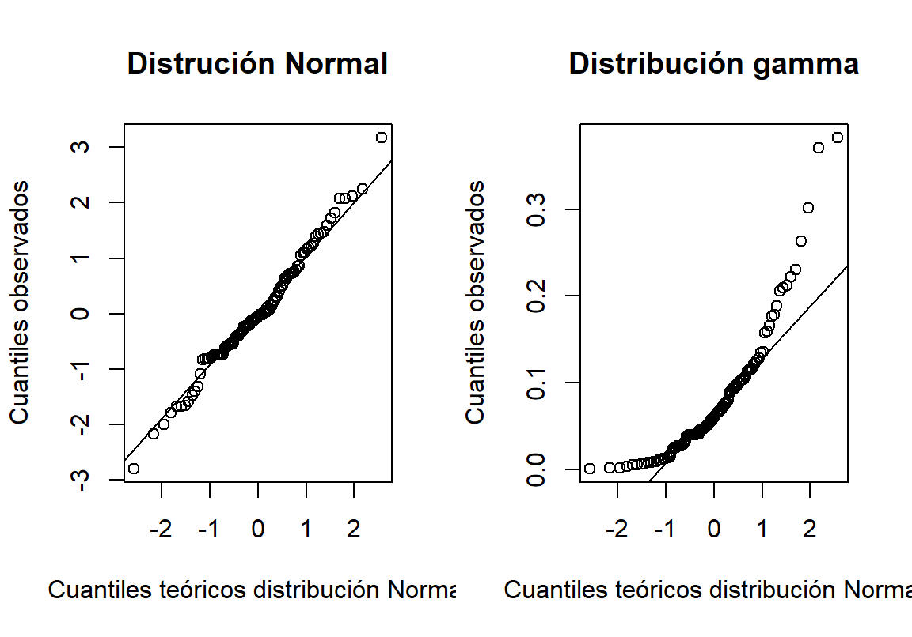


**Residuos estandarizados vs Predichos**  

Este gráfico es similar al primero, pero los residuos están estandarizados. Esperamos no ver ningún patrón, con los residuos distribuidos normalmente alrededor de cero. En la siguiente figura muestro ejemplos de distintos gráficos de residuos vs predichos:


En el primer caso veremos cómo son los gráficos *deseados* de residuos vs predichos. Tanto en **A** como en **B** tenemos residuos normales, la diferencia está en que para el modelo en **B** los predichos responden a niveles de un factor. Es importante mirar la dispersión de los residuos y que la variabilidad se mantenga constante a lo largo de todo el dominio. No hay reglas exactas para describir estos gráficos, se aprende mirando los patrones o, en este caso, la falta de ellos!

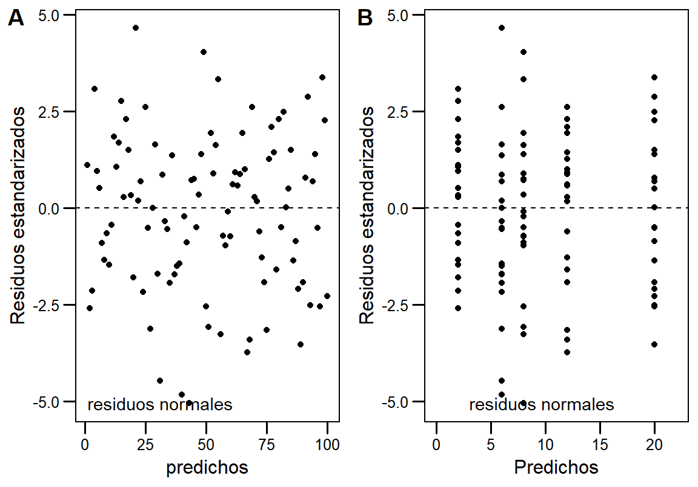

En el segundo caso vemos problemas clásicos como los gráficos en forma de *cono*, predichos más altos tienen mayor variabilidad. Un gráfico de este estilo indica incumplimiento del supuesto de homocedasticidad.


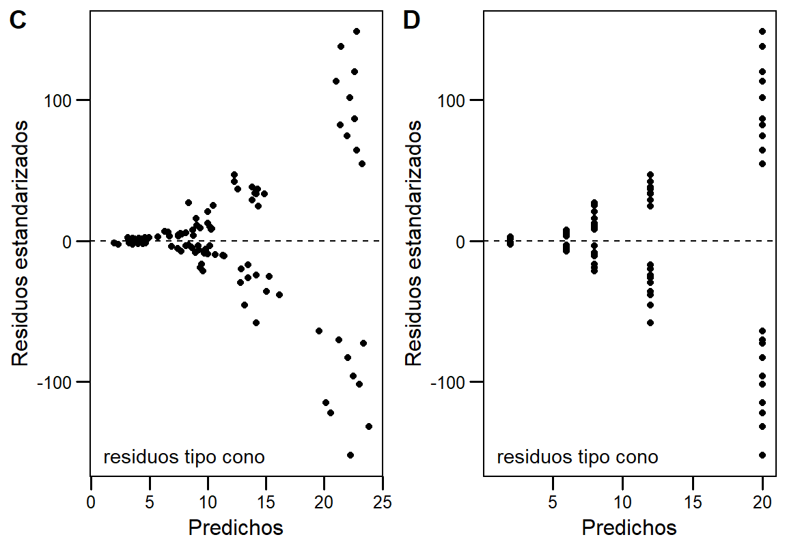

Finalmente, dos casos distintos. En **D**, vemos residuos con un patrón de $x^2$, indica que nuestro modelo lineal no sigue el patrón de distribución de los datos. En **E**, vemos cómo modifica un outlier un gráfico al gráfico de residuos mostrado en **A**.


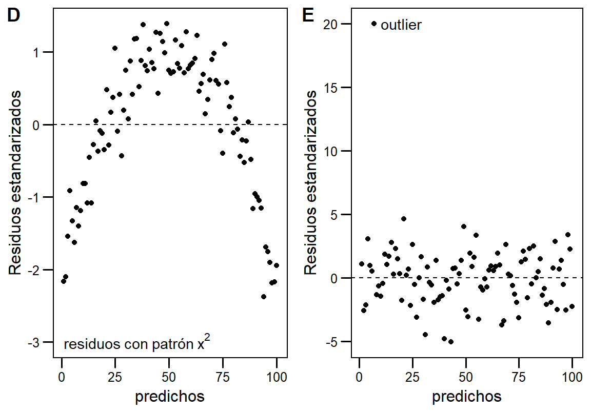


**Gráfico de puntos influyentes**   

Los puntos influyentes son aquellos con gran palanca o *leverage*. Formalmente, dada la matriz de diseño de nuestro modelo $\mathbf{X}$ y la matriz de proyección $\mathbf{H}=\mathbf{X} \ (\mathbf{X}^{\mathsf{T}}\mathbf{X})^{-1} \ \mathbf {X} ^{\mathsf{T}}$, el leverage para la observación $i$ está definido como el elemento $i$ de la diagonal de la matriz $\mathbf{H}$ ($h_{ii}=\mathbf{H}_{ii}$).  

Cuando tenemos pocas variables es fácil observarlos en el ajuste lineal.  

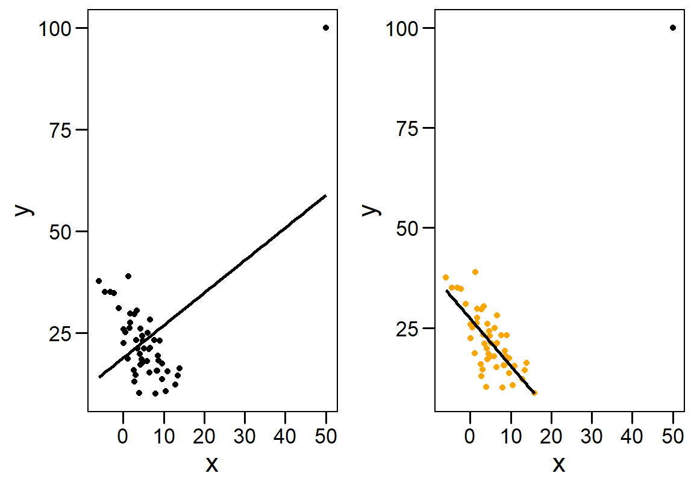

Vemos que aquellos puntos que están muy alejados en $x$ tienen gran influencia sobre el ajuste. En particular, si estos puntos no se alinean bien con el patrón general de los datos, pueden forzar el modelo hacia un ajuste erróneo. Es conveniente tener buena cobertura, es decir, tomar registros igualmente espaciados a lo largo del rango de $x$, para prevenir este tipo de eventos. En este caso, el punto en cuestión tiene alto residuo y alto leverage. La distancia de Cook ($D$) es una variable derivada de los residuos y el leverage, que permite determinar si una observación es influyente y se calcula a partir de la suma de los efectos en el modelo al eliminar cada observación. Valores de ditancia de Cook altos ($D_i > 1$) indican que la observación es influyente.


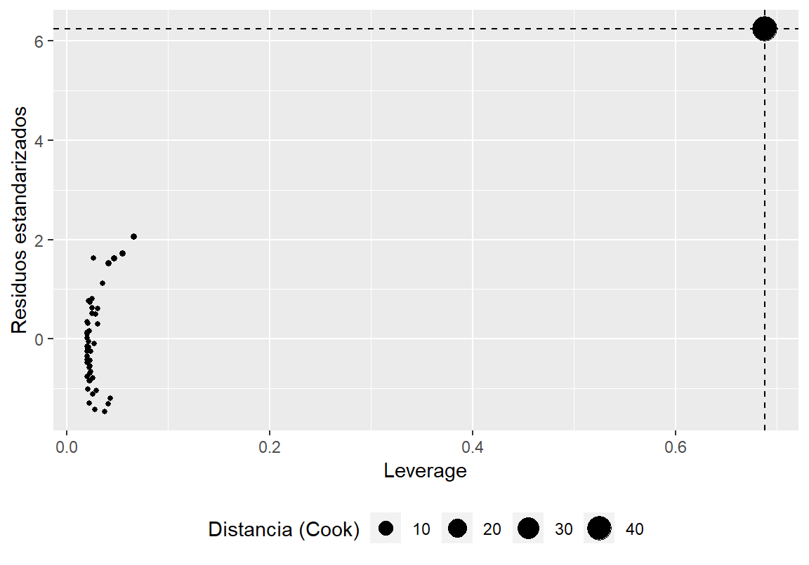


Un caso famoso es el cuarteto de Anscombe, cuatro datasets muy particulares que poseen prácticamente idéntica estadística descriptiva. Sin embargo, al graficarlos, vemos que son muy distintos[^myplot-anexo]. 


```r
# Crear los 4 graficos. 
p1 <- my_plot(anscombe, x1, y1, dataset1) 
p2 <- my_plot(anscombe, x2, y2, dataset2)
p3 <- my_plot(anscombe, x3, y3, dataset3)
p4 <- my_plot(anscombe, x4,  y4, dataset4)

# Ponerlos todos juntos con gridExtra
gridExtra::grid.arrange(p1, p2, p3, p4)
```

<div class="figure" style="text-align: center">
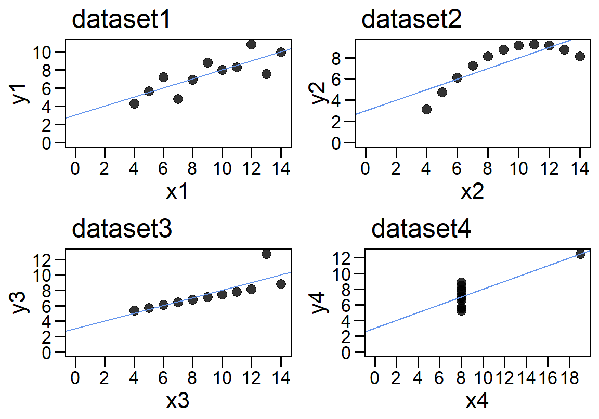
<p class="caption">(\#fig:anscombe)Cuarteto de Anscombe</p>
</div>


Un caso extremo fue desarrollado hace poco por [Alberto Cairo](http://www.thefunctionalart.com/2016/08/download-datasaurus-never-trust-summary.html) y luego llevado a R en forma de paquete (`datasauRus`), cuya página puedes encontrar [aquí](https://github.com/lockedata/datasauRus). Abajo muestro un ejemplo básico de estos datasets. El mensaje que intento transmitir es: **Siempre debemos inspeccionar gráficamente nuestro datos.**  


```r
library(datasauRus)
ggplot(datasaurus_dozen,
       aes(x=x, y=y, colour=dataset))+
  geom_point()+
  theme_void()+
  theme(legend.position = "none")+
  facet_wrap(~dataset, ncol=3)
```

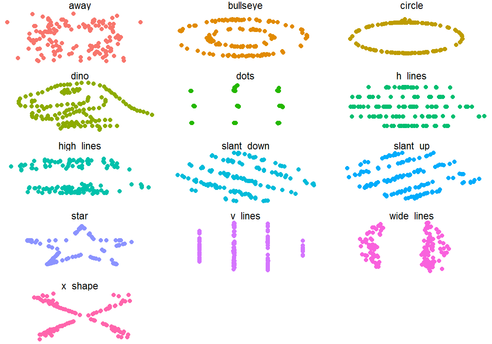


## Análisis de supuestos en R

¿Cómo podemos asegurarnos que nuestros modelos cumplen los supuestos? Podemos explorar el ajuste y analizar el cumplimiento de supuestos en R utilizando la función `plot`, que maneja bien objetos `lm`. Nuestro modelo fue armado teniendo en cuenta los supuestos, al analizar los gráficos de diagnóstico, vemos que se comporta de modo excelente.  


```r
# Acomodamos las opciones gráficas para 4 gráficos en 2x2
par(mfrow = c(2, 2))
# graficamos el ajuste
plot(modelo_chocolate)
```

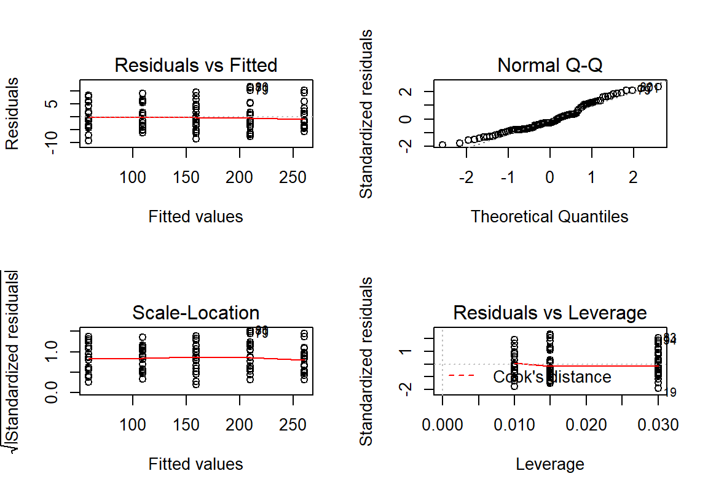


### Cuando los residuos no son normales

En muchas ocasiones los gráficos de diagnóstico nos darán la idea de que no se cumplen los supuestos de normalidad de residuos (u homocedasticidad). En general, los modelos lineales son robustos a la ligera falta de normalidad. Existen distintas estratégias para manejar estos problemas que escapan los objetivos de este capítulo.

## Visualizando residuos en R

Nuestro modelo lineal asume que los errores están normalmente distribuidos alrededor de la esperanza. Formalmente, pedimos $\mathcal{E}_i \sim \  \mathcal{N}(\mu,\,\sigma^{2})$ donde $\mu=0$ y $\sigma^{2} \approx cte$. 

En el `modelo_chocolate` este supuesto se cumple (lo armamos de ese modo[^check_residuals]). En esta sección quiero explorar los residuos de los modelos lineales y brindar herramientas gráficas para conceptualizar mejor lo que la regresión está haciendo con nuestros datos. Voy a modificar los datos de chocolate para que el ajuste sea peor y permita visualizar los residuos mejor (básicamente agregamos ruido en dosis). 


```r
# Agregar ruido en dosis creando nueva columna
datos$nueva_dosis <- datos$dosis + rnorm(100,10,10)
# Calcular el nuevo modelo
nuevo_modelo <- lm(data = datos,
                   respuesta~nueva_dosis)
# Guardar los predichos del modelo en datos
datos$nuevo_pred <- nuevo_modelo$fitted.values
# Guardar los residuos
datos$residuos <- nuevo_modelo$residuals 
# Veamos la data
fit_plot <- ggplot(datos, aes(nueva_dosis, respuesta))+
    geom_smooth(method="lm", se=FALSE, color="lightgray")+      
    geom_point(alpha = 0.5) +
    theme_base()+
    theme(plot.background = element_rect(colour = NA))+
    xlab("Dosis Chocolate (gr)")+
    ylab("Felicidad")

fit_plot
```

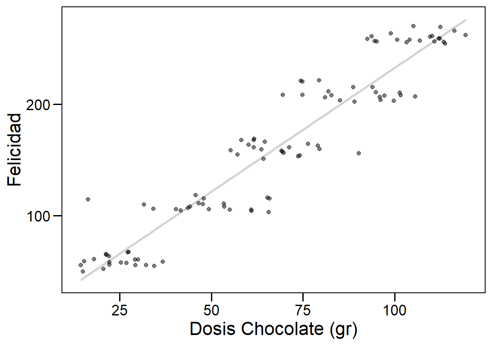

En este gráfico vemos que el ajuste sigue siendo bueno, pero hay mayor cantidad de puntos alejados de la recta. En vez de la recta de ajuste, usemos sólo los predichos.


```r
# Graficar
pre_plot <- ggplot(datos, aes(nueva_dosis, respuesta))+
  geom_point()+
  # Agregamos los predichos en una nueva capa!
  geom_point(aes(nueva_dosis, nuevo_pred), color="gray50", pch=1) +
  theme_base()+
  theme(plot.background = element_rect(colour = NA))+
  xlab("Dosis Chocolate (gr)")+
  ylab("Felicidad")
pre_plot
```

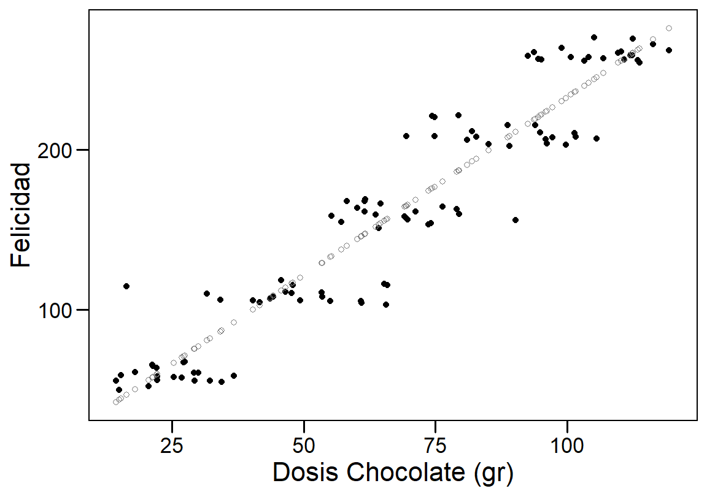

Como vemos, los predichos están alineados perfectamente en la regresión. Podemos agregar los residuos de la siguiente forma:


```r
pre_plot +
  geom_segment(aes(xend = nueva_dosis, yend = nuevo_pred),
               alpha=0.5)
```

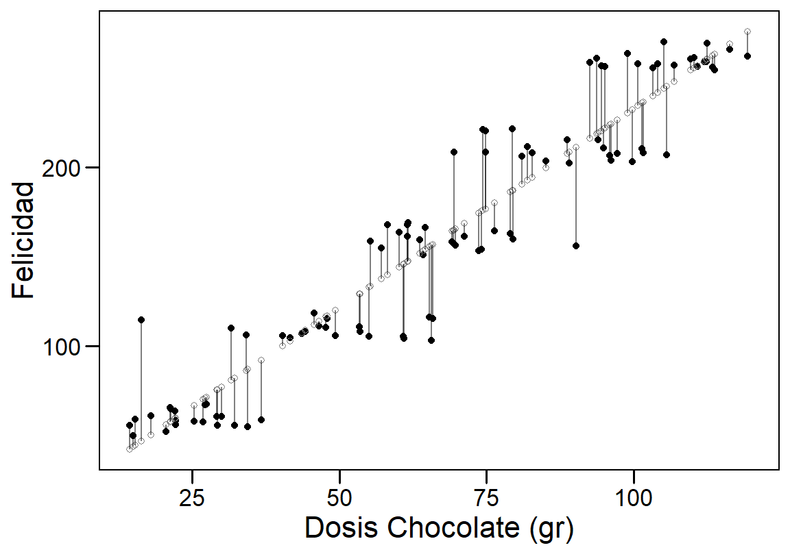


Lo que nuestra regresión está realizando es minimizar la suma de los residuos al cuadrado (ver Ecuación \@ref(eq:residuo2)). Una herramienta para visualizar mejor los puntos con residuos grandes es graficarlos utilizando una escala de color y tamaño.


```r
ggplot(datos, aes(nueva_dosis, respuesta))+
  #Agregamos opción de color dentro del geom_point()
  geom_point(aes(color = residuos, size=abs(residuos)))+ 
  geom_point(aes(nueva_dosis, nuevo_pred), color="gray50", pch=1) +
  geom_segment(aes(xend = nueva_dosis, yend = nuevo_pred),
               alpha=0.5)+
  theme_base()+
  theme(plot.background = element_rect(colour = NA))+
  xlab("Dosis Chocolate (gr)")+
  ylab("Felicidad")+
  # Agregamos color segun los residuos
  scale_color_gradientn(colours = c("red", "black", "red"))+
  # Sacamos la leyenda
  guides(color = FALSE,
         size = FALSE)
```

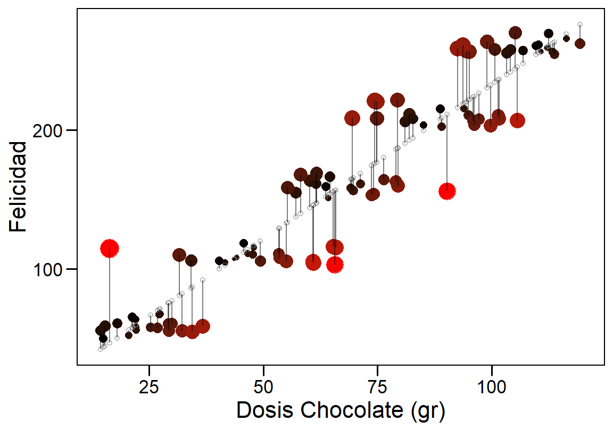


## Descomponiendo variabilidad

Existen distintas fuentes de variabilidad. La variabilidad total en nuestro modelo viene dada por la diferencia entre los datos observados y la media general ($y_i - \bar{y}$).


```r
# Creamos un grafico base al que agregaremos varias capas
grafico_base <- ggplot(datos, aes(nueva_dosis, respuesta))+
    geom_hline(yintercept = mean(datos$respuesta))+
    geom_point() +
    theme_base(base_size = 12)+
    theme(plot.background = element_rect(colour = NA))+
    xlab("Dosis Chocolate (gr)")+
    ylab("Felicidad")+
    annotate("text", label = "media global",
             x = 30, y = mean(datos$respuesta) + 15,
             size = 4, colour = "black")

# Variacion respecto de la media global
variacion_total <- grafico_base +
      geom_segment(aes(xend=nueva_dosis,
                       yend=mean(datos$respuesta)),
                       alpha=0.5)+
      ggtitle("Variación total")

# Graficar
variacion_total
```

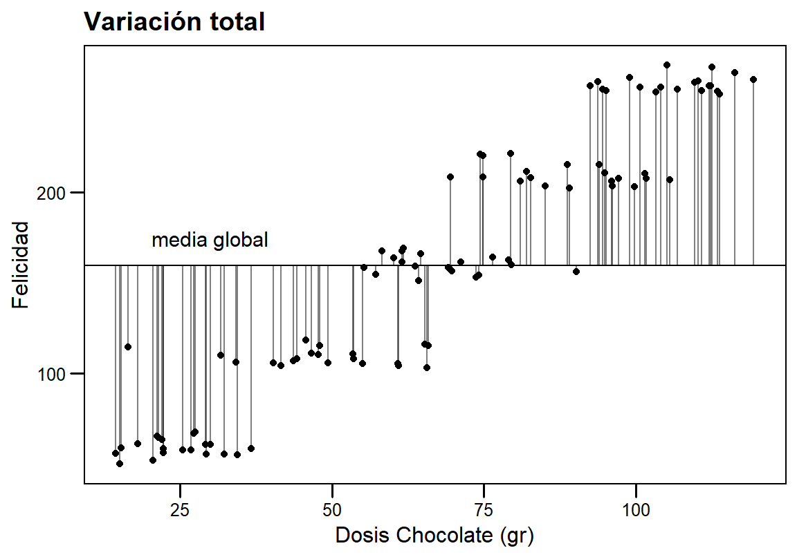


Debido a que las predictoras tienen un efecto en los valores predichos, nuestro modelo logra efectivamente explicar una porción de la variabilidad total. Esta porción es la distancia entre la media y los valores predichos ($\hat{y} - \bar{y}$).


```r
# Variacion explicada
variacion_explicada <- grafico_base+
 geom_smooth(method="lm", se=FALSE, color="lightgray")+
  geom_point(aes(nueva_dosis, nuevo_pred), color="gray50", pch=1) +
  geom_segment(aes(xend = nueva_dosis, y = mean(datos$respuesta),
                   yend = nuevo_pred), alpha=0.5)+
  ggtitle("Variación explicada")  
#Graicar
variacion_explicada
```

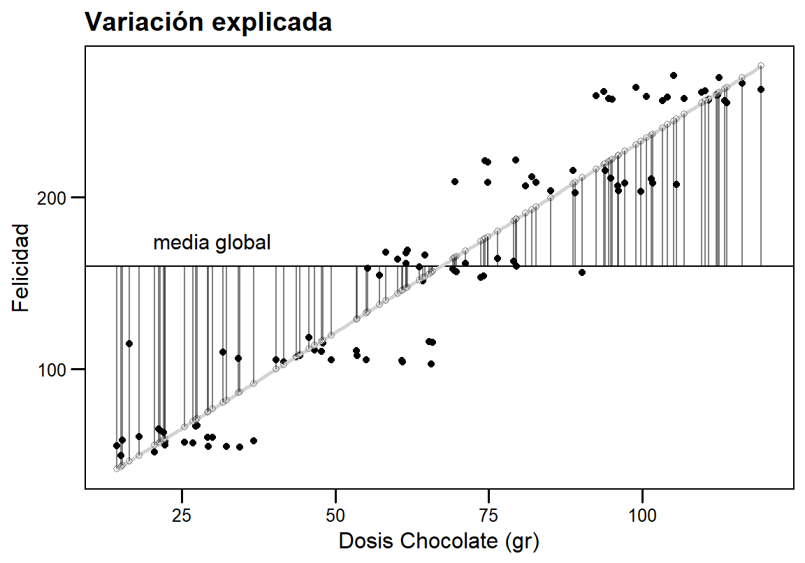

Sin embargo, muchos puntos tienen un valor observado distinto al valor predicho (residuos ver Ecuación \@ref(eq:residuo1)). Decimos que es variación *no explicada* porque porque nuestro modelo predice distinto a lo observado, es decir, la variación en nuestras predictoras no puede explicar la diferencia observada.  


```r
# Variacion no explicada por el modelo
variacion_no_explicada <- grafico_base +
  geom_smooth(method="lm", se=FALSE, color="lightgray")+
  geom_point(aes(nueva_dosis, nuevo_pred), color="gray50", pch=1) +
  geom_segment(aes(xend = nueva_dosis, yend = nuevo_pred),
               alpha=0.5)+
  ggtitle("Variación no explicada")  
# Graficar    
variacion_no_explicada
```

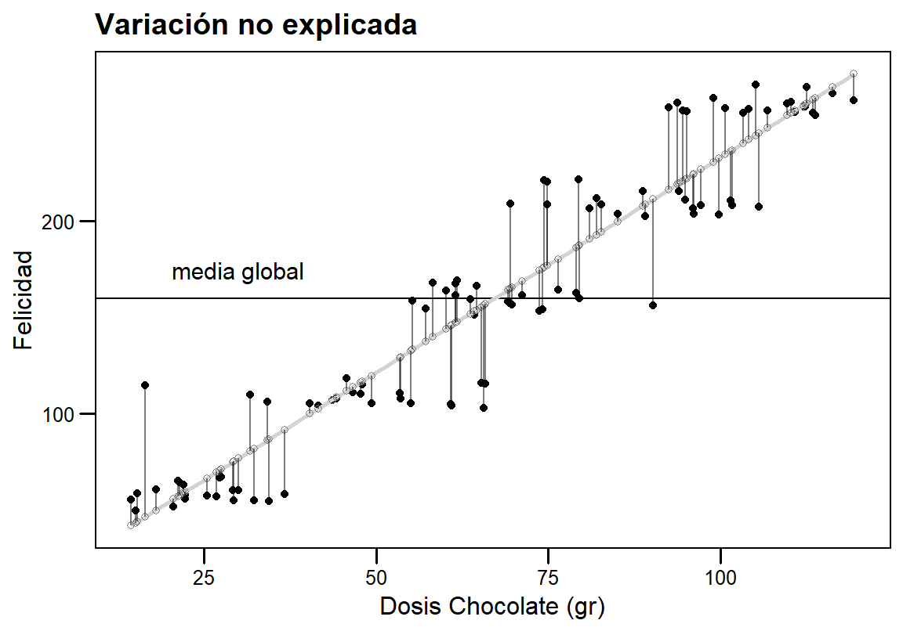

Idealmente, queremos que la fracción de variabilidad explicada sea grande, cercana a la total. Esta información normalmente se condensa en el llamado *coeficiente de determinación* ($R^2$). Formalmente, podemos construir este coeficiente a partir de la suma de cuadrados explicada y total, aunque es más sencillo calcularlo a partir de su complemento:  


\begin{equation}
R^2 = \frac{SC_{exp}}{SC_{total}} = 1 - \frac{\Sigma(y_i - \hat{y_i})^2}{\Sigma (y_i - \bar{y})^2}
  (\#eq:r-squared)
\end{equation}

$R^2$ toma valores entre 0 y 1, con 1 como máximo valor predictivo. Una consecuencia de cómo está definido este coeficiente es que, al agregar variables a nuestros modelos, siempre incrementaremos el $R^2$. Por eso es siempre conveniente utilizar el $R^2$ ajustado según el número de predictoras. Afortunadamente, todos los softwares estadísticos ajustan el coeficiente automáticamente.   


```r
# Podemos acceder al R^2 con
summary(modelo_chocolate)$r.squared
```

```
[1] 0.9953145
```

> Ejercicio: calcular el modelo lineal para el cuarteto de anscombe con R^2

## ¿Por qué hacer una regresión?

Los objetivos de realizar un análisis de regresión pueden resumirse en: 

1. Describir la relación funcional entre X e Y (rectilínea, polinomial,
cuadrática, …)
1. Determinar cuánta de la variación en Y puede ser explicada por
la variación de X y cuánto permanece sin explicar.
1. Estimar los parámetros del modelo.
1. Hacer inferencia sobre los parámetros del modelo (mediante pruebas de
hipótesis y cálculo de intervalos de confianza).
1. Predecir nuevos valores de Y para valores específicos de X en
el dominio estudiado (interpolación dentro del rango de la(s) variable(s) predictora(s)).

## Resumen

* Los modelos lineales se escriben como combinación lineal de estimadores y predictoras.  
* Los modelos estadísticos tienen incorporado un error asociado con la variación entre las unidades experimentales.  
* Cuando modelamos, modelamos la Esperanza dado una combinación de predictoras y un conjunto de supuestos sobre la distribución de nuestra variable respuesta.  
* R posee herramientas analíticas y gráficas para escribir y evaluar el ajuste de modelos lineales.  
* Una medida del valor predictivo de nuestro modelo es el coeficiente de determinación $R^2$.

## Recursos

* Un gran ejemplo para visualizar residuos [aquí](https://drsimonj.svbtle.com/visualising-residuals)
* Una función que utiliza ggplot para crear gráficos de diagnóstico de modelos [aquí](https://rpubs.com/therimalaya/43190)


## Respuestas

Para calcular la regresión en el cuarteto de Anscombe podemos realizar lo siguiente.


```r
# Calcular los modelos
m1 <- lm(data = anscombe, y1~x1)
m2 <- lm(data = anscombe, y2~x2)
m3 <- lm(data = anscombe, y3~x3)
m4 <- lm(data = anscombe, y4~x4)
# Ponerlos en una lista
lista <- list(m1=m1, m2=m2, m3=m3, m4=m4)
```

Utilizando el paquete `broom` en conjunto con las funciones `lapply` y `bind_rows`  podemos obtener resultados de todos los modelos juntos. Vemos que el ajuste de todos los modelos es idéntico (no debería sorprendernos si recordamos \@ref(fig:anscombe)).


```r
# Obtener datos del ajuste
bind_rows(lapply(lista, function(x) broom::tidy(x)), .id = 'modelo')
```

```
# A tibble: 8 x 6
  modelo term        estimate std.error statistic p.value
  <chr>  <chr>          <dbl>     <dbl>     <dbl>   <dbl>
1 m1     (Intercept)    3.00      1.12       2.67 0.0257 
2 m1     x1             0.500     0.118      4.24 0.00217
3 m2     (Intercept)    3.00      1.13       2.67 0.0258 
4 m2     x2             0.500     0.118      4.24 0.00218
5 m3     (Intercept)    3.00      1.12       2.67 0.0256 
6 m3     x3             0.500     0.118      4.24 0.00218
7 m4     (Intercept)    3.00      1.12       2.67 0.0256 
8 m4     x4             0.500     0.118      4.24 0.00216
```

Podemos obtener muchas medidas de ajuste con una estrategia similar (utilizando `glance`). En este caso, seleccionamos(con `select`) las columnas que contienen el $R^2$.


```r
r_lista <- lapply(lista, function(x) broom::glance(x))
# Obtener el R
r_lista %>% bind_rows(.id= 'modelo') %>%
  select(modelo, r.squared, adj.r.squared)
```

```
# A tibble: 4 x 3
  modelo r.squared adj.r.squared
  <chr>      <dbl>         <dbl>
1 m1         0.667         0.629
2 m2         0.666         0.629
3 m3         0.666         0.629
4 m4         0.667         0.630
```

Vemos que el $R^2$ también es idéntico. Aprovecho para repetir el mensaje: **Siempre es necesario graficar los datos!**

[^michaelis]: Más información en la cinética enzimática [aquí](https://es.wikipedia.org/wiki/Cin%C3%A9tica_de_Michaelis-Menten). 
[^tilde]: Si no puedes localizar la tilde en tu teclado, prueba `ALT+126`
[^check_residuals]: Cuando creamos el modelo, explícitamente definimos variación en $y$ con la función `rnorm()`, con media 0 y sd constante. Para comprobar que el supuesto se cumple, puedes correr `mean(modelo_chocolate$residuals)` que dará como resultado un número muy pequeño, empíricamente cero. Además del qqplot, existen pruebas analíticas para normalidad: `shapiro.test(datos$residuos)` nos da un p>0.05, que indica que no tenemos evidencias para decir que los residuos no siguen una distribución normal. 
[^myplot-anexo]: La función utilizada para graficar fue construida con `ggplot2` para ahorrar trabajo, para verla ir al Anexo al final del capítulo.

## Anexo {-}

La función utilizada para realizar múltiples gráficos en \@ref(fig:anscombe)


```r
# Graficando con ggplot y gridExtra
# Vamos a hacer 4 ggplots y ponerlos todos juntos con gridExtra
# Esta función puede ser útil para acortar los llamados de cada gráfico

my_plot <- function(dataset, x_data, y_data, dataset_name){
  
  x_data <- enquo(x_data)
  y_data <- enquo(y_data)
  dataset_name <- enquo(dataset_name)
  
  plot1 <- ggplot(dataset,
                  aes(!!x_data, !!y_data),
                  environment = environment())+
           geom_point(color='black',size=3, alpha=0.8)+
           theme_base()+
           theme(plot.background = element_rect(colour = NA))+
           scale_x_continuous(breaks = seq(0, 20, 2))+
           scale_y_continuous(breaks = seq(0, 12, 2))+
           geom_abline(intercept = 3,
                       slope = 0.5,
                       color = "cornflowerblue")+
           expand_limits(x = 0, y = 0) +
           labs(title = dataset_name)  
}
```

