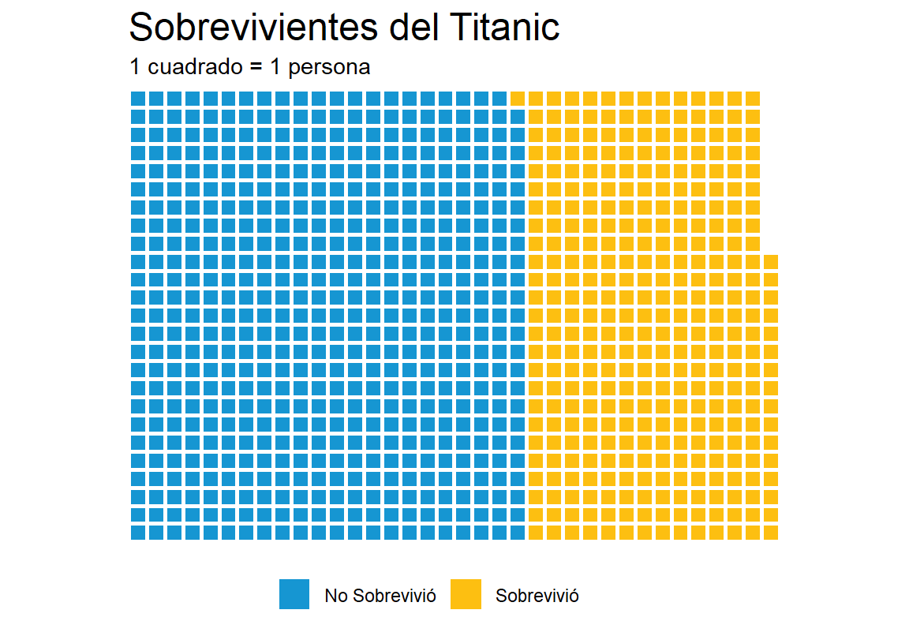
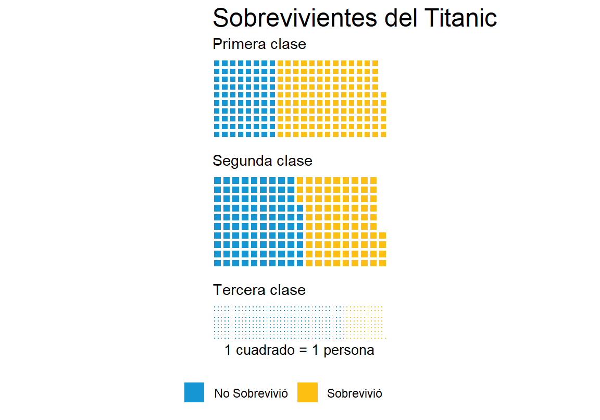
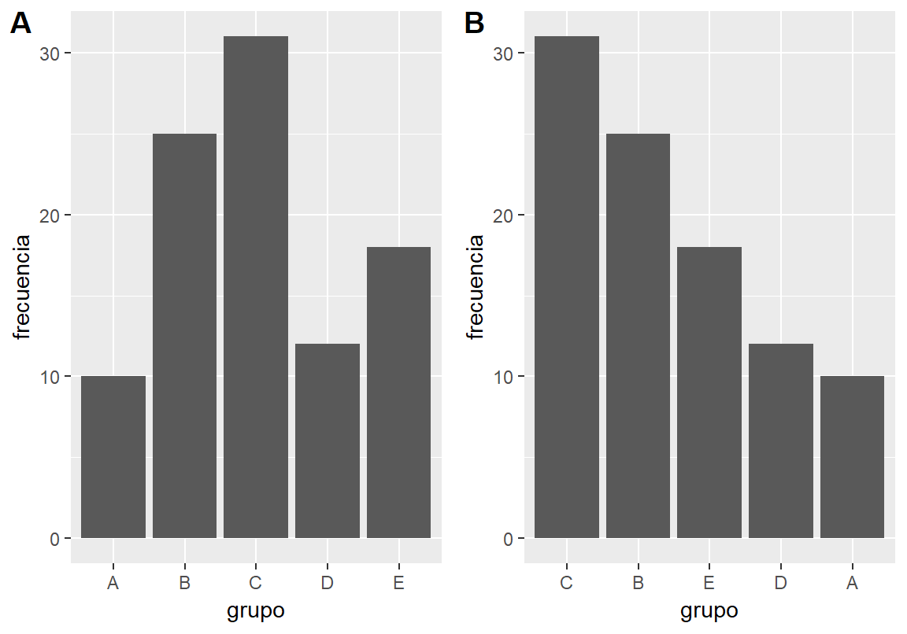
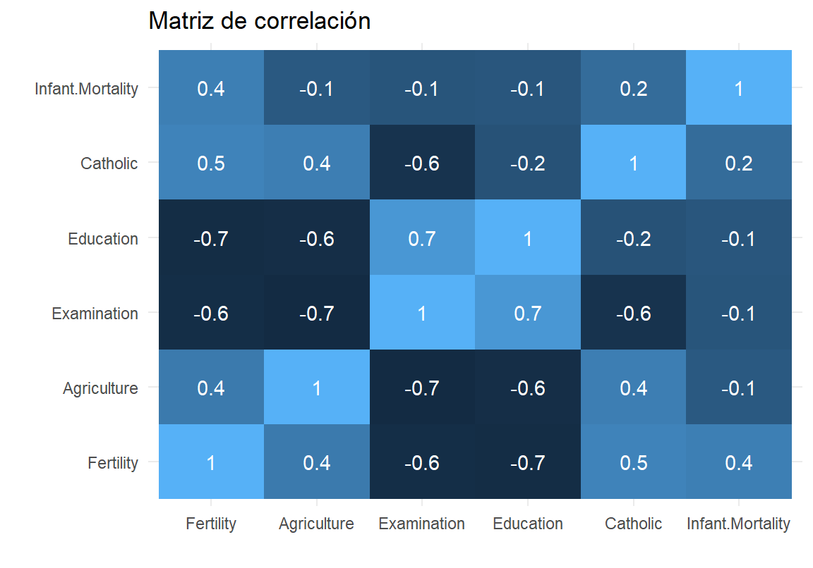
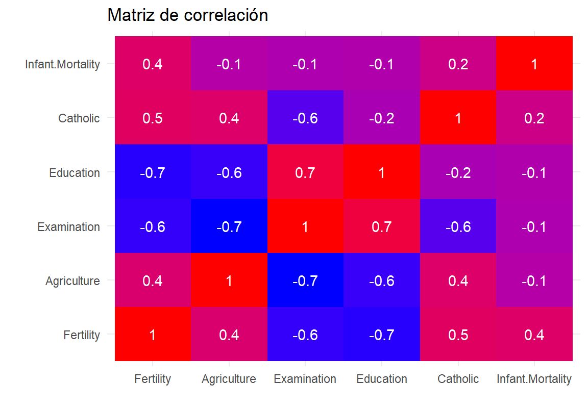
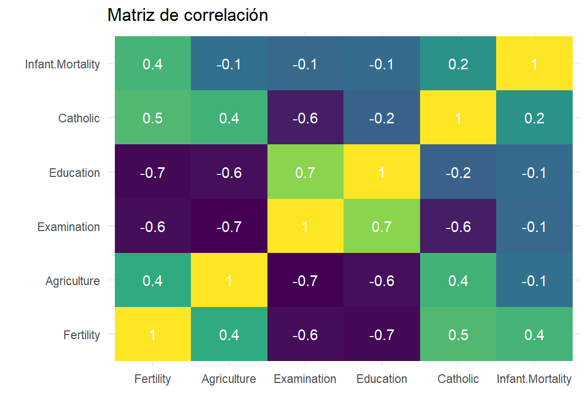
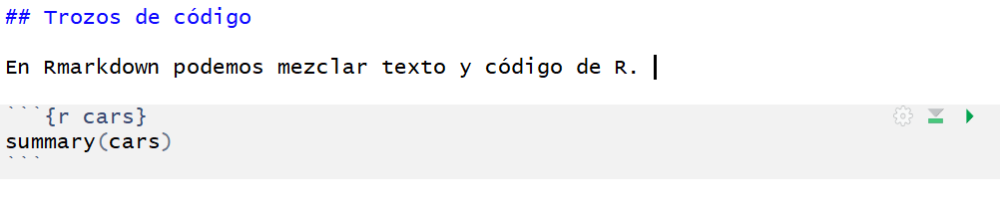

# Comunicación


El trabajo estadístico no termina cuando entendemos la estructura de los datos. Nuestro trabajo estará incompleto a menos que logremos llevar aquello que destilamos de la evidencia a la combinación correcta de palabras e imágenes que logren recrear el mensaje en otra mente.  

La mayoría de los usos a continuación son explotados a su máxima expresión si se posee cierta familiaridad con los sistemas de control de versiones (por ejemplo, GIT) y plataformas online basadas en dichos sistemas (por ejemplo, GitHub). Dicho material excede a la complejidad de este libro[^git]. Sin embargo, los principios generales que desarrollo a continuación son independientes de los sistemas de control de versiones.

## Ciencia reproducible

Uno de los grandes motores detrás de la ciencia reproducible es el acceso a abierto a los datos y el código que se utilizó para analizarlos. La ventaja de realizar ciencia abierta de este modo es la disminución de errores de procedimiento que quedan escondidos en una computadora a la que nadie tiene acceso. Por ejemplo, un error de tipeo en una fórmula en Excel puede pasar desapercibido y llevar a conclusiones erróneas. Errores en planillas de Excel son muy complicados de hallar.  

Aunque parezca extremo, existen casos documentados de este tipo.

* [Nota en Washington Post](https://www.washingtonpost.com/news/wonk/wp/2016/08/26/an-alarming-number-of-scientific-papers-contain-excel-errors/?noredirect=on&utm_term=.d265244d3d9b)
* [Nota en The Economist](https://www.economist.com/graphic-detail/2016/09/07/excel-errors-and-science-papers)

## Gráficos

En un capítulo anterior realizamos análisis exploratorios. Como nuestro objetivo era entender los datos de manera rápida (ver Sección \@ref(caso-de-estudio)), dichos análisis no se focalizaron en comunicar visualmente hacia un *externo* o *consumidor*. En esta sección, nuestro énfasis estará puesto en la reproducción de gráficos que comuniquen de manera efectiva a un consumidor que no se ha familiarizado con los datos. 

Retomemos el dataset del Titanic. Toda la información necesaria para comprender los fenómenos está en el set de datos crudos. 


```
   PassengerId Survived Pclass    Sex Age SibSp Parch    Fare Embarked
1            1        0      3   male  22     1     0  7.2500        S
2            2        1      1 female  38     1     0 71.2833        C
3            3        1      3 female  26     0     0  7.9250        S
4            4        1      1 female  35     1     0 53.1000        S
5            5        0      3   male  35     0     0  8.0500        S
6            6        0      3   male  NA     0     0  8.4583        Q
7            7        0      1   male  54     0     0 51.8625        S
8            8        0      3   male   2     3     1 21.0750        S
9            9        1      3 female  27     0     2 11.1333        S
10          10        1      2 female  14     1     0 30.0708        C
```


Pero cuando vemos los datos crudos, es prácticamente imposible extraer información útil. Incluso con un dataset pequeño, debemos tomar activamente medidas para reorganizar los datos y realizar cálculos mentales. Siempre es conveniente explotar nuestra facilidad para extraer patrones de manera rápida, mediante procesamiento visual inconsciente. Hagamos un gráfico tipo *waffle* (también conocidos como gráficos tipo *tile* o azulejo). 

### Waffle plots


```r
# Si es la primera vez, vamos a necesitar unos cuantos paquetes
# install.packages("rlang")
# install.packages("stringi")
# install.packages("curl")
# install.packages("devtools")
# devtools::install_github("hrbrmstr/waffle")
# Paquete para hacer gráficos de tipo waffle
library(waffle)

library(tidyverse)
library(titanic)
```


```r
# Calculamos supervivencia
sobrev <- titanic_train %>%
          group_by(Survived) %>%
          count() %>%
          ungroup()%>%
          mutate(Survived = c("No Sobrevivió", "Sobrevivió"))

# Waffle plot
waffle(sobrev, rows = 25, size = 1,
       colors = c("#1696d2", "#fdbf11"),
       legend_pos = "bottom")+
  labs(title = "Sobrevivientes del Titanic",
      subtitle = "1 cuadrado = 1 persona")
```




Este tipo de representaciones es común en los periódicos. Podemos recrear el gráfico por clase. 


```r
# Calculamos supervivencia por clase
sobrev2 <- titanic_train %>%
    group_by(Pclass, Survived) %>%
    count() %>%
    ungroup()%>%
    mutate(Survived = ifelse(Survived==0,"No Sobrevivió", "Sobrevivió"))

iron(
waffle(filter(sobrev2, Pclass==1) %>% select(-Pclass),
       rows = 10, size=1,
       colors = c("#1696d2", "#fdbf11"),
       legend_pos = "none")+
  labs(title = "Sobrevivientes del Titanic",
      subtitle = "Primera clase"),
waffle(filter(sobrev2, Pclass==2) %>% select(-Pclass),
       rows = 10, size=1,
       colors = c("#1696d2", "#fdbf11"),
       legend_pos = "none")+
  labs(subtitle = "Segunda clase"),
waffle(filter(sobrev2, Pclass==3) %>% select(-Pclass),
       rows = 10, size=1,
       colors = c("#1696d2", "#fdbf11"),
       xlab = "1 cuadrado = 1 persona",
       legend_pos = "bottom")+
  labs(subtitle = "Tercera clase")
)
```



### Gráficos de barras

Los gráficos de barras son herramientas que encontramos con frecuencia para representar variables categóricas. Veamos un ejemplo sencillo.


```r
ejemplo <- data.frame(grupo=LETTERS[1:5],
                      frecuencia=c(10,25,31,12,18))

ejemplo
```

```
  grupo frecuencia
1     A         10
2     B         25
3     C         31
4     D         12
5     E         18
```

Exploremos las diferencias en estas dos representaciones. En la figura  \@ref(fig:geom-bar-order-2) podemos ver cómo modificar la percepción visual de los gráficos de barras según la importancia del mensaje. La variable explicatoria es un factor que, tal como en este caso, podría tener un orden lógico y el lector se beneficiaría de esta estructura. Ejemplos de dichos factores son los clásicos *muy malo, malo, neutro, bueno, muy bueno* o *infante, adulto, anciano*. Sin embargo, nuestro interés podría centrarse en comunicar cuáles son las categorías más/menos comunes con facilidad y podemos valernos de una reorganización de datos para ello. 


```r
# Gráfico de barras
p1 <- ggplot(ejemplo, aes(x=grupo,
                          y=frecuencia)) +
  geom_col()

# Gráfico de barras ordenado según frecuencia
p2 <- ggplot(ejemplo, aes(x=reorder(grupo,-frecuencia),
                          y=frecuencia))+
  geom_col()+
  xlab("grupo")

cowplot::plot_grid(p1,p2, labels = "AUTO")
```

<div class="figure" style="text-align: center">

<p class="caption">(\#fig:geom-bar-order-2)Gráficos de barras ordenados según eje niveles de la variable explicatoria o respuesta.</p>
</div>

> Ejercicio: Explorar este concepto utilizando data de `precip`.

### Explorando gradientes

En muchas instancias nos interesa hacer notar el rango de variables cuantitativas, que pueden representarse con un gradiente. En este caso, vamos a explorar representaciones gráficas de matrices de correlación. Las m


```r
# Construimos matriz de correlación
corr_datos <- cor(swiss)

# Utilizamos esto como base
grafico_matriz <- qplot(data=reshape2::melt(corr_datos),
      x=Var1, y=Var2,
      fill=value, geom="tile") +
  geom_text(aes(label = round(value, 1)), color="white") +
  theme_minimal()+
  xlab("") + ylab("")+
  ggtitle("Matriz de correlación")+
  theme(legend.position = "none")

# Exploramos variantes de fill
grafico_matriz +  scale_fill_continuous()
grafico_matriz + scale_fill_gradient(low="blue", high="red")
grafico_matriz + scale_fill_viridis_c()
```




### Mapas

En la sección \@ref(nueva-zelanda) detallamos paso a paso cómo podemos realizar mapas con calidad de publicación utilizando el paquete `tm` (por ejemplo, ver Figura \@ref(fig:nz-profesional)).


## RMarkdown

Markdown es un lenguage de marcado ligero que permite agregar marcajes sencillos al texto plano (`.md`), para convertirlo en un poderoso conjunto de operaciones que pueden exportarse a formatos de publicación profesional como `.html`, `.pdf` y `.tex`[^markdown-wiki]. *RMarkdown* es la implementación de Markdown dentro de Rstudio. RMarkdown posee toda la funcionalidad de Markdown y además permite introducir trozos de código.  

Los archivos de Rmarkdown son archivos de texto con extensión `.Rmd`. Podemos crearlos dentro de Rstudio desde el mismo menú con el que abrimos scripts.  


Al abrirlo, un navegador nos permitirá seleccionar opciones (como el título, autor, etc). No me centraré en esa ventana debido a que todas estas opciones pueden modificarse en el encabezado del nuevo archivo `.Rmd` (ver Sección \@ref(encabezado)).   

## Texto

Markdown es un lenguaje que permite escribir de manera veloz, con muy pocas distracciones. La funcionalidad para editar la presentación de texto es limitada, pero es más que suficiente para el 99% de las cosas que necesitamos al escribir. Los siguientes ejemplos están ordenados segun cómo se escriben en Rmarkdown y cómo es el render.


`Lo esencial es *invisible* a los ojos.` $\rightarrow$ Lo esencial es *invisible* a los ojos.  
`Lo esencial es **invisible** a los ojos.` $\rightarrow$ Lo esencial es **invisible** a los ojos.  
`Lo esencial es ~~in~~visible a los ojos.` $\rightarrow$ Lo esencial es ~~in~~visible a los ojos.  

Si tienes familiaridad con $\LaTeX$ es posible utilizarlo para fórmulas matemáticas en línea con la frase que se está escribiendo. Por ejemplo, un supuesto de los modelos lineales generales es $\mathcal{E}_i \sim \  \mathcal{N}(\mu,\,\sigma^{2})$. Utilzar $\LaTeX$ en RMarkdown es tan sencillo como englobar el código utilizando el símbolo `$`. Si queremos utilizar una ecuación, por ejemplo, utilizamos los entornos `\begin{equation}` y `\end{equation}` y escribimos sin necesidad de utilizar el símbolo `$`.  

Para utilizar resaltado tipo `código` en línea utilizamos palabras envueltas en *backticks* (`` ` ``)[^backticks]. Podemos utilizar código de R en la línea en la que estamos escribiendo de la forma `r`+`espacio`+`función deseada`. Por ejemplo, si combinamos con $\LaTeX$ y le preguntamos a R cuánto es $\pi$, nos dará el resultado en la misma línea así: $\pi$ = 3.1415927[^en-mi-pc].

## Separando líneas y párrafos

La belleza de Rmarkdown es que acomoda el texto y las figuras automáticamente, por lo que no debemos preocuparnos por el número de líneas y demás problemas que aparecen con un editor de texto tradicional. Sin embargo, en ciertas ocasiones realmente deseamos forzar un quiebre, un espacio extra. Para separar párrafos, basta con terminar la línea que se está escribiendo con dos espacios. Por ejemplo,  

*No te des por vencido, ni aún vencido, no te sientas esclavo, ni aún esclavo;*  

Puede transformarse en:  

*No te des por vencido, ni aún vencido,*  
*no te sientas esclavo, ni aún esclavo;*  

Si agregamos dos espacios entre las palabras deseadas[^normalmente].  

Las listas de objetos son un caso puntual muy útil:

```
# Listas no numeradas
* item 1
* item 2
+ item 3
* item 4
    * sub-item
    * sub-item

```
Se ve así:  

* item 1
* item 2
+ item 3
* item 4
    * sub-item
    * sub-item

```
# Listas numeradas
1. item 1
1. item 2
1. item 3
    a) item 3a
    a) item 3b
```

Se ve así: 

1. item 1
1. item 2
1. item 3
    a) item 3a
    a) item 3b


En las listas numeradas no debemos mantener la cuenta. Simplemente `1. ` y escribimos lo que necesitamos, Markdown hace el resto!  

Otra posibilidad es utilizar texto resaltado. Para resaltar texto utilizamos el símbolo mayor (>) seguido de un espacio. Esta opción no es recomendada para uso extensivo, pero puede resaltar una frase corta de un modo interesante. Por ejemplo,  

> R es genial.

Cuando terminamos una sección o deseamos una marca física entre párrafos, podemos usar 3 asteriscos (*).  

```
# Línea horizontal
***
```

Se ve:  

***

## Trozos de código

En Rmarkdown podemos mezclar texto y código de R. La siguiente imagen muestra cómo se ve en mi computadora:  



Cuando estos trozos se agregan al documento final, corren en la consola de R y el output se incluye en los resultados. Por ejemplo, el siguiente trozo:


```r
summary(cars)
```

```
     speed           dist       
 Min.   : 4.0   Min.   :  2.00  
 1st Qu.:12.0   1st Qu.: 26.00  
 Median :15.0   Median : 36.00  
 Mean   :15.4   Mean   : 42.98  
 3rd Qu.:19.0   3rd Qu.: 56.00  
 Max.   :25.0   Max.   :120.00  
```

Para insertar trozos de código podemos hacer click en insert o mediante el comando rápido Ctrl+Alt+I.


## Links e imágenes

Los links e imágenes pueden incluirse utilizando corchetes ([]) y paréntesis. Por ejemplo,

```
# Imágenes

# URLs
[descripción de mi link](link)
```
El link puede ser un directorio dentro de nuestra computadora (`imagenes/vacaciones/.png`) o via `www` con un link externo, como el logo de Rstudio:  


## Encabezado

Los encabezados son útiles para diversos archivos, ciertamente necesarios para la organización de documentos más complejos. Rmarkdown utiliza un encabezado conocido como YAML y tiene la siguiente forma:

```
--- 
title: "Un mundo feliz"
author: "Aldous Huxley"
date: "1932"
output: html_document
---
```

Por ejemplo, el encabezado de este libro es el siguiente[^encabezado]:

```
--- 
title: "Introducción a estadística con R"
author: "Matias Andina"
date: "2018-09-30"
site: bookdown::bookdown_site
documentclass: book
---

```

En este caso, la fecha la he creado con un llamado a la función `Sys.Date()` (`r` + `espacio` + `Sys.Date()`) que permite que cada vez que este libro se compila, se use la fecha de sistema para el compilado., De este modo, no tengo que actualizarlo manualmente cada vez que edito el libro.  

## Knit

Para armar el documento, debemos hacer click en *knit*. El producto final será un documento tipo `.html` que contenga todo el texto y las imágenes del archivo `.Rmd`. 

## Otros proyectos con RStudio

* Presentaciones de diapositivas con Markdown y `R presentation`.
* Usando el paquete `blogdown`, Websites como [este](http://matiasandina.netlify.com)
* Usando el paquete `bookdown`, libros como éste ([y otros!](bookdown.org))

## Notas

Mucha tecnología cotidiana detrás de los servicios de publicación está principalmente desarrollada alrededor del idioma inglés. Problemas inesperados pueden aparecer incluso cuando hacemos todo bien utilizando R, Rstudio y Rmarkdown. Por ejemplo, mientras escribía este libro tuve un problema con el nombre de mis archivos que contenían tilde (por ejemplo, el archivo de este capítulo era "Comunicación.Rmd"). La inconveniente `ó` provocó que el link a ciertas imágenes del capítulo (`www. .../Comunicación/imagen-01.png`) no pudiera ser encontrado y dichas imágenes no aparecieran. La solición de compromiso es (como en muchas otras direcciones de internet) no utilizar caracteres que no existen en inglés (por ejemplo, la ñ, o palabras con tildes).

## Recursos

* Cheatsheet oficial de Rmarkdown en español por Rstudio [aquí](https://www.rstudio.com/wp-content/uploads/2015/03/rmarkdown-spanish.pdf)
* Buen material sobre visualización con ggplot2 [aquí](http://urbaninstitute.github.io/urban_R_theme/)

[^encabezado]: El encabezado que muestro es una porción que es comparable con un documento clásico. El encabezado real contiene ciertas especificaciones para que este libro pueda ser publicado online y entiendo que no aportan al ejemplo.
[^markdown-wiki]: Puedes encontrar más información sobre Markdown[aquí](es.wikipedia.org/markdown)
[^git]: Puedes aprender sobre GIT [aquí](https://git-scm.com/book/es/v1/Empezando)
[^normalmente]: Normalmente suelo agregar un enter y escribir en la siguiente línea. Aunque no es necesrario, me ayuda a visualizar el render antes de tiempo.
[^backticks]: Los backtics son difícilies de encontrar en el teclado en español, puedes probar ALT+96.
[^en-mi-pc]: Para lograr esto el formato debe ser `` $\pi$ = 3.1415927 ``
